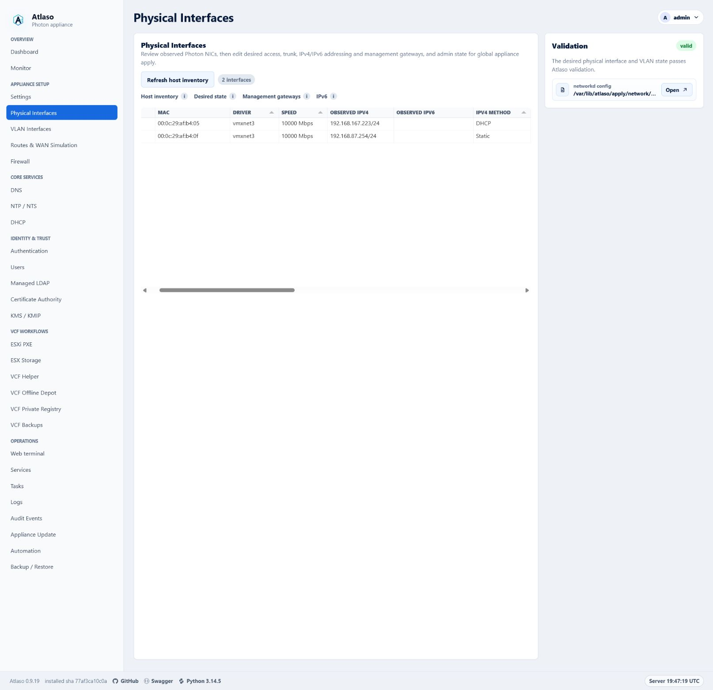
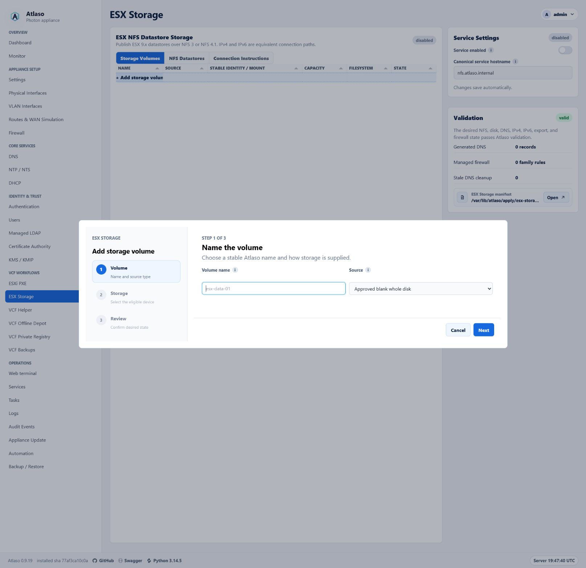

# Atlaso UI Design Guide

This guide is the mandatory interaction and presentation contract for the Atlaso appliance. It applies to every change
that affects templates, authored CSS, browser JavaScript, controls, layouts, data grids, dialogs, wizards, or visible
copy.

The goal is consistency, not a collection of page-specific widgets. Reuse the established Atlaso patterns below before
proposing a new one. The compliance program for existing surfaces is tracked in
[GitHub issue #115](https://github.com/mdaneri/Atlaso/issues/115).

## Mandatory contributor gate

Before planning a UI change:

1. Read this guide after completing the repository policy gate in
   [AGENTS.md](https://github.com/mdaneri/Atlaso/blob/main/AGENTS.md).
2. Classify the work as one of the established patterns: **direct-edit Tabulator**, **wizard-backed Tabulator**,
   **read-only Tabulator**, or **non-grid settings**. If none is truthful, classify it as approval-only
   **custom/other**.
3. Name the existing Atlaso reference that will be reused in the first progress update and in the pull request. For
   **custom/other**, cite the explicit maintainer approval and name the closest related Atlaso reference.
4. Obtain explicit maintainer approval before introducing a custom data grid or an interaction pattern that is not
   defined here.

Delegated agents must complete the same gate. A delegating agent must include the guide in the delegated prompt and
verify compliance before using the work.

## Choose the interaction pattern

| Pattern                          | Use it when                                                                                                                                                                  | Atlaso reference                                                               |
| -------------------------------- | ---------------------------------------------------------------------------------------------------------------------------------------------------------------------------- | ------------------------------------------------------------------------------ |
| Direct-edit Tabulator            | A collection has independent, compact fields that can be validated and saved one row at a time.                                                                              | **Physical Interfaces**                                                        |
| Wizard-backed Tabulator          | A collection remains useful to browse in a grid, but add or edit requires dependent choices, discovery, credentials, safety decisions, or a review step.                     | **ESX Storage**; **Automation Schedules**                                      |
| Read-only Tabulator              | A primary resource or operational collection is inspected, filtered, sorted, paginated, or opened for detail without inline mutation.                                        | **Tasks**; **Audit Events**; **Network Boot Discovered Hosts**                 |
| Non-grid settings                | A small set of singleton service or appliance settings is edited as desired state rather than as a resource collection.                                                      | **DNS** service settings and validation rail                                   |
| Custom/other (approval required) | The work is not truthfully a collection or settings pattern, such as a dashboard, chart, public portal, or standalone dialog, and no established Atlaso interaction applies. | Cite explicit maintainer approval and name the closest related Atlaso surface. |

Tabulator is the only data-grid implementation. This restriction does not prevent CSS Grid from being used for page
layout; it prevents new bespoke HTML, CSS, or JavaScript resource grids.

**Custom/other** is an approval escape hatch, not a default category. First reuse any applicable page shell, control,
dialog, status, accessibility, and responsive behavior defined by this guide. The approval must record why the four
established patterns are not truthful and what new interaction contract future work should follow.

Use a semantic HTML table only for a small, non-interactive summary or review preview that is not a browsable or
editable resource collection. A collection does not become exempt merely because it currently has few rows.

## Shared browser foundation

The classic browser asset `static/ui-patterns.js` exposes `window.AtlasoUiPatterns` in both the management and public
shells. It loads after the vendored Tabulator asset and before page code. The service worker precaches the same
versioned asset.

- `AtlasoUiPatterns.createGrid(...)` is the only approved constructor entry point for every direct-edit,
  wizard-backed, or read-only Tabulator. It owns shared loading, ready, empty, error, permission, status, keyboard,
  context-menu, and server-rendered fallback behavior. The fallback remains visible until Tabulator emits
  `tableBuilt`, and it is retained or restored when initialization fails.
- `AtlasoUiPatterns.createWizard(...)` is the only approved step-controller entry point. It owns step locking,
  synchronous and asynchronous validation, review entry, navigation, discard confirmation through the shared
  confirmation modal, recoverable errors, focus containment, first-control focus, and launcher-focus restoration.
- Wizard templates use `data-atlaso-wizard` on the form and the generic `data-atlaso-wizard-*` attributes for steps,
  navigation, status, and actions. Page adapters keep only business-specific discovery, validation, conditional-field,
  review-population, and submission callbacks.

All existing Tabulator initializers use `createGrid`, and primary resource collections use the shared grid rather than
custom interactive native tables. Raw constructors outside the shared foundation are forbidden. The repository policy
check rejects raw constructors, wizard markup without the generic contract, and page-specific generic step-controller
logic.

## Tabulator collection contract

All primary resource collections use the repository's vendored Tabulator assets and shared Atlaso grid styles. Do not
recreate sorting, selection, editing, keyboard behavior, responsive columns, pagination, empty states, or context menus
from scratch.

Every Tabulator collection must:

- retain an accessible server-rendered fallback with truthful headers and values;
- treat custom formatter return values as HTML sinks, escaping persisted or user-controlled values at the sink or
  returning DOM nodes populated through `textContent` so accepted text cannot become executable markup;
- have a stable row identity and an explicit loading, empty, error, and permission-denied state;
- preserve the current tab, selection, filters, and scroll context when an autosave or refresh can do so safely;
- use compact Atlaso control sizing, typography, status badges, and validation language;
- expose destructive and secondary row actions through the standard row context menu instead of permanent inline action
  clutter;
- keep read-only, generated, unavailable, and permission-restricted cells visibly distinct from editable cells;
- allow horizontal scrolling when the information cannot remain legible at the available width rather than compressing
  values beyond recognition; and
- preserve backend contracts, authorization checks, CSRF/session protections, and desired-state boundaries.

### Direct editing

Use direct editing only when each field can be understood and validated without a sequence of dependent choices.
Physical Interfaces is the reference.

- Autosave an edited row through the existing desired-state endpoint.
- Show a compact saving, saved, or failed status without shifting the page.
- On failure, retain the attempted value and a useful error, or roll back to the last confirmed value when the current
  contract requires rollback.
- Refresh affected validation and preview content in place.
- Physical Interfaces may use the shared confirmation detail region to review an observed DHCP address/prefix and
  gateway together before its bounded DHCP-to-static row action saves desired state. Clearing that gateway uses the
  same shared confirmation pattern with an explicit routed-connectivity warning.
- Put the new-record row at the bottom, keep it pinned there under every sort direction, and label it `+ Add record here`.
- In a new-record placeholder, enable only the required identity field first. Keep generated or defaulted cells blank
  and locked until identity is valid.
- Use the established editors for switches, enumerations, exact values, tags, and multiline content. Do not embed a form
  layout inside a row.
- When an **Enabled** column represents ordinary desired-state availability, make it directly editable. Saving a
  changed value must change whether that resource is available in rendered desired state while preserving the global
  appliance-apply boundary.

If a record cannot satisfy these constraints, keep its collection in Tabulator and move add/edit into a wizard.

### Read-only collections

Tasks and Audit Events are the references for operational collections. Network
Boot Discovered Hosts reuses that read-only grid contract while placing
permission-gated secondary actions in the row context menu and opening an
escaped semantic report with a compact history selector.

- Keep sorting, filtering, pagination, status, and detail navigation consistent with the established operational grids.
- Do not imply editability through editable-cell styling, input-shaped content, or hover behavior.
- Provide explicit detail actions or row navigation with keyboard equivalents.
- Keep sensitive output, secrets, and raw error payloads out of collection cells unless an existing permission-checked
  detail flow intentionally exposes them.
- Mask password values by default. A permission-checked reveal uses the small borderless eye control: show the plain eye
  while masked, draw a slash through it while the value is visible, and change its accessible label and title between
  **Reveal password** and **Hide password**. Automatically return to the masked state after 15 seconds. Reveals must
  disable browser caching and produce an audit event without the value.

## Grid-launched wizard contract

ESX Storage is the primary add/edit reference. Automation Schedules is the reference for a longer, type-dependent
workflow.

The Tabulator collection remains visible when the wizard is closed. Launch add from the bottom add row. Launch edit from
row double-click or the row context menu when both are appropriate and discoverable.

Keep an ordinary desired-state **Enabled** boolean directly editable in its collection even when the rest of the record
uses a wizard. Use the standard tick/cross formatter and `tickCross` editor, save the complete validated record through
its existing edit route, restore the previous value on failure, and never invoke appliance enforcement. A security or
lifecycle boundary that requires credentials, confirmation, or an irreversible action is not an ordinary Enabled
boolean and keeps its established guarded workflow.

**VLAN Interfaces is the approved exception to the ordinary inline-Enabled rule.** Parent, VLAN identity, addressing,
MTU, role, and **Admin Up** form one dependent desired-state record and must be reviewed and saved together through the
shared add/edit wizard. Its Tabulator is a read-only browse surface; no persisted VLAN field is cell-editable. New VLANs
default to **Admin Up**, while edits preserve the saved state. A VLAN whose parent is missing may remain saved only while
disabled and must move to an available trunk before it can be enabled.

Every wizard must:

- use the shared Atlaso wizard panel, step rail, controls, spacing, and status presentation;
- use the shared two-column `.form-grid` for peer fields and `.form-stack` for consistently spaced full-width rows;
- keep an operator Description in the first step on its own full-width multiline row when the resource supports one;
- place the resource description in step 1 with its identity fields whenever the resource has a description;
- place an ordinary desired-state **Enabled** control in its own final step immediately before **Review** whenever the
  resource has an enabled state;
- give the dialog an accessible name and description, move focus to the first actionable control, trap focus while open,
  and return focus to the launcher when closed;
- show the current step, total step count, step name, and concise purpose;
- keep future steps unavailable until prerequisites pass;
- validate the current step before advancing and place validation feedback next to the affected control plus in an
  announced summary when needed;
- use **Back**, **Next**, and **Cancel** consistently, with an explicit final action on the review step;
- include a final review that names the object, desired-state changes, safety boundaries, and whether appliance
  enforcement requires global apply;
- retain entered values and validation errors when moving backward or after a recoverable submission failure;
- require confirmation before discarding meaningful unsaved wizard input; and
- close only after a successful save, then restore collection context and show the resulting row or status.

When peer resources are presented as tabs, keep a `+ Add <resource>` launcher as the final tab after every existing
resource. The add launcher opens the shared wizard and must not displace, sort ahead of, or appear outside the tablist.

Do not perform host mutation as a side effect of moving between steps. Wizard submission saves desired state unless the
established workflow is an explicit task action. Appliance configuration enforcement remains owned by the global
`/ui/management/appliance-apply` workflow.

## Authenticated primary navigation

The management sidebar is an approved `custom/other` disclosure interaction. It reuses native disclosure semantics and
the authenticated sidebar's existing typography, width, link order, active state, and responsive shell.

- Filter links by the signed-in identity before rendering a group. Do not render empty group markup, identifiers, or
  browser-state keys.
- Use a native button for each group label with accurate `aria-expanded` and `aria-controls` values. Associate the link
  container with that button and show a standard chevron whose direction communicates state without color.
- Start every rendered group expanded when no saved browser-local choice exists. Ignore malformed, obsolete, or
  unavailable storage and keep navigation usable without persistence.
- Restore saved choices only for inactive groups. Always expand the group containing the current page on load without
  overwriting its saved choice, so navigating elsewhere can restore the operator's preference.
- Hide collapsed link containers with the native `hidden` contract so their links leave the tab order and accessibility
  tree. Native button activation owns Enter and Space behavior; do not add competing key handlers.
- Keep the global **Review appliance changes** card outside every disclosure and visible whenever pending changes exist.
- At the two-column breakpoint, keep each group heading and its links as one grid item. Return to one group per row at
  the mobile breakpoint without clipping labels or adding horizontal overflow.

### VCF Helper remote-credential wizard contract

Every VCF Helper wizard that connects to a remote VCF component uses the same first four steps:

1. **Credential** — choose a saved vault and key, or continue with manual credentials.
2. **Server** — show the remote server address. A saved vault key fills this value from the HTTP or HTTPS URI selected
   in the credential picker and makes the control read-only; manual mode keeps it editable. Server-address controls
   show only `host`, IP, or `host:port`, never the URI scheme. A control explicitly labeled as a URL retains the full
   HTTP or HTTPS URL.
3. **TLS fingerprint** — probe without resolving or sending credentials, display the observed SHA-256 fingerprint, and
   require explicit out-of-band confirmation before authentication.
4. **Login** — collect request-local username and password only in manual mode. Disable the controls and skip this step
   when a saved vault credential is selected.

Place workflow-specific steps, such as inventory selection, password selection, review, or task queueing, after this
shared sequence. Never load a vault password into page state or a password input. If the server or fingerprint changes,
clear the confirmation and repeat the TLS step before any credential is resolved or sent.

The credential picker lists only keys with HTTP or HTTPS URIs. Render one option per valid URI so an operator can choose
the exact endpoint when a key has several. Do not render unusable SSH-only or URI-less keys as disabled options. If the
selected vault has no valid remote API credentials, show **No HTTP/HTTPS credentials available** and keep manual mode
active.

## Page layout and settings

Use the existing application shell. Configurable service pages use the DNS page as the default layout reference:

- keep the primary resource collection or workflow in one framed `.panel.wide-panel` in the main column;
- keep service settings in the right-side rail;
- use the compact **Pending Appliance Changes** card for the current apply unit and the shared appliance-review modal;
- keep service-specific validation, warnings, and compact preview actions in the **Validation** card;
- keep full rendered configuration out of the rail and open it in the shared preview modal; and
- collapse the rail below the main content at narrow widths without changing reading or keyboard order.

ESXi PXE is the reference when one primary service frame has several views. Put the resource heading, concise purpose,
summary status, `.tool-tabs` tablist, and associated tab panels inside the same outer frame. Do not place the tablist in
a detached panel or wrap every tab panel in a competing outer card. Use `.zone-tabs` for switching between peer
workspaces, organizations, domains, or repositories; use `.tool-tabs` for related views of the resource named by the
containing frame.

The right rail keeps settings and validation separate. The settings card owns desired-state controls. The
**Validation** card truthfully summarizes current readiness, lists actionable errors or warnings, and contains only
compact preview actions. Do not duplicate validation state in a separate main-column frame or omit the Validation card
when a configurable service has readiness requirements. OpenID Connect follows this composition: OIDC administration
and its tool tabs occupy the main frame, while Provider Settings and Validation remain persistent in the right rail.
When the service renders an appliance configuration, the Validation card must include the shared
`partials/config_preview_action.html` row with the truthful staged path and a redacted preview; a valid status alone is
not a substitute for making the reviewed configuration available.

Treat routine forms as desired-state editors. Autosave safe changes with `data-autosave-form` and a nearby
`.autosave-status`; do not add a visible Save button when the established endpoint safely supports autosave. Editing and
enforcement are separate. Never add a service-specific apply card, route, or job in place of global appliance apply.

Use the established control for the value:

- switch for a binary setting;
- select or list editor for a short enumeration;
- input for an exact free-form value;
- textarea for multiline configuration;
- tabs for mutually exclusive modes that solve the same job; and
- tag editor for one-or-more interfaces, addresses, networks, domains, or labels.

### Multiple checkbox choices

Use checkbox choice tiles when an operator may select several independent options and each option benefits from a short
description. The **Allowed scopes** control in the OpenID Connect confidential-client wizard is the reference. Keep a
plain checkbox list for compact, self-explanatory options, and use a select, radio group, or tabs when the choices are
mutually exclusive.

The tile treatment must:

- use a semantic `fieldset` and `legend`, with one native checkbox wrapped by each full-width `label`;
- place a concise option name and supporting description beside the checkbox;
- use the selected border and background, the native checked state, and a visible `:focus-within` treatment so color is
  never the only indication;
- reserve a compact trailing badge for durable constraints such as **required**, not transient validation messages;
- preserve server-side validation because a badge or default checked state does not enforce a requirement;
- arrange a short set in a balanced grid and collapse to one column at narrow widths; and
- keep the native checkbox visible and the complete tile clickable. Do not replace it with a scripted div or use the
  visual card as a mutually exclusive radio control.

Use the OIDC scope-choice structure for this pattern:

```html
<fieldset class="scope-choice-fieldset">
  <legend>Allowed scopes</legend>
  <div class="scope-choice-grid">
    <label class="scope-choice">
      <input type="checkbox" name="allowed_scopes" value="openid" checked>
      <span class="scope-choice-copy">
        <strong>OpenID</strong>
        <small>Required identity subject and ID token</small>
      </span>
      <span class="scope-choice-badge">required</span>
    </label>
  </div>
</fieldset>
```

Every configurable setting has an adjacent `i` help control using `.field-label` and `.help-icon`. The tooltip explains
what changes, where it applies, and any safety boundary. Use explicit action labels such as **Review appliance changes**
or **Submit appliance changes** instead of generic **Save** or **Apply**.

Destructive actions use the shared `data-confirm-modal` pattern. The confirmation names the object, explains what is
removed, and states whether the appliance changes immediately or only after global appliance apply. Do not use browser
confirmation dialogs or immediate destructive submits.

## Validation, status, and permissions

- Validation states use explicit **valid**, **needs attention**, **disabled**, or other truthful language already
  established by the appliance.
- Read-only evidence panels use a neutral **Not recorded** state when an artifact is not yet expected, **Available**
  only for validated inspectable evidence, and actionable **Needs attention** when durable state expects an absent,
  unreadable, malformed, or inconsistent artifact. Neutral absence is ordinary text, not an alert; actionable evidence
  failures remain perceivable as an alert without exposing raw filesystem exceptions.
- Errors explain what failed and how the operator can recover. Do not replace actionable errors with a generic failure
  toast.
- Loading and saving indicators must not cause large layout shifts.
- Disabled controls must have a visible reason when the operator could reasonably expect the action to be available.
- The UI may hide actions the current role cannot perform, but the server must continue to enforce authorization.
- No-JavaScript fallbacks must remain truthful and usable for reading. Mutating fallback forms retain CSRF, permission,
  validation, and confirmation boundaries.

## Accessibility and responsive behavior

All established patterns must work with keyboard-only operation and at desktop and narrow viewports.

- Use native controls and semantic landmarks before adding ARIA.
- Give server-rendered tabs literal initial `aria-selected` values and let the shared tab script update them after
  restoring state.
- Associate labels, help, validation, and descriptions with their controls.
- Keep a visible focus indicator and a logical focus order.
- Never make hover the only way to discover help or an action.
- Provide keyboard equivalents for row double-click and context-menu actions.
- Announce autosave, validation, and asynchronous completion without repeatedly interrupting the operator.
- Keep dialogs usable at browser zoom and on short or narrow viewports; dialog content scrolls while its title and
  primary navigation remain understandable.
- Preserve meaningful document order when a split workspace collapses.
- Do not use color as the only indicator of state, editability, or error.

## Reviewed semantic-table exemptions

The following may remain semantic tables while they stay compact, non-interactive summaries rather than browsable or
editable resource collections:

- backup archive-scope summaries;
- generated DHCP PXE option previews;
- generated DNS reverse-zone previews;
- VCF Helper FQDN review inside its modal;
- tooltip and membership summaries; and
- compact key/value, manifest, configuration, and result previews.

If an exempt summary gains collection behavior such as sorting, filtering, pagination, selection, row navigation, inline
editing, or resource actions, it must move to Tabulator or receive explicit maintainer approval for a new exception.

## Reference screenshots

### Physical Interfaces: direct-edit Tabulator

The collection is the page's primary workspace. Compact grid editing handles independent interface fields while
validation stays in the right-side rail.



### ESX Storage: grid-launched wizard

The storage collection remains the browse surface. Add/edit opens a structured wizard with step navigation, validation,
and a final review.



## Pull-request checklist

For every UI change:

- [ ] The interaction is classified as direct-edit Tabulator, wizard-backed Tabulator, read-only Tabulator, non-grid
  settings, or approval-only custom/other.
- [ ] The pull request names the existing Atlaso reference being reused, or for custom/other cites maintainer approval
  and the closest related reference.
- [ ] No custom grid or new interaction pattern was added without explicit maintainer approval.
- [ ] Desired-state, autosave, permission, confirmation, validation, and global appliance-apply boundaries are
  preserved.
- [ ] The server-rendered fallback remains truthful and accessible.
- [ ] Focused tests and the full required repository checks pass.
- [ ] The affected flow was verified at desktop and narrow viewports, with keyboard navigation, zoom, focus, and
  validation recovery considered.
- [ ] Appliance-deployed behavior was smoke-tested in VMware Workstation when the affected flow depends on the deployed
  appliance.
