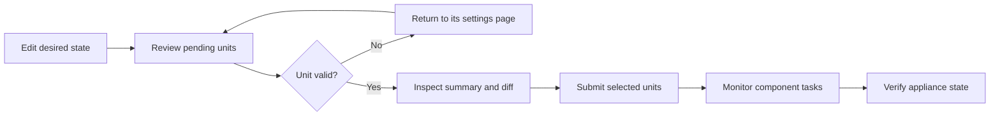

# Apply appliance changes

Use Appliance Apply after editing Atlaso settings to enforce selected desired state on the Photon appliance. The review
is global: one submission can apply related changes from several service pages in a controlled order.

<!-- BEGIN GENERATED INTERFACE OVERVIEW -->
## Interface overview

This verified appliance view provides visual orientation before you begin.

*Figure: Appliance change review with valid and invalid desired-state units.*

<!-- END GENERATED INTERFACE OVERVIEW -->

!!! important
    Editing and applying are separate actions. Autosave updates Atlaso's desired state; it does not change Photon
    services. Host changes begin only after an administrator selects valid units and chooses **Submit appliance
    changes**.

## Before you begin

You need:

- an administrator account with permission to apply appliance changes;
- saved desired-state changes on one or more service or settings pages;
- validation errors resolved for every unit you intend to submit; and
- no other Appliance Apply task pending or running.

If a change can interrupt management access, use the local appliance console or VMware console as a recovery path
before submitting it.

## Understand the workflow

Atlaso groups related settings into apply units. For example, DNS and DHCP share one `DNS/DHCP (dnsmasq)` unit because
they use the same generated configuration and service reload. A change can affect several units; Web Terminal listener
changes commonly require **Appliance Settings**, **Public Services**, and **Firewall** together.

## Review pending changes

1. Finish editing the desired state on the relevant service pages.
2. Open **Review appliance changes** from the lower-left sidebar card or a page-level pending-change action.
3. Read the status of every changed unit:

   | Status | Meaning | What to do |
   | --- | --- | --- |
   | **valid** | The desired state passes current validation. | Inspect it and keep it selected if it belongs in this run. |
   | **needs attention** | Atlaso found an error that prevents submission. | Open the unit's page, correct the error, and review again. |
   | Warning | The unit is valid but has an operational caution. | Read the warning and confirm the effect before submission. |

4. Expand each selected unit and inspect its summary and rendered difference.
5. Clear the checkbox for a valid unit that should remain pending for a later run.

Valid changed units are selected by default. Invalid units are not submitted. Unselected units remain in the pending
count after the task starts.

!!! warning
    Review all related units together when one feature crosses service boundaries. Submitting only part of a related
    change can leave the new behavior unavailable until the remaining units are applied.

## Submit and monitor

1. Confirm that the selection contains only the units intended for this run.
2. Choose **Submit appliance changes**.
3. Keep the task dialog open while the master task and its component rows progress.
4. Open a component row to inspect its bounded, redacted result.
5. Wait for the master task to reach a terminal state.

Components run sequentially. If one component fails, Atlaso stops the sequence and marks the remaining components
**skipped**. Other write operations are locked while the master task is pending or running; read-only pages, task
inspection, authentication actions, and safe cancellation remain available.

Safe cancellation does not interrupt the helper step already running. It allows that step to finish, skips work that
has not started, and releases the mutation lock after the master task becomes terminal.

## Verify the result

Do not treat a submitted task as proof that the appliance changed successfully.

1. Confirm that the master task is **succeeded**.
2. Confirm that every selected component is **succeeded**, not **failed** or **skipped**.
3. Return to the affected service page and confirm its pending indicator cleared.
4. Verify the resulting runtime behavior from the relevant service guide.

Examples include checking service health, resolving a managed DNS name, reaching the intended listener, or confirming
the installed configuration from the appliance console. Use the service-specific verification procedure rather than
relying only on a green UI status.

In development, adapters normally run in dry-run mode. A successful dry-run proves that Atlaso validated and recorded
the command intent; it does not prove that Photon services changed.

## Recover from a failed apply

1. Open the failed component and read its validation, error, and redacted command output.
2. Correct the desired state on the owning service page.
3. Review the pending units again. Units that succeeded earlier keep their updated baselines; failed and skipped units
   remain pending when their desired state still differs.
4. Submit only the units required for the corrected run.

If Atlaso restarts during an apply, startup marks the running child failed, marks pending children skipped, fails the
master task, and releases the global lock. Review the task before resubmitting.

If a selected unit changed after submission but before execution, Atlaso fails closed and asks for a new review. This
prevents a queued task from applying state that the administrator did not inspect.

## Safety boundaries

- `/appliance-apply` is the only desired-state host-mutation workflow.
- Only one Appliance Apply master can be pending or running.
- Photon mutations use constrained `atlaso-helper` actions; the web process does not receive broad root access.
- Previews, diffs, task results, logs, and audit details redact sensitive-looking values.
- A successful component updates only that component's last-applied baseline.
- Fresh-appliance baseline initialization records comparison metadata only; it does not run helper commands.

For apply-unit ownership, staging paths, helper commands, baselines, locking, and execution internals, see the
[Appliance Apply technical reference](../reference/appliance-apply-technical.md).
