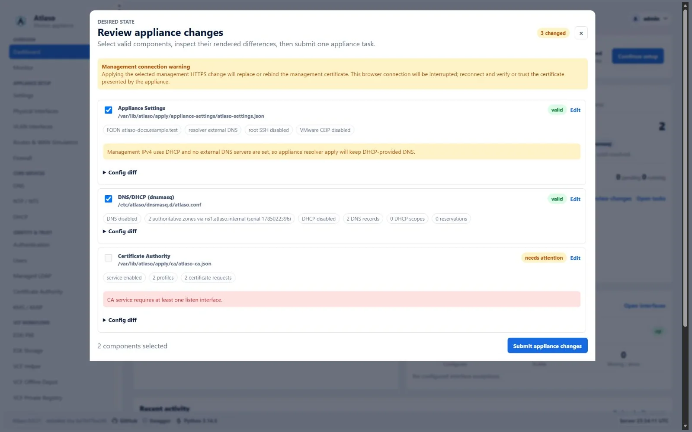
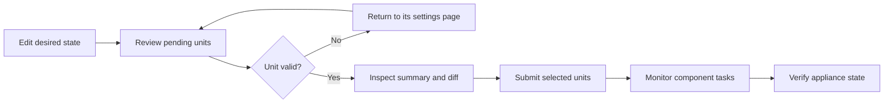

# Apply appliance changes

Use Appliance Apply after editing Atlaso settings to enforce selected desired state on the Photon appliance. The review
is global: one submission can apply related changes from several service pages in a controlled order.

<!-- BEGIN GENERATED INTERFACE OVERVIEW -->
## Interface overview

This verified appliance view provides visual orientation before you begin.

*Figure: Appliance change review with valid and invalid desired-state units.*

<!-- END GENERATED INTERFACE OVERVIEW -->

!!! important
    Editing and applying are separate actions. Autosave updates Atlaso's desired state; it does not change Photon
    services. Host changes begin only after an administrator selects valid units and chooses **Submit appliance
    changes**.

## Before you begin

You need:

- an administrator account with permission to apply appliance changes;
- saved desired-state changes on one or more service or settings pages;
- validation errors resolved for every unit you intend to submit; and
- no other Appliance Apply task pending or running.

If a change can interrupt management access, use the local appliance console or VMware console as a recovery path
before submitting it.

## Understand the workflow

Atlaso groups related settings into apply units. For example, DNS and DHCP share one `DNS/DHCP (dnsmasq)` unit because
they use the same generated configuration and service reload. A change can affect several units; Web Terminal listener
changes commonly require **Appliance Settings**, **Public Services**, and **Firewall** together.

## Review pending changes

1. Finish editing the desired state on the relevant service pages.
2. Open **Review appliance changes** from the lower-left sidebar card or a page-level pending-change action.
3. Read the status of every changed unit:

   | Status | Meaning | What to do |
   | --- | --- | --- |
   | **valid** | The desired state passes current validation. | Inspect it and keep it selected if it belongs in this run. |
   | **needs attention** | Atlaso found an error that prevents submission. | Open the unit's page, correct the error, and review again. |
   | Warning | The unit is valid but has an operational caution. | Read the warning and confirm the effect before submission. |

4. Expand each selected unit and inspect its summary and rendered difference.
5. Clear the checkbox for a valid unit that should remain pending for a later run.

Valid changed units are selected by default. Invalid units are not submitted. Unselected units remain in the pending
count after the task starts.

!!! warning
    Review all related units together when one feature crosses service boundaries. Submitting only part of a related
    change can leave the new behavior unavailable until the remaining units are applied.

## Submit and monitor

1. Confirm that the selection contains only the units intended for this run.
2. Choose **Submit appliance changes**.
3. Keep the task dialog open while the master task and its component rows progress.
4. Open a component row to inspect its bounded, redacted result.
5. Wait for the master task to reach a terminal state. The dialog, lower-left sidebar badge, pending count, and global
   write lock update automatically; a page reload is not required.

If another session starts a new Apply immediately after the current master finishes, the monitor completes the current
task's terminal refresh before following the newer task.

Components run sequentially. If one component fails, Atlaso stops the sequence and marks the remaining components
**skipped**. Other write operations are locked while the master task is pending or running; read-only pages, task
inspection, authentication actions, and safe cancellation remain available.

A management-path change is the exception to independent component execution: Atlaso selects Certificate Authority,
Network, Firewall, Appliance Settings, and Public Services together and runs them as one recoverable handoff. The task
keeps the previous address, public port, and HTTP/HTTPS listener active until consecutive bounded checks prove the
Atlaso loopback upstream, candidate nginx listener, and host-facing `/openapi.json` are ready. On failure, each bundled
component records the same failing layer
and rollback result. The handoff applies only the management front-door portion of Appliance Settings; unrelated
Appliance Settings differences remain pending for a later Apply instead of being folded into the network transaction.
An active appliance without a last-applied Network baseline cannot safely identify its previous management path, so
Atlaso blocks Network apply without host mutation until a known-good settings archive restores that baseline or a
maintainer completes local-console recovery.

Safe cancellation does not interrupt the component already running. Every helper or adapter command in that component
continues to completion. After the component returns, Atlaso skips the remaining components and releases the mutation
lock when the master task becomes terminal.

If the dialog shows **Live task status is temporarily unavailable**, leave it open while Atlaso retries. The last known
task and lock remain visible until an authoritative response arrives. If the warning persists, open **Tasks** in another
tab to inspect the master task and verify appliance connectivity before deciding whether to reload the affected page.

## Verify the result

Do not treat a submitted task as proof that the appliance changed successfully.

1. Confirm that the master task is **succeeded**.
2. Confirm that every selected component is **succeeded**, not **failed** or **skipped**.
3. Return to the affected service page and confirm its pending indicator cleared.
4. Verify the resulting runtime behavior from the relevant service guide.

Examples include checking service health, resolving a managed DNS name, reaching the intended listener, or confirming
the installed configuration from the appliance console. Use the service-specific verification procedure rather than
relying only on a green UI status.

In development, adapters normally run in dry-run mode. A successful dry-run proves that Atlaso validated and recorded
the command intent; it does not prove that Photon services changed.

## Recover from a failed apply

1. Open the failed component and read its validation, error, and redacted command output.
2. Correct the desired state on the owning service page.
3. Review the pending units again. Units that succeeded earlier keep their updated baselines; failed and skipped units
   remain pending when their desired state still differs.
4. Submit only the units required for the corrected run.

If Atlaso restarts during an ordinary apply, startup marks the running child failed, marks pending children skipped,
fails the master task, and releases the global lock. For an interrupted management handoff, startup first asks the
privileged helper to stop and verify any surviving handoff process before restoring the captured previous runtime state,
then records the recovery result on the failed task.
The same stop-and-recover path runs immediately if Atlaso times out while waiting for the privileged helper, because the
fixed handoff service can outlive its waiting process.
The helper retains that rollback state until Atlaso durably commits the bundled component results and baselines. If a
restart occurs after that database commit, startup idempotently acknowledges the committed candidate instead of falsely
claiming a rollback. A failed task whose helper acknowledgement is not proven retains the global Apply lock until startup
or immediate exception recovery reconciles that state. Review the task before resubmitting.

If a selected unit changed after submission but before execution, Atlaso fails closed and asks for a new review. This
prevents a queued task from applying state that the administrator did not inspect.

## Safety boundaries

- `/ui/management/appliance-apply` is the only desired-state host-mutation workflow.
- Only one Appliance Apply master can be pending or running.
- Photon mutations use constrained `atlaso-helper` actions; the web process does not receive broad root access.
- Previews, diffs, task results, logs, and audit details redact sensitive-looking values.
- Secret-bearing Local Users, Certificate Authority, and Managed LDAP inputs use mode `0600` only during their helper
  execution window. Both the control plane and helper remove them on terminal outcomes, and startup removes stale
  inputs after interruption.
- Read-only Local Users status uses an isolated short-lived input and cannot overwrite a pending apply payload.
- A successful component updates only that component's last-applied baseline.
- Fresh-appliance baseline initialization records comparison metadata only; it does not run helper commands.

## Complete technical contents

No original section was removed. The [Appliance Apply technical reference](../reference/appliance-apply-technical.md)
is divided into these scannable groups:

| Reference group | Contents |
| --- | --- |
| [Workflow and execution model](../reference/appliance-apply-technical.md#workflow-and-execution-model) | Backend routes, global locking, helper boundaries, and apply-unit ownership. |
| [Appliance and network units](../reference/appliance-apply-technical.md#appliance-and-network-units) | Users, inventory, networking, routing, and DNS/DHCP. |
| [Infrastructure and security units](../reference/appliance-apply-technical.md#infrastructure-and-security-units) | PXE, storage, firewall, backups, certificates, and KMS/KMIP. |
| [Appliance settings and operations](../reference/appliance-apply-technical.md#appliance-settings-and-operations) | NTPsec, appliance settings, logs, power, tasks, and VCF Offline Depot. |
| [State, results, and interface contracts](../reference/appliance-apply-technical.md#state-results-and-interface-contracts) | Baselines, diffs, job results, recovery, and UI expectations. |
