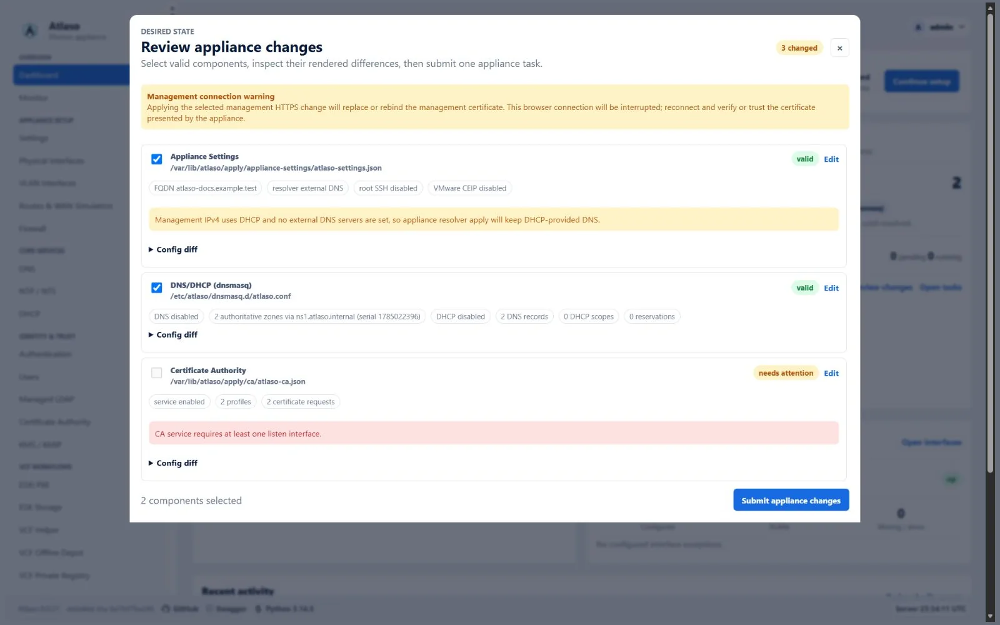
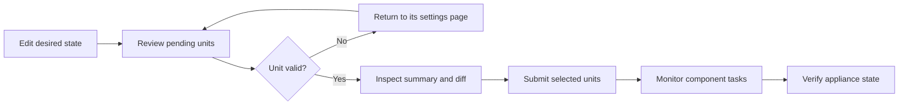

# Apply appliance changes

Appliance Apply enforces selected desired state from multiple service pages in one ordered Photon submission.

<!-- BEGIN GENERATED INTERFACE OVERVIEW -->
## Interface overview

This verified appliance view provides visual orientation before you begin.

*Figure: Appliance change review with valid and invalid desired-state units.*

<!-- END GENERATED INTERFACE OVERVIEW -->

!!! important
    Editing and applying are separate actions. Autosave updates Atlaso's desired state; it does not change Photon
    services. Host changes begin only after an administrator selects valid units and chooses **Submit appliance
    changes**.

## Before you begin

You need:

- an administrator account with permission to apply appliance changes;
- saved desired-state changes on one or more service or settings pages;
- validation errors resolved for every unit you intend to submit; and
- no other Appliance Apply task pending or running.

Before submitting a change that can interrupt management access, prepare the local appliance or VMware console.

## Understand the workflow

```mermaid
flowchart LR
    A[Edit desired state] --> B[Review pending units]
    B --> C{Unit valid?}
    C -- No --> D[Return to its settings page]
    D --> B
    C -- Yes --> E[Inspect summary and diff]
    E --> F[Submit selected units]
    F --> G[Monitor component tasks]
    G --> H[Verify appliance state]
```

Atlaso groups related settings into apply units. DNS and DHCP share one `DNS/DHCP (dnsmasq)` unit. Web Terminal changes
can require **Appliance Settings**, **Public Services**, and **Firewall**. A management-to-access conversion with a
gateway change also selects **Routing & WAN** with Network and uses the protected handoff. A WAN-only change
to a mirrored management default uses the same handoff. Each WAN unit executes from its captured snapshot.
Reverse-proxy publication is rendered with **Public Services**; enabled HTTPS listeners also depend on **Certificate
Authority**, listener admissions on **Firewall**, and managed authoritative records on **DNS/DHCP**. Review and select
the changed dependencies together. The [reverse-proxy guide](../services/reverse-proxies.md) describes its generated
artifacts and recovery checks.
When effective source NAT or port forwarding depends on changed Network and WAN state, reviewing Network also
selects and locks **Routing & WAN**. The review validates that WAN candidate before submission, so required changes
and any blocking errors are visible together.
**Routing & WAN** owns routing and WAN simulation; **Traffic Publishing** owns source NAT and port forwarding.
Turning either feature off removes its runtime state while preserving saved rows. NAT is **suspended** while Routing
is off. Port forwards couple Firewall and Traffic Publishing, including when deleting the last mapping; service edits
also validate listener conflicts. See [Traffic Publishing](traffic-publishing.md) for dependencies and recovery.

## Review pending changes

1. Finish editing the desired state on the relevant service pages.
2. Open **Review appliance changes** from the lower-left sidebar card or a page-level pending-change action.
3. Read the status of every changed unit:

   | Status | Meaning | What to do |
   | --- | --- | --- |
   | **valid** | The desired state passes current validation. | Inspect it and keep it selected if it belongs in this run. |
   | **needs attention** | Atlaso found an error that prevents submission. | Open the unit's page, correct the error, and review again. |
   | Warning | The unit is valid but has an operational caution. | Read the warning and confirm the effect before submission. |

4. Expand each selected unit and inspect its summary and rendered difference.
5. Clear the checkbox for a valid unit that should remain pending for a later run.

Valid changed units are selected by default; invalid units are not. Unselected units remain pending after submission.

Select **Network** to verify DHCP/SLAAC listeners and **DNS/DHCP** to publish generated DNS, even after startup renewal.
If applied listener ownership is unproven, apply the named service first. Inspect locked pending Certificate Authority,
Firewall, Appliance Settings, and Public Services changes; clear Network to defer them. Omitted dependencies block submission.

!!! warning
    Review related units together when a feature crosses service boundaries; partial application can leave behavior unavailable.

## Submit and monitor

1. Confirm that the selection contains only the units intended for this run.
2. Choose **Submit appliance changes**.
3. Keep the task dialog open while the master task and its component rows progress.
4. Open a component row to inspect its bounded, redacted result.
5. Wait for completion; the dialog, sidebar badge, pending count, and global write lock update without a page reload.

If another session starts an Apply after the current one, the monitor finishes the current task's refresh first.

Components run sequentially. On failure, Atlaso marks the rest **skipped**. Writes are locked while a master task
is pending or running; read-only pages, task inspection, authentication, and safe cancellation remain available.
A management-path change is the exception to independent component execution. Atlaso selects Certificate Authority,
Network, Firewall, Appliance Settings, and Public Services together after all other dependencies expand, then runs one
recoverable handoff. It retains the previous addresses, listener, firewall policy, and TLS identity until bounded Atlaso
loopback, candidate nginx, dynamic-address, and host-facing `/openapi.json` checks prove the candidate ready.
The transaction validates bundled TLS material, persists the candidate resolver and source-restricted firewall rules,
and retires the old path only after readiness succeeds. Before publishing the applied Network baseline, Atlaso records
the helper-confirmed DHCP or SLAAC address in observed interface state so the committed listener remains immediately
eligible. On failure it restores the complete previous state and records the same actionable failing layer and rollback
result on every bundled component.
Successful baselines use the submitted snapshots, including applied resolver values; unrelated desired changes remain
pending. A missing known-good Network baseline blocks mutation. Durable state and backups support safe recovery until
the database commit is proven and acknowledged. See the [technical reference](../reference/appliance-apply-technical.md)
for the complete handoff and recovery contract.

Safe cancellation does not interrupt the component already running. Every helper or adapter command in that component
continues to completion. After the component returns, Atlaso skips the remaining components and releases the mutation
lock when the master task becomes terminal.

An ordinary Appliance Settings Apply keeps management access online, checks readiness, and restores the previous
configuration on failure; see the [technical reference](../reference/appliance-apply-technical.md). Retained older tasks
may show **Applying management settings; Atlaso is reconnecting to task status.** Current tasks do not restart the worker.

If that reconnect exceeds the bounded grace window, or a status failure is not part of the planned restart, the dialog
instead shows **Live task status is temporarily unavailable** with a link-free instruction to open **Tasks** in another
tab if the problem persists. Atlaso continues retrying and retains the last known task and lock until an authoritative
response arrives. Use Tasks to inspect the master task and verify appliance connectivity before deciding whether to
reload the affected page.

## Verify the result

1. Confirm that the master task is **succeeded**.
2. Confirm that every selected component is **succeeded**, not **failed** or **skipped**.
3. Return to the affected service page and confirm its pending indicator cleared.
4. Verify the resulting runtime behavior from the relevant service guide.

When enabling local DNS, apply **DNS/DHCP (dnsmasq)** before the subsequent Appliance Settings resolver change. Atlaso keeps
the last-applied external or DHCP resolver active until then, so an unapplied selection cannot redirect to loopback.
When disabling applied local DNS, selecting **DNS/DHCP (dnsmasq)** includes **Appliance Settings** first, moving the
management resolver away from `127.0.0.1` before the local listener stops.
If enabling Management HTTPS creates a pending CA-managed certificate, the review includes **Certificate Authority** and
installs its files before **Appliance Settings**. Changing the management HTTP/HTTPS mode or public listener port uses
the protected handoff to recompute Network, Firewall, and Public Services listeners together. If Network has separate
pending edits, select Network explicitly with Appliance Settings before submitting that change.
Examples include checking service health, resolving a managed DNS name, reaching the intended listener, or confirming
installed configuration from the appliance console. Use the service-specific procedure; a green UI status is insufficient.

In development, adapters normally run in dry-run mode. A successful dry-run proves that Atlaso validated and recorded
the command intent; it does not prove that Photon services changed.

## Recover from a failed apply

1. Open the failed component and read its validation, ordered task events, error, and redacted command output.
2. Correct the desired state on the owning service page.
3. Review pending units again; successful units keep their baselines, while failed and skipped changes remain pending.
4. Submit only the units required for the corrected run.

Tasks retain bounded Apply stage, component, skip, cancellation, handoff, and recovery events at every log level.
Correlate their task IDs and timestamps with [Operational Logs](logs.md) and the [Audit log](audit-log.md).
Safe helper stages and return codes may be retained while the cause remains unknown. See
[Important-event coverage](logs.md#important-event-coverage) for retained evidence and limits.

If Atlaso restarts during an ordinary apply, startup fails the running child and master task, skips pending children,
and releases the global lock. For an interrupted management handoff, the privileged helper first stops and verifies any
surviving apply process, restores the captured previous runtime state, and records the recovery result.
The same path runs immediately after a helper wait timeout because the fixed apply service can outlive its waiting
process. Recovery uses a separate fixed service identity; before retrying, the helper stops and verifies any surviving
recovery service so two rollback attempts cannot mutate the same network state concurrently.
The helper retains that rollback state until Atlaso durably commits the bundled component results and baselines. If a
restart occurs after that database commit, startup idempotently acknowledges the committed candidate instead of falsely
claiming a rollback. A failed task whose helper acknowledgement or rollback is not proven retains the global Apply lock
until startup or immediate exception recovery reconciles that state, even when an older task payload lacks the newer
pending marker. Review the task before resubmitting.
If a selected unit changes before execution, Atlaso rejects the task and asks for a new review.

## Safety boundaries

- `/ui/management/appliance-apply` is the only ordinary desired-state host-mutation workflow. The confirmed complete
  factory reset on **Backup and Restore** is a dedicated recovery exception that validates and applies every clean
  factory unit itself; it does not create a follow-up Apply submission.
- Only one Appliance Apply master can be pending or running.
- Photon mutations use constrained `atlaso-helper` actions; the web process does not receive broad root access.
- Previews, diffs, task results, logs, and audit details redact sensitive-looking values.
- Secret-bearing Local Users, Certificate Authority, and Managed LDAP inputs use mode `0600` only during their helper
  execution window. Both the control plane and helper remove them on terminal outcomes, and startup removes stale
  inputs after interruption.
- Read-only Local Users status uses an isolated short-lived input and cannot overwrite a pending apply payload.
- A successful component updates only that component's last-applied baseline.
- Fresh-appliance baseline initialization records comparison metadata only; it does not run helper commands.

## Complete technical contents

No original section was removed. See the
[technical reference](../reference/appliance-apply-technical.md) for implementation and recovery contracts.
