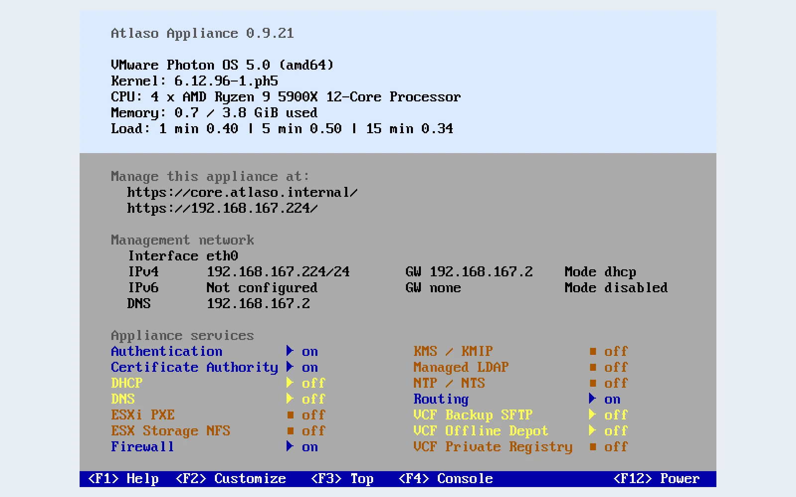

# Local appliance console

Use the local console when the management UI is unavailable or when you need direct status and recovery controls.
Atlaso owns only the first virtual terminal (`tty1`); `Alt+F2`, `Alt+F3`, and later terminals keep the normal Photon
login prompt.

<!-- BEGIN GENERATED INTERFACE OVERVIEW -->
## Interface overview

This verified appliance view provides visual orientation before you begin.

*Figure: VMware console after a successful appliance apply.*

<!-- END GENERATED INTERFACE OVERVIEW -->

## Before you begin

- Open the VM console in the deployed hypervisor.
- Use the Photon `root` password for authenticated recovery actions.
- Treat console networking and service changes as real appliance mutations.
- Prefer the web UI for routine desired-state editing when it is reachable.

The appliance image configures the local framebuffer at 1280×800 with the `VGA8x16` console font, providing 50 text
rows and 160 columns from boot onward. To verify the image-level console configuration after a fresh boot or reboot,
run `cat /sys/class/graphics/fb0/virtual_size` and `stty -F /dev/tty1 size` from a local shell. The expected results are
`1280,800` and `50 160`, respectively.

## Read the main screen

The main screen refreshes every five seconds and shows:

- the Atlaso and Photon versions, architecture, kernel, CPU, memory, and load;
- management interfaces, addresses, gateways, address modes, DNS servers, and management URLs;
- desired and runtime state for Atlaso-managed services; and
- the available function-key actions.

During the first 30 seconds after startup, a missing interface inventory is shown as
**Initializing appliance networking...**. If the interface remains missing after that period, the console reports the
normal actionable error.

A raw VMware VM with no OVF envelope confirms that state through 30 consecutive successful empty VMware Tools reads.
Atlaso then records non-OVF first-boot completion, logs **No OVF deployment properties supplied; using image
defaults.**, clears the initialization lock and any stale network-review handshake, and opens the ordinary console.
The warning does not require input. A reboot uses the durable marker and does not repeat the confirmation wait. If the
same disk is later deployed with a real OVF envelope, Atlaso discards the non-OVF classification and validates the
supplied deployment properties normally.

## Correct invalid VMware OVF networking on first boot

An OVF/OVA deployment with inconsistent management networking pauses before the network or data disks are initialized.
The console displays **First-time initialization — Network configuration requires review** and the non-secret OVF
address, gateway, DNS, and appliance-name values. This screen does not depend on management-network readiness.
From the first tty1 screen until the deployment root password applies, only Help and the bounded network-review action
are available; Customize, process monitor, root shell, and power actions remain locked.

1. Press `F2` or `Enter`.
2. Correct the prepopulated IPv4 and IPv6 modes, addresses, gateways, and DNS servers.
3. Select **Apply**, review the values, and choose **Continue initialization**.
4. Wait for the normal appliance console to replace the review state.
5. Verify `https://<management-address>/openapi.json` from another machine.

Static IPv4 and IPv6 gateways must be reachable through their configured prefix and cannot equal the interface address.
For IPv4 prefixes shorter than `/31`, both the interface and gateway must also be usable host addresses rather than the
network or broadcast address; `/31` point-to-point peers remain valid. An IPv6 link-local gateway is also valid. The OVF
customizer validates the complete correction before making any host change. The first-boot flow does not request,
display, or persist deployment passwords: it retains the original OVF credentials in the waiting customizer and accepts
only non-secret network corrections from the console.

Atlaso validates the FQDN, required properties, credentials, and root-SSH boolean before offering network-only
correction. If initialization stays on the starting screen and no network review appears, correct those non-network OVF
properties in the hypervisor and restart the deployment, or redeploy with corrected values. When VMware Tools has not
yet supplied a complete valid set of Atlaso OVF properties, the customizer keeps tty1 privileged actions locked and
retries unanswered, unreadable, malformed, incomplete, or invalid non-network responses instead of using the
image-build credentials; redeploy if valid properties never become available. Only a successful empty response can
contribute to the bounded non-OVF confirmation. A present envelope without complete valid properties remains blocked.
A reboot after successful customization removes any stale review document by trusting the redacted applied marker.
If a later customization step fails after either the original or corrected network validates, the review screen remains
backed by the waiting customizer. Resolve the safe condition named in
`/var/log/atlaso/vmware-ovf-customize.log`, then resubmit the network review to retry; the applied marker remains absent
until the retry succeeds. Before a retry changes the host, Atlaso durably removes any pending-success record left by the
earlier attempt, so an interruption cannot promote stale state on the next boot.

Credential scrub and applied-marker finalization occur after host customization has already succeeded. Those layers
retry from the durable pending-success marker without returning to network review, because changing DHCP or static
values cannot resolve deployment-property cleanup. A successful scrub clears `guestinfo.ovfEnv` through VMware Tools,
promotes the applied marker, removes the initialization/review handshake, and opens the ordinary console.

Service state uses compact labels:

| Label       | Meaning                                            |
| ----------- | -------------------------------------------------- |
| `▶ on/off`  | The runtime is running.                            |
| `■ on/off`  | The runtime is stopped.                            |
| `! crashed` | A backing unit failed.                             |
| `? on`      | The service is enabled but runtime is unavailable. |

## Choose an action

| Key   | Action                 | Authentication | Use it for                                                   |
| ----- | ---------------------- | -------------- | ------------------------------------------------------------ |
| `F1`  | Help                   | None           | Screen regions, state legend, navigation, and safety notes.  |
| `F2`  | Customize              | Root password  | Management networking, DNS, Firewall, and service isolation. |
| `F3`  | Process monitor        | Root password  | A temporary interactive `top` session.                       |
| `F4`  | Root shell             | Root password  | Advanced diagnosis when bounded recovery is insufficient.    |
| `F12` | Restart or shut down   | Root password  | Audited appliance power actions with confirmation.           |

Authentication is required again every time an authenticated action opens. Atlaso does not reuse a password or an
authorization result between menus.

## Recover management networking

1. Press `F2` and authenticate as Photon `root`.
2. Open the management network editor.
3. Choose the IPv4 and IPv6 modes.
4. Enter static addresses and gateways only when the corresponding mode is **Static**.
5. Enter external DNS servers.
6. Review the values and submit the change.
7. Wait while Atlaso applies corrected Network and Firewall state, observes the corrected addresses, retries unfinished
   first-boot HTTPS, applies Appliance Settings, and verifies local application plus nginx readiness.
8. Confirm that the console reports both appliance-apply task IDs and shows the expected management address and URL.
9. Verify that `http://<management-address>/` redirects to HTTPS from another machine.
10. Verify that `https://<management-address>/openapi.json` returns HTTP 200 from another machine.

The editor supports IPv4 DHCP or static configuration. IPv6 can be disabled, automatic through RA/SLAAC, or static.
Static IPv4 and IPv6 gateways must be on-link and cannot equal their interface address; an IPv6 gateway may instead be
link-local.

The recovery action updates Atlaso desired state and submits two synchronous, scoped global appliance-apply tasks. The
first always applies Network and Firewall so stale management-source restrictions cannot survive an address correction.
Atlaso reads host interface observations without reconciling inventory and waits up to 30 seconds for a usable
observed IPv4 address and, when enabled, IPv6 address on the corrected interface. Static observations must match
the address and prefix captured by the completed Network task;
DHCP and automatic IPv6 observations remain separate from desired state. If inventory is unavailable or either
requested family has not acquired a usable address, recovery and Appliance Settings stop with an observation error.
Check the interface and DHCP/IPv6 acquisition, then retry the console correction.
Before acknowledging HTTPS recovery, Atlaso reobserves dynamic addresses on the exact interface and MAC.
The complete DHCP/SLAAC address set must match the original publication receipt and the served leaf SANs.
A changed lease, withdrawn prefix, unavailable link, or discovery timeout leaves the CA baseline pending.
HTTP-only recovery also retains its original dynamic address scope before readiness and reobserves it
under writer admission before reporting success. A later inventory refresh cannot redefine that captured scope;
changed DHCP leases or SLAAC prefixes require another recovery attempt. HTTP recovery does not publish CA state.
The interface must be administratively and operationally up; a retained address on a disconnected link cannot pass.
Every enabled management path in the completed snapshot must be eligible. A management VLAN with a missing,
down, or non-trunk parent stops recovery and Settings capture even when another physical listener works.
Native observation also proves each VLAN's tag, configured IPv4/IPv6 addresses and up state against the completed
snapshot, including its parent's pinned MAC and native link identity. A missing or down VLAN or parent blocks all
observation publication. Final HTTP and HTTPS acceptance repeats this proof under writer admission within its
five-second native-discovery budget; a working physical listener cannot hide a failed VLAN path.
Each discovery attempt uses the remaining acquisition timeout, so a stalled command cannot leave the console waiting
indefinitely. Tentative or duplicate-address-detection-failed addresses cannot pass.
If newer address edits are pending, Atlaso records the applied observation but stops dependent recovery and Settings;
apply or reconcile those edits first.

After observation succeeds, Atlaso refreshes HTTPS with the completed Network task even when first boot is complete.
Bound recovery preserves desired state and bypasses first-boot seeding and inventory reconciliation even when
first-boot evidence is incomplete. Bound recovery validates the applied site without requiring its first-boot marker.
It preserves
the applied management protocol and listener ports while refreshing certificates. Bootstrap restart has
a bounded inner deadline; a timeout requests service cancellation. Recovery removes or replaces a task binding only
after systemd proves that no bootstrap job is queued or running. A still-active or ambiguous binding is preserved.
Atlaso validates nginx
before any reload, and ensures nginx and Atlaso are enabled and running. After the second task applies Appliance
Settings, the console requires five stable local checks: application `/openapi.json` on port 8000 plus the applied
nginx management mode. Bound HTTP-only recovery also rechecks the completed Network paths and required dynamic
observations under writer admission before native site validation. After stable HTTP readiness, it repeats admitted
Network and applied HTTP-mode/port checks before reporting success. Settings publication records its executed baseline
with the confirmed restart transition before releasing admission. Bundled management handoffs retain the same
writer admission from staging through their executed baseline commit. CA subject/settings and profile creation, edit and
deletion share recovery admission, so issuance policy cannot change during an admitted recovery.
CA reconciliation also takes admission when an Appliance Settings API or browser save commits its outer transaction.
These saves read their Settings state after admission, and issuance refreshes cached CA material without releasing
the caller's transaction or discarding its staged desired changes. Post-handoff native discovery has a five-second
deadline; failure publishes no observations. Bound readiness probes reserve twelve seconds of the shared operation budget
for final service-state, native address and TLS attestation; unbound recovery reserves only its two-second service check.
Every baseline merge shares writer admission and reloads the JSON baseline row, preserving concurrently applied units.
HTTPS mode requires the HTTP redirect and HTTPS
`/openapi.json`; HTTP-only mode requires
HTTP `/openapi.json`.

It never falls back to unvalidated host commands. A validation, bootstrap, firewall, nginx, service, or readiness
failure names the failing layer on the console and leaves unapplied desired state pending for review in the web UI.

## Isolate or restore appliance services

Use **Disable all appliance services** when troubleshooting requires maintenance isolation. Atlaso records the current
enabled and active state, stops the application services, and preserves the console, management networking, resolver,
and firewall persistence services.

While isolation is active, the action changes to **Restore appliance services**. Restore uses the saved state and does
not enable units that were previously disabled.

## Open a process monitor or root shell

- Press `F3`, authenticate, and use `top`. Press `q` to return to the Atlaso screen.
- Press `F4`, authenticate, and use the root Bash session only for necessary diagnosis. Run `exit` or press `Ctrl+D` to
  return.

Root-shell open and close events are audited as `console:root`. The screen is cleared before the status interface is
redrawn.

## Restart or shut down

Press `F12`, authenticate, choose the power action, and confirm it. Restart and shutdown use the delayed, audited,
constrained power helper. `Ctrl+Alt+Del` is disabled so it cannot bypass this workflow.

## Verify recovery

After any console change:

1. Check the displayed management addressing and service exceptions.
2. Open the management URL from another machine.
3. Verify `/openapi.json`.
4. Review the resulting task and audit event in the web UI.
5. Resolve or roll back any desired state left pending by a failed action.

For systemd ownership, redraw behavior, GRUB branding, service-isolation boundaries, and configuration paths, see the
[local console technical reference](../reference/appliance-console-technical.md).

Certificate bootstrap is bound to the completed Network task and checks its management paths while holding the shared
writer lock through issuance. Certificate projection reads saved service settings without initializing optional rows
or reconciling service defaults, so incidental commits cannot release that lock.
Pending address, VLAN, or administrative-state changes stop recovery before certificate
mutation. Completed recovery publishes only the management leaf; it leaves other certificates and revocation files
untouched. Its hostname and terminal SANs come from applied Settings, so pending Settings edits cannot change the
recovery leaf. Publication uses the certificate/key paths captured in applied Settings, keeping nginx on the refreshed
leaf even when its filenames use a prior hostname. Missing applied identity or paths stops recovery.
A missing or changed applied CA root requires
ordinary CA Apply before recovery. After nginx reload, stable readiness and served-leaf proof against the task-bound
publication receipt, successful publication
records only the refreshed leaf in the CA baseline, preserving unrelated pending CA intent; a failed publication
does not advance that baseline. Upgrade comparison accepts both legacy naive SQLite and timezone-aware PostgreSQL
UTC expiry encodings without rewriting applied evidence or hiding real certificate changes. Readiness probes use the
applied default HTTP and HTTPS listener ports, including
nonstandard ports. Ordinary CA Apply shares the publication writer lock and records only its executed payload; after
listener reloads it reacquires admission and refuses a baseline commit if recovery or a desired edit superseded that
payload. Transient recovery loads the appliance environment and state working directory before acknowledgement,
so it uses the appliance database. First-boot publication records its exact captured CA baseline.
Recovery also requires the applied CA issuance policy: subject and digest settings and every profile's
key, validity, and usage constraints must still match the captured CA snapshot. Pending policy edits stop
recovery before issuance. Older snapshots without this policy evidence require an explicit CA Apply first;
recovery never infers or rewrites their provenance. Disabled IPv6 is cleared during inventory reconciliation
and excluded from management certificate addresses even when a stale observation remains.
Native observation also skips deprecated addresses and expired preferred lifetimes, so renumbering selects
the new preferred dynamic address rather than a still-valid old lease.
The completed Network snapshot can include newly enabled flagged-access management listeners. The console
observes every applied physical management path together, proving each name/MAC and requested address family
before publishing observations and starting certificate recovery. A missing listener or lease blocks recovery.
Startup/UI inventory, console observation, and helper-confirmed lease refresh acquire the shared writer
before native discovery. A delayed inventory reader cannot publish a pre-admission lease over a newer console observation.
Because service startup can clear a temporarily missing lease, the console repeats complete observation before
Settings capture and again before its second recovery. Scoped issuance and receipt acknowledgement refuse
a missing requested dynamic family rather than issuing or accepting a leaf without that address.

Before Appliance Settings is submitted, the console rechecks the completed Network management paths under the shared
network-object writer lock held through Settings capture. An address edit made during HTTPS recovery stops submission
and remains pending; it cannot enter Settings as though Network had already applied it.
