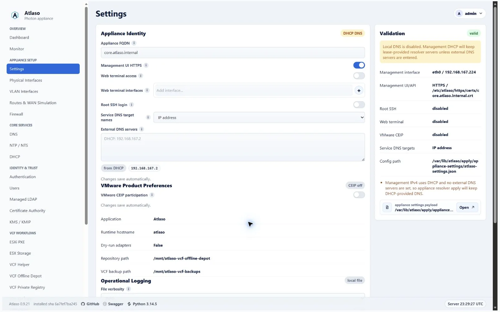
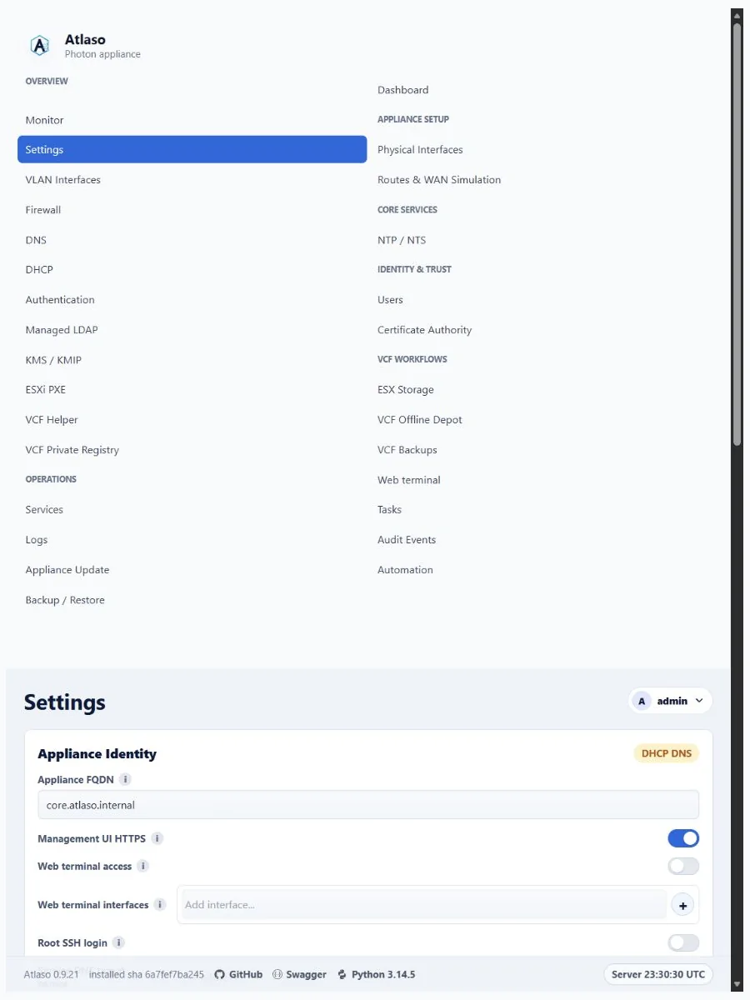
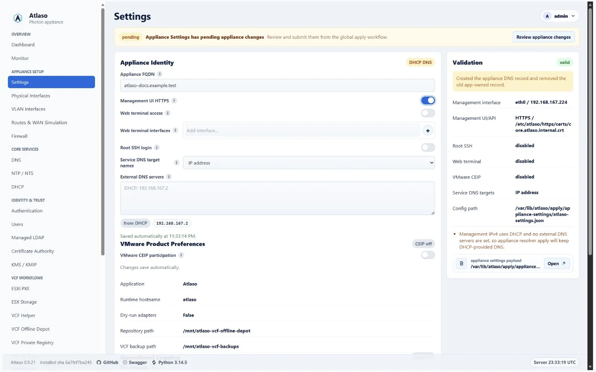
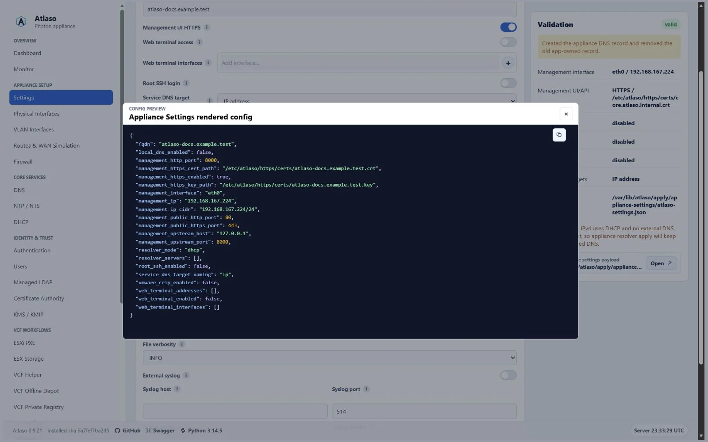
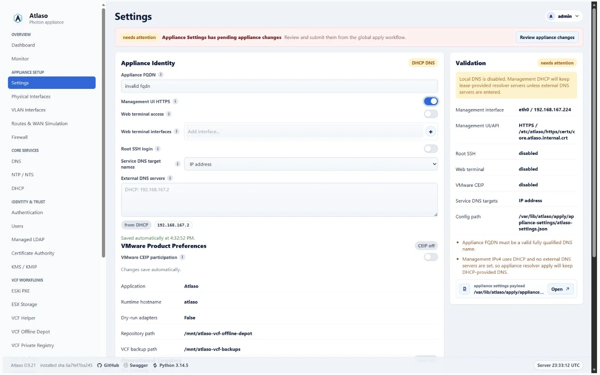

# Appliance settings

Open **Appliance Settings** to edit appliance-wide desired state: the appliance FQDN, OS hostname, resolver mode and
servers, management UI HTTPS preference, and root SSH login preference.

<!-- BEGIN GENERATED INTERFACE OVERVIEW -->
## Interface overview

This verified appliance view provides visual orientation before you begin.

*Figure: Settings in the verified clean-appliance desktop state.*

<!-- END GENERATED INTERFACE OVERVIEW -->

## Configure authentication lifetimes

The **Authentication lifetimes** section saves immediately and does not create a pending Appliance Apply unit:

- **Browser session inactivity timeout** defaults to 30 minutes and accepts 5 through 1,440 minutes. Atlaso evaluates
  the current value before every protected browser handler, so lowering it can expire an existing inactive session on
  its next request. Raising it does not resurrect a session that already expired.
- **Maximum API token lifetime** defaults to 90 days and accepts 1 through 365 days. It applies only when a new token is
  issued. An omitted expiry uses the configured maximum; an explicit timezone-aware future expiry may be shorter.
  Existing token expiry timestamps remain unchanged.

Atlaso stores browser activity server-side. Full-page navigation, submitted forms, deliberate browser actions, and the
CSRF-protected activity heartbeat extend the timeout. Static assets, background status polling, and passive page
refresh requests do not. At the exact inactivity boundary Atlaso invalidates the session before the protected handler,
clears browser identity and CSRF state, records a sanitized audit event, and returns `401` to fetch/API consumers. Human
navigation returns to the appropriate management, public, or protocol login surface with **Session expired due to
inactivity**.

The OIDC provider applies the same timeout to its separate `/identity` browser session. Its signed cookie carries only
an opaque session identifier; Atlaso persists the authoritative activity and terminal-expiry state. A successful
credential submission starts the session, while silent `prompt=none` authorization does not refresh it. Once the
deadline is reached, silent authorization returns `login_required`, and raising the policy cannot resurrect that
expired session; a new interactive sign-in is required.

Settings archives preserve both policy values but exclude active browser-session records. Factory reset restores the
30-minute and 90-day defaults and invalidates all earlier sessions and tokens.
During the first upgrade that introduces the persisted token policy, Atlaso migrates a valid legacy
`ATLASO_API_TOKEN_TTL_DAYS` value instead of silently replacing it with the 90-day default. Subsequent startups retain
the database policy, so removing or changing that legacy environment variable does not overwrite operator state.

## Before you begin

Confirm the intended management hostname and DNS records. Keep an alternate console session available before changing
management connectivity or SSH policy. Routine field changes autosave, but they do not change the host immediately.

## Edit and validate

1. Change only the desired-state fields required for the maintenance window. Authentication lifetime fields use their
   separate immediate autosave boundary described above.
2. Watch the compact autosave status.
3. Resolve errors or warnings in the Validation card.
4. Open the rendered preview and confirm the hostname, resolver, HTTPS, and SSH effects.
5. Open **Pending Appliance Changes** and submit the valid Appliance Settings unit.

The review modal may include other changed units. Unselect unrelated work before submission.

Changing the domain portion of the appliance FQDN also reconciles factory-derived service identities. Atlaso derives
each factory hostname from the new appliance domain, updates coupled OIDC issuer and managed-certificate desired state,
and safely refreshes app-owned DNS aliases. Explicitly customized service hostnames and operator-owned DNS records are
preserved. Review every affected service, Certificate Authority, DNS/DHCP, Firewall, and Public Services unit shown as
pending; autosave changes desired state but does not apply those units to the host.

The root SSH preference controls whether the root account may log in remotely; it does not control ordinary
bootstrap-administrator SSH. Firewall admission for that administrator follows the effective management listener,
including a flagged access physical interface or VLAN, while unflagged access networks remain closed on TCP/22.

## Verify and recover

After the task succeeds, confirm the expected management URL and resolver behavior. If management access is lost, use
the [local appliance console](appliance-console.md) to inspect networking and restore a known-good configuration.

<!-- BEGIN GENERATED ADDITIONAL SCREENSHOTS -->
## Additional verified states

These captures show responsive layouts and useful operational states referenced by this page.

### Appliance Settings

*Figure: Settings in the verified clean-appliance responsive state.*

*Figure: Valid Appliance Settings waiting for global appliance apply.*

*Figure: Rendered Appliance Settings configuration preview.*

*Figure: Appliance Settings validation error for an invalid FQDN.*

<!-- END GENERATED ADDITIONAL SCREENSHOTS -->
