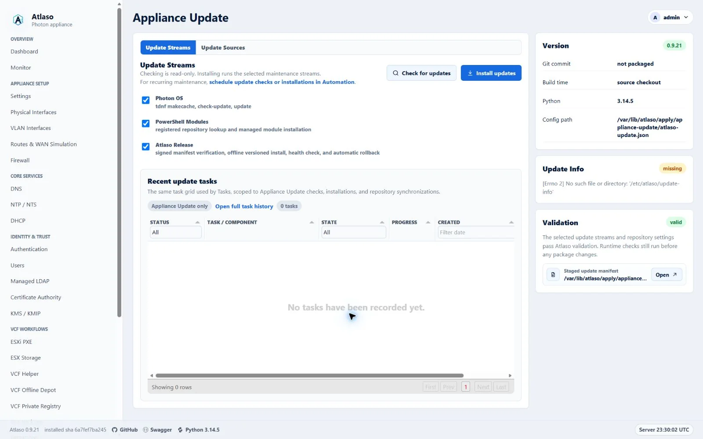
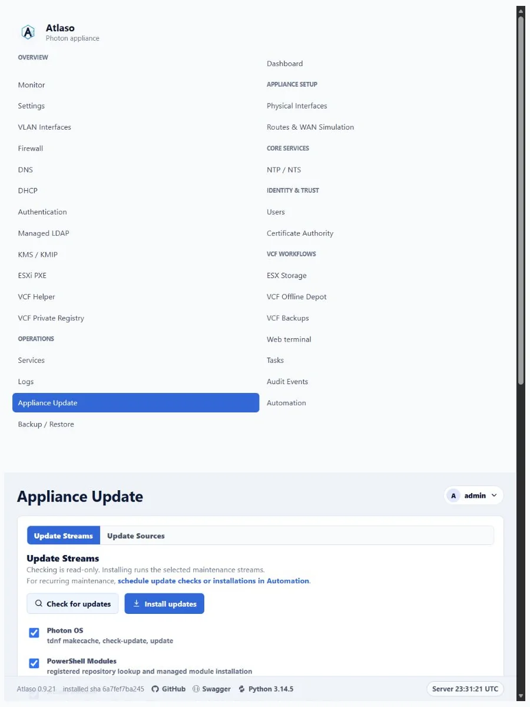

# Signed Appliance Releases and Photon Updates

Appliance Update is audited runtime maintenance, separate from desired-state enforcement and `/appliance-apply`. The web
process queues work, and `atlaso-worker.service` executes it as a durable `appliance-update` task. Each manual or
scheduled check/install is one parent task with an ordered child step for every selected stream. The child owns its
status, progress, timestamps, compatibility evidence, error, and bounded redacted helper output. The parent retains the
shared source snapshot and aggregates the selected channel and release, verified key ID, checksums, service checks,
rollback result, and final outcome.

<!-- BEGIN GENERATED INTERFACE OVERVIEW -->
## Interface overview

This verified appliance view provides visual orientation before you begin.



*Figure: Appliance Update in the verified clean-appliance desktop state.*

<!-- END GENERATED INTERFACE OVERVIEW -->

## Update streams

Atlaso has three update streams:

- **Atlaso Release** installs one signed, self-contained application release. It replaces the former independent Atlaso
  wheel and Python Libraries streams.
- **Photon OS** checks or installs packages only after validating the proposed system Python ABI against the active
  Atlaso release.
- **PowerShell Modules** checks or installs the explicitly managed modules from their selected repositories. After
  installing or updating `VCF.PowerCLI`, the helper reapplies and verifies the centralized VMware CEIP preference at
  PowerCLI `AllUsers` scope. Explicit `User` and `Session` overrides remain outside Atlaso ownership. Privileged
  PowerShell work uses the root-owned home `/var/lib/atlaso/powershell`, so synchronized repository state persists
  without depending on the service's read-only `/root` view.

The appliance never performs a broad runtime `pip --upgrade` and never contacts PyPI during a Atlaso release update.
Application dependencies and bootstrap tools are exact, hash-locked wheels inside the release bundle.

Checks execute every selected child even when another check fails, which keeps diagnostics independent. Installations
preserve the safety order Atlaso Release, PowerShell Modules, then Photon OS. PowerShell remains independently
observable after a release failure, while Photon is marked **skipped** with an explicit reason if either earlier
selected stream failed. The parent succeeds only when every selected child succeeds.

## Release sources and channels

GitHub is the default distribution origin:

- GitHub Releases stores immutable versioned manifests, signatures, and bundles.
- GitHub Pages publishes signed `development`, `preview`, and `stable` channel pointers. Its root serves a small
  informational release-repository page; appliances continue to use only the signed JSON documents under `/updates`.
- A successful `main` CI run publishes the exact successful commit as `vX.Y.Z` and advances `development`.
- A protected manual dispatch may recover a failed publication only by naming a full commit that already has a
  successful `main` push CI run. The workflow verifies that provenance and that the commit remains on `main` before
  rebuilding and signing its deterministic release inputs.
- The manual promotion workflow advances `preview` or `stable` to an existing verified release. Promotion never rebuilds
  the artifact.

The default source is:

```text
https://mdaneri.github.io/Atlaso/updates
```

The human-facing Pages URL is `https://mdaneri.github.io/Atlaso/`. The repository name is case-sensitive in the
project-site path. The landing page contains no updater state or trust material and does not replace signature
verification.

For the `stable` channel, the appliance reads:

```text
https://mdaneri.github.io/Atlaso/updates/channels/stable/manifest.json
https://mdaneri.github.io/Atlaso/updates/channels/stable/manifest.json.sig
```

Operators may add HTTPS mirrors and failover sources. A mirror copies the original channel pointers, release manifests,
signatures, and bundles without re-signing them. Every source must satisfy the same signed v2 contract. Credentials
remain encrypted in the database and move to the privileged helper only in the existing mode-0600 transient file. They
are not written to manifests, tasks, audits, URLs, or helper output.

Photon and PowerShell source fields autosave as desired runtime-maintenance configuration. **Synchronize repositories**
explicitly writes only Atlaso-owned tdnf and PowerShell client configuration. Their source cards show whether that
synchronization has not run, succeeded, or failed. Signed Atlaso sources are read directly, are checked during each
update, and do not configure pip or report package-client synchronization state.

Each source editor presents repository identity first, then its location or discovered runtime data, followed by one
grouped **Repository behavior** row. Autosave and synchronization state remain together in a separated footer, with
repository deletion isolated as the destructive action.

Managed PowerShell module editors follow the same hierarchy: module identity and version policy first, then a grouped
**Module behavior** switch and a separated autosave/delete footer. The Update Streams workspace keeps the shared Tasks
grid, server-scoped to Appliance Update tasks. It preserves the standard sorting, filtering, component tree, progress,
row menu, and detail behavior. Because the embedded endpoint is already scoped to Appliance Update, the Task / Component
column is fixed there; the full Tasks page retains its editable component filter. The grid expands through the remaining
Update Streams workspace height rather than using a compact fixed-height embed. This table replaces the former Last
Update rail and submission-result cards. Checks and installations submit asynchronously: only grid data refreshes, the
new task is highlighted, and both action buttons remain disabled until that task succeeds, fails, or is cancelled. The
stream actions use explicit **Check for updates** and **Install updates** labels, with distinct search and install cues
and visible copy that identifies the check as read-only. The same header links recurring maintenance to the Automation
Schedules workspace, where operators can schedule Appliance Update checks or installations. The Update Info rail card
reports whether durable updater evidence is available and opens the full JSON through the shared preview modal, matching
Validation instead of rendering unbounded output inline.

## Trust contract

Appliances contain named Ed25519 public keys under:

```text
/etc/atlaso/update-trust.d/<key-id>.pem
```

Private signing keys exist only in the protected `appliance-release` GitHub environment. The updater rejects missing,
malformed, unknown-key, mismatched, or invalid signatures. A release may add a future public key because its contents
are already signed by a currently trusted key. Old keys are retained until an overlapping signed release has provisioned
the replacement.

Photon image builds stage the checked-in `image/common/update-trust` directory and fail if it is missing, empty, or
contains a malformed public key. The development-only VMware `deploy-wheel.ps1` bridge also synchronizes every
checked-in `.pem` public key into the root-owned trust directory. Updating only the application wheel cannot repair a
missing trust store because the unprivileged application does not write `/etc`.

If an appliance reports that a named channel signing key is not trusted, first verify that the matching checked-in
public key exists on the appliance:

```sh
sudo ls -l /etc/atlaso/update-trust.d/
sudo openssl pkey -pubin \
  -in /etc/atlaso/update-trust.d/<key-id>.pem \
  -noout
```

Rebuild or redeploy an affected development appliance with the corrected image or `deploy-wheel.ps1`. Production
operators must provision the exact published public key through a trusted out-of-band appliance maintenance path; never
disable signature verification or copy private signing material to an appliance.

A signed channel pointer contains its channel, selected version and full commit, immutable release-manifest URL, issue
time, and signing-key ID. The signed release manifest contains its version and commit, build time, updater protocol,
database schema version, supported Python ABIs, bundle URL/size/hash, and a hash for every bundled file.

Atlaso accepts only signed v2 channel pointers and immutable release manifests. The Pages root is informational and is
not part of the update trust contract.

## Transactional installation

The helper verifies the channel and release signatures, URL contract, updater protocol, current Python ABI, bundle
size/hash, safe archive paths, exact content set, and per-file hashes before it can switch the running release.

Each candidate is built under:

```text
/opt/atlaso/releases/<version>
```

The helper creates the candidate virtualenv from the ABI-specific retained wheelhouse with `PIP_CONFIG_FILE=/dev/null`,
`--no-index`, `--require-hashes`, and no network dependency resolution. It then runs `pip check`, imports the
web/worker/console modules, and validates the installed entry points. `/opt/atlaso/current` points at the active
release, while `/opt/atlaso/.venv` points through `current` to its virtual environment.

Before switching, the helper enables the nginx maintenance response, pauses the web and console services, closes the
worker's database session, and creates a consistent SQLite backup. It atomically changes `current`, installs the
matching privileged helper and systemd definitions, starts the application, and probes internal `/openapi.json`.

Any failure restores the previous release link, helper/systemd files, and database snapshot before maintenance mode is
removed. A root-owned finalizer at `/var/lib/atlaso/apply/appliance-update/finalizer-status.json` records the definitive
transaction result so the worker can persist the durable task outcome. Without a matching definitive finalizer, worker
startup marks an interrupted running parent failed even when every child step committed before the restart; child
results remain available as recovery evidence. Only the current and previous known-good releases are retained; the UI
does not expose arbitrary historical downgrades.

## Photon OS boundary

Manual and scheduled Photon checks/installations remain available. Before mutation, the helper records an inspection of
the proposed tdnf transaction and queries all repository candidates with the Photon-supported `tdnf repoquery python3`
interface, then deterministically selects the highest advertised minor ABI. It fails closed if that ABI is not listed in
the active signed Atlaso bundle.

If Photon changes Python to another supported ABI, the helper reconstructs the active virtualenv from the retained
offline wheelhouse before restarting and probing Atlaso. It does not claim automatic RPM rollback and never reboots
automatically. If OS maintenance leaves the appliance unhealthy, the task records the transaction evidence and manual
recovery boundary.

Atlaso 0.9.18 is a clean-break appliance release. It does not migrate databases, schedules, credentials, update sources,
or installed environments from the retired product. Deploy a fresh Atlaso appliance and configure its signed update
sources directly.

## Signed lifecycle fixture

Hyper-V lifecycle coverage can exercise the complete release transaction with:

```powershell
scripts/windows/hyperv/invoke-lifecycle-test.ps1 `
  -SignedReleaseRepositoryUrl https://release-fixture.example.test/updates
```

The fixture must use the appliance's named test trust key. Its signed `preview` channel must select a healthy release
newer than the image baseline; its signed `development` channel must select a candidate that reaches database startup
and then fails the service-health probe. The lifecycle runner proves that each release task exposes a Atlaso Release
child step, proves the preview upgrade, expects the development parent and child to fail with `rolled_back=true`, and
compares the active release, compatibility virtualenv, database schema hash, and user identities before and after
rollback. It then rechecks the web, worker, console, internal `/openapi.json`, and host-facing API. Omitting the URL
skips only this externally supplied fixture.

## Release operator workflow

The protected workflows use these checked-in inputs:

```text
requirements-appliance.lock
requirements-appliance-bootstrap.in
requirements-appliance-bootstrap.lock
requirements-release-tools.in
requirements-release-tools.lock
image/common/update-trust/
```

These dependency inputs and hash locks are committed public release inputs: they contain package metadata and integrity
hashes, never credentials or private package-index configuration. The CI declaration fingerprint prevents dependency or
Python-range changes without a regenerated hash lock. Release CI installs only the hash-locked bootstrap tools, verifies
every downloaded wheel or source archive against the checked-in lock, builds any missing pure wheel without build
isolation, and writes an ABI-specific `requirements-wheelhouse.lock` over the resulting wheel bytes. It does this for
the appliance's CPython 3.14 runtime before running:

```bash
python scripts/build_release_bundle.py \
  --wheelhouses wheelhouses \
  --signing-key /protected/release-key.pem \
  --signing-key-id atlaso-release-2026-01 \
  --commit <successful-main-sha>
```

Publication is idempotent. An existing tag or release must identify the same commit and exact asset bytes or the
workflow fails. Annotated release tags use an explicit GitHub Actions bot identity and do not depend on runner-global
Git configuration. Each GitHub Release description keeps the exact signed source commit first, then appends GitHub's
generated changelog. The checked-in release-note configuration groups merged pull requests as new and improved work,
fixes, documentation, dependency updates, or other changes; dependency updates are excluded from the enhancement group
so they appear only once.

To preview generated notes for the current signed-release lineage without changing GitHub, authenticate `gh` for the
repository and run:

```bash
python scripts/backfill_release_notes.py --start-tag v0.9.18
```

Review every rendered body before adding `--apply`. The command resolves each release's annotated tag to its exact
commit, uses the immediately preceding published semantic-version release as its comparison point, and preflights the
entire range before the first edit. Historical tags predate the checked-in release-note configuration, so the command
requests GitHub's default merged-pull-request, contributor, and comparison content, then groups those pull requests from
their current labels using the same Atlaso category precedence. It updates only a legacy provenance-only body, skips
notes that already match, and refuses unexpected or manually customized text. Immediately before each edit it
revalidates that the body and release identity still match the preflight snapshot. After every edit it verifies that the
title, tag, target, publication state, and asset identity remain unchanged:

```bash
python scripts/backfill_release_notes.py --start-tag v0.9.18 --apply
```

Atlaso starts a new signed update lineage at `v0.9.18`; it does not consume or publish the retired product's update
bridge. If an otherwise successful `main` release fails after signing but before publication, run **Publish appliance
release**, provide the exact successful `main` commit in `release_sha`, and verify the recovered tag, release assets,
signatures, and `development` pointer. The dispatch refuses commits without a successful `main` push CI run and
preserves the normal tag/release mismatch checks. If the tag and release already published but channel advancement
failed, dispatch the same successful SHA again: publication verifies the existing asset names and bytes before retrying
the signed pointer update.

To promote, run **Promote appliance release**, choose `preview` or `stable`, and provide an existing version without the
`v` prefix.

Schedules for checks or installs live under **Operations → Automation**. See [`automation.md`](automation.md).

<!-- BEGIN GENERATED ADDITIONAL SCREENSHOTS -->
## Additional verified states

These captures show responsive layouts and useful operational states referenced by this page.

### Appliance Update



*Figure: Appliance Update in the verified clean-appliance responsive state.*

<!-- END GENERATED ADDITIONAL SCREENSHOTS -->
