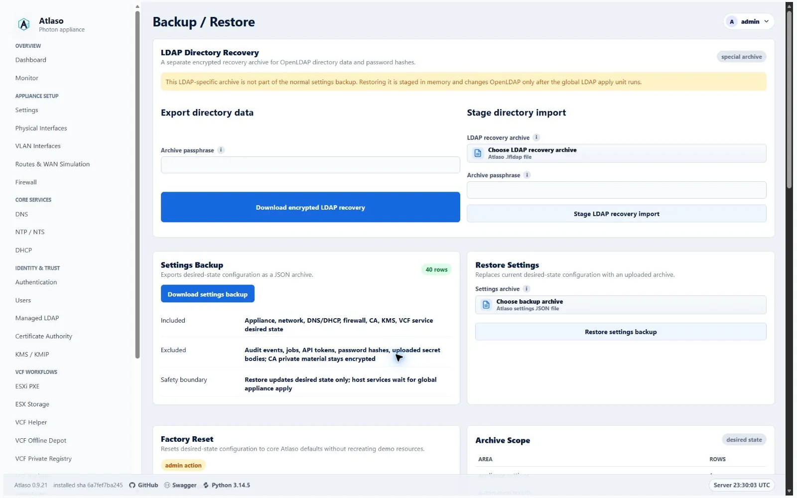
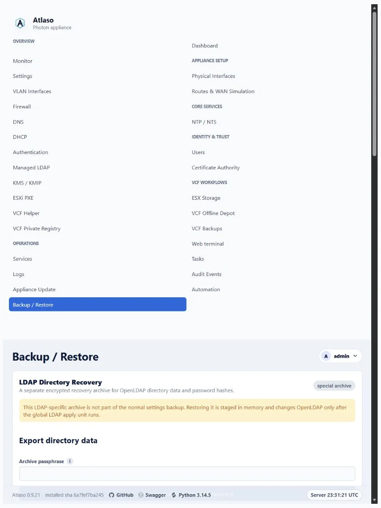

# Backup and restore

Open **Backup and Restore** to protect Atlaso settings before maintenance and recover the control-plane configuration
when needed.

<!-- BEGIN GENERATED INTERFACE OVERVIEW -->
## Interface overview

This verified appliance view provides visual orientation before you begin.

*Figure: Backup and Restore in the verified clean-appliance desktop state.*

<!-- END GENERATED INTERFACE OVERVIEW -->

## Create a backup

1. Create a named backup before a high-risk configuration or update operation.
2. Download the archive and store it according to the environment's access policy.
3. Retain the appliance secrets key with the appliance recovery material; encrypted private keys are not portable
   without it.

Backups can contain operational configuration and encrypted sensitive material. Do not attach them to public issues.
VCF/ESX password vault entries are not included in settings archives. Restore clears vaults and the unused legacy
Kickstart-binding compatibility table; recreate or reimport vault entries before re-enabling dependent scripts or PXE
workflows. Non-secret ESXi PXE custom-variable catalog definitions and defaults are included so restored Kickstarts
retain their `{{custom.*}}` prerequisites. Uploaded VCF Private Registry CA bundle bytes are also excluded. When an
enabled registry depends on an uploaded bundle instead of the internal CA, the export records the registry as disabled;
upload the CA bundle again and review the registry settings before re-enabling it.

## Return the complete appliance to factory state

**Factory reset appliance** is not a settings-only restore and does not require a later Appliance Apply. After the
administrator explicitly chooses whether to keep or change both the bootstrap administrator and root passwords and
confirms the destructive action, Atlaso creates a durable non-secret recovery marker, stops database
writers, builds a private replacement database, validates all generated runtime configuration, and activates the clean
state for all 16 apply units. Only after the candidate passes validation does Atlaso atomically replace the active
database. The management plane restarts and the initiating browser is handed back to sign-in.

The reset:

- removes all control-plane records, including local and external users, password hashes, API tokens, sessions,
  schedules, queued and completed jobs, automation history, audit events, vault entries, certificates, VLANs, routes,
  service configuration, and settings-archive metadata;
- stops Atlaso, its worker, and the tty1 console, then repeatedly inventories, stops, and verifies UUID-named
  `atlaso-helper-action-*` transient services until none remain before inventorying and cancelling every bounded
  `atlaso-update-restart-*` timer and service; reset cleanup and root-password actions use that bounded family too; it
  propagates the helper-action mode into the scheduled reset runner so those bounds also apply to web-triggered resets;
  it then stops and verifies every timestamped `atlaso-automation-*` transient service before runtime activation so no
  in-flight helper, delayed update restart, console mutation, or pre-reset script with a loaded vault credential can
  outlive the reset transaction; readiness restarts and verifies the console with the other required services;
- recreates only factory/bootstrap records, including the bootstrap accounts, management `eth0`, the appliance DNS
  record, and built-in CA profiles; VCF Offline Depot download profiles are not recreated;
- enables the minimum routing, firewall, authentication, and management-plane defaults while leaving optional services
  disabled, then records identical desired and applied baselines so **Review appliance changes** shows zero pending
  units;
- inventories live Atlaso-owned VLAN definitions and dedicated route tables after validation, then removes those VLAN
  links, route-table entries, and route-bound WAN impairment qdiscs before applying factory networking; this bounded
  cleanup does not depend on a possibly missing or stale database apply baseline; and
- changes the appliance-instance identity, invalidating every earlier browser session and bearer token.

The operation deliberately preserves payload files on documented storage paths. This includes VCF Offline Depot
content under `/mnt/atlaso-vcf-offline-depot`, backup artifacts under `/mnt/atlaso-vcf-backups`, VCF Private Registry
payload under `/mnt/atlaso-vcf-registry`, and managed ESX Storage payloads. Their database references are removed, so
an administrator must explicitly rediscover, reconfigure, or delete retained payload later. Fixed transient Apply
staging under `/var/lib/atlaso/apply` is scrubbed; secret-bearing Local Users, CA, and LDAP staging is also removed on
failure. Successful reset also removes retained VCF Backup authorized keys, the Web Terminal CA key pair, and pending
Web Terminal signing requests so re-enabling either feature cannot reuse credentials from before reset. The bootstrap
account home is retained, but its SSH authorization files are removed. OIDC browser cookies carry the appliance-instance
identity and are rejected after reset even when a recreated bootstrap user receives the same database identifier. CA
private-key paths present before reset but omitted from validated factory state are removed after runtime activation;
paths retained by factory state are rewritten and preserved. The disabled KMIP service's operational store and KEK are
removed, as are the managed Photon repository file, its embedded credentials, the synchronized update-source state, and
Atlaso-registered PowerShell repositories. Atlaso synchronizes every affected directory before advancing the durable
marker to management-readiness verification, so a reboot cannot restore a deleted staging or credential entry. Payload
storage remains outside this cleanup boundary.

Earlier sessions, bearer tokens, service credentials, and removed-account credentials stop working. The reset preserves
the current bootstrap administrator web/Photon password and root password for each **Keep current password** choice. A
**Change password** choice applies the submitted value during the protected reset transaction; the administrator value
becomes both the bootstrap web credential and its Photon OS password, while the root value changes only the Photon root
account and does not enable root SSH. New values must satisfy the packaged factory Local Users password policy, even
when the appliance currently permits a weaker policy. Atlaso gives each reset request its own mode-`0600` staging file;
the helper admits only one request at a time and a busy request removes only its own file. An admitted request copies
the values into root-only durable reset recovery state, passes OS values through the constrained helper and stdin, and
retains the credential file until a durable post-activation marker proves only readiness remains. Runner and finalizer
then remove it idempotently. Password values never enter
the database, recovery marker, tasks, audits, logs, or UI responses. Sign in using the bootstrap administrator password
selected for the reset. Factory state disables Management HTTPS and restores the packaged management network
(`192.168.49.1/24` on `eth0`), so the browser may lose the old address or HTTPS endpoint. Use the VMware or
Hyper-V console to find or correct management networking when the login page does not return at the former URL.

If detached scheduling fails before reset execution begins, a later confirmed submission replaces both the rejected
password plan and its scheduling marker before retrying. Once execution has started, a failed marker remains
recovery-only; another browser submission cannot replace its credentials or progress.

A second browser submission while the admitted reset timer or service is active returns a retryable busy response. It
does not clear the later administrator's session or imply that their password choices replaced the admitted plan. The
password summary beside the reset form always describes the packaged factory Local Users policy that validates changed
administrator and root values, even when current desired state contains a different policy.

Reset progress and only the non-secret `keep`/`change` choices are recorded outside the database in
`/var/lib/atlaso/factory-reset/request.json`; the last successful result is recorded in `last-result.json`. Atlaso
resumes an incomplete marker before the web control plane starts after
a reboot. The marker remains `awaiting_readiness` after runtime activation and is removed only after Atlaso, worker,
tty1 console, nginx, and two consecutive management `/openapi.json` checks are ready. If reset reports failure,
preserve the VM,
inspect `journalctl -u atlaso-factory-reset`, correct the reported
runtime prerequisite, and reboot or run `sudo /opt/atlaso/bin/atlaso-helper factory-reset resume --real` from the local
console. Resume is idempotent and retains the old database until a validated candidate is ready for replacement. A
nonblocking transaction lock rejects overlapping scheduled, boot-resume, or console runners without allowing them to
modify the active reset transaction; the pending systemd delay timer is part of that active transaction.

Development and non-appliance fallback reset supports only keeping both passwords and follows the same replacement
boundary without host mutation: Atlaso builds and validates a private SQLite candidate first, then copies its complete
table contents under one `BEGIN IMMEDIATE` writer transaction. Earlier writers must finish before replacement and later
writers cannot commit until the factory contents are durable, so a pre-reset transaction cannot reintroduce removed
records afterward. A candidate-rendering, schema-contract, or validation failure leaves the source database unchanged.

## Restore safely

1. Take a VM snapshot or equivalent rollback point.
2. Select the intended archive and review the restore warning.
3. Confirm the destructive restore through the shared confirmation dialog.
4. Wait for the restore task to finish, then sign in again if the session was invalidated.
5. Review pending desired state before submitting any appliance apply.

Atlaso validates every supplied archive collection, required row field, relationship, and enabled VLAN or static-route
target before it removes current desired state. Enabled service listener addresses must exactly match the addresses
derived from their selected interfaces. Firewall source groups must use nonblank current-format identifiers and names,
nonempty string entry lists, unique identifiers, and assignments that resolve to `any` or a supplied group. Every
non-comment DNS conditional-forwarder line must include a domain and one or more servers. Because password hashes remain
outside settings archives, exported Managed LDAP users are disabled and restored archives that try to enable a user
without a staged password are rejected. Recover the directory passwords and review user enablement before the next
global LDAP apply. If validation or a later restore phase fails, Atlaso rolls back the database transaction and leaves
any separately staged LDAP recovery import metadata and in-memory payload available. A successful settings restore or
factory reset intentionally clears that staged LDAP recovery material.

OIDC group mappings are preflighted in their effective global, client, and managed-LDAP organization contexts. A
client-specific mapping may replace the global mapping for the same source, but effective external group names must
remain unique case-insensitively within every context before current desired state is removed. Mapping source fields and
external group names must be supplied as JSON strings rather than values that require scalar coercion. Atlaso trims
those names before checking effective case-insensitive uniqueness, matching the persisted mapping form.

Restored vSphere Key Provider, trusted-vCenter, and public-certificate identities must use canonical UUIDs so every
retained record remains addressable through the management UI and API after restore.

Certificate and signing-key lifecycle state is restored with the desired state. Atlaso reconstructs CA certificate
validity, serial numbers, and SHA-256 fingerprints from the archived public PEM, preserves CA issue, expiry, and
revocation timestamps, and preserves OIDC key activation, retirement, and publication-overlap timestamps so still-live
tokens retain their verification key. Disabled CA certificate rows receive the same bounded status, managed-path, and
supplied-material checks as enabled rows before any current state is removed. Every restored leaf PEM must contain
exactly one canonical public certificate, and every restored chain must contain only its canonical parsed certificates;
every restored CSR must likewise contain only its single canonical public request. None may include trailing or
private-key material. Disabled issued or revoked certificate rows are still verified against the restored CA root before
mutation, so an unrelated certificate serial cannot enter Atlaso's restored revocation state.
Every revoked row must retain both its certificate serial number and revocation timestamp even while the CA or row is
disabled, ensuring later CA enablement can publish a complete CRL.
Certificate, private-key, and chain deployment paths must be unique across archived CA rows and cannot reuse the root,
legacy root, bundle, or CRL publication paths. Enabled NTS settings must reference the exact chain and private-key paths
owned by the restored enabled `ntp:nts` certificate.

ESXi Network Boot host MAC addresses are normalized and checked for duplicate identities before restore. Installer ISO
references are normalized beneath the managed ISO root before they are restored, so a valid relative archive reference
cannot become dependent on the appliance helper's working directory. VCF Offline Depot archives must retain Atlaso's
fixed `/mnt/atlaso-vcf-offline-depot` store path; another absolute path is rejected before current desired state is
removed. Archived ESXi custom-variable definitions retain the same 64-entry limit enforced by the management workflow.
ESX Storage resources receive canonical validation even when the optional settings row is absent; Atlaso uses the same
default disabled settings applied during later state reads.

Preflight also requires every canonical service-status row, limits DHCP scopes to access physical interfaces or enabled
VLANs with a matching address family, and reserves firewall source-group ID `any` for Atlaso's built-in unrestricted
group. These checks prevent a successful restore from creating missing service controls, publishing DHCP on management
networks, or widening a restricted firewall assignment.
All nonempty DHCP reservation addresses are parsed during preflight, including disabled rows; enabled reservations alone
receive the additional enabled-scope membership check.
An enabled Management HTTPS, NTS, KMS, or OIDC service must reference an enabled, issued managed certificate containing
both its public certificate and encrypted private key. Disabled certificate rows never satisfy service readiness.

Settings restore accepts only the current settings-archive schema v2 and requires its complete section inventory.
Older archive schemas are rejected before current desired state is removed; export a fresh archive from a current
Atlaso appliance before relying on it for recovery.

Verify identity, DNS, service configuration, and recent tasks after recovery. Restore changes Atlaso state; host
services are enforced only through their documented workflows.

Every archived physical-interface and VLAN row must include a non-empty role. Atlaso rejects a missing or null role
before clearing current desired state; only the retired `services` and `storage` values receive the bounded compatibility
mapping to `access`.

<!-- BEGIN GENERATED ADDITIONAL SCREENSHOTS -->
## Additional verified states

These captures show responsive layouts and useful operational states referenced by this page.

### Backup and restore

*Figure: Backup and Restore in the verified clean-appliance responsive state.*

<!-- END GENERATED ADDITIONAL SCREENSHOTS -->
