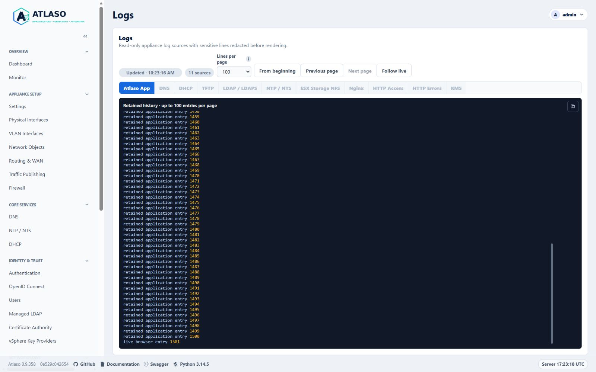
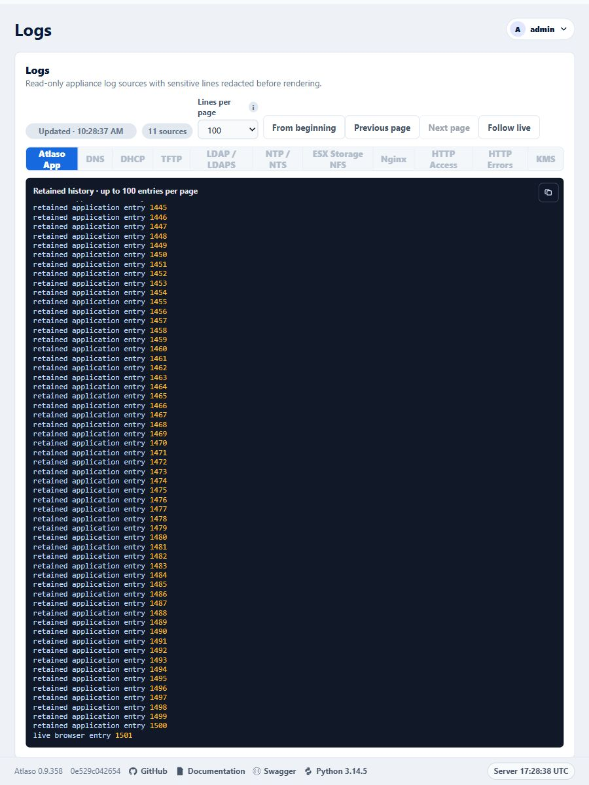

# Operational logs

Open **Logs** for read-only application and appliance diagnostics. Use the page to narrow an incident by time, severity,
source, and message before moving to a service-specific verification step.

Atlaso records significant state changes, execution milestones, failures, incomplete evidence, and recovery outcomes in
the existing audit, task, and operational log surfaces. Routine page reads, polls, and unchanged healthy observations
are suppressed. See [Important-event coverage](#important-event-coverage) for event scope, severity, retention, and
limits.

<!-- BEGIN GENERATED INTERFACE OVERVIEW -->
## Interface overview

This interface capture uses synthetic test data for visual orientation.

*Figure: Logs history controls in the desktop layout with synthetic test data.*

<!-- END GENERATED INTERFACE OVERVIEW -->

## Captured application and HTTP history

Supported provisioning and development deployment prepare producer-owned history for App, KMS, and HTTP logs.
App and KMS capture sanitized records in their existing processes. HTTP capture seals the previous Nginx files,
requests the supported reopen operation, and verifies that every Nginx process has released the old files before
importing them. The collector runs every five seconds; new HTTP entries appear after a successful collection.
Accepted history pages keep their original boundaries while newer records arrive.

The initial migration stops the affected producers, preserves the complete retained legacy inventory, verifies its
hashes, and imports it before selecting the new store. App capture uses the existing web and worker processes;
no logging wrapper replaces the worker. Oversized physical entries show an omission notice while their private-key
redaction state continues into subsequent entries. App history retains an 8 MiB window measured in original input
bytes. KMS and HTTP history currently preserve all captured records and sealed raw generations; administrators
must account for their disk growth. Raw migration copies remain protected and are not displayed by the viewer.

A conflicting HTTP rotation configuration prevents activation rather than risking an incomplete import.
A capture failure preserves its durable recovery state. Successfully prepared sanitized records can be recovered
without replaying raw secrets; an interruption before sanitization requires operator investigation and leaves capture
unavailable. Do not delete a selected store or its pending state to resume logging. Existing displayed pages remain
available in the browser when a request fails.

Signed-release migration runs only after the release has committed and before maintenance mode is cleared.
A failure at this stage requires forward recovery, not rollback of the selected history. For first adoption from a
release with the older helper, install the verified new helper through the supported deployment procedure before
starting the signed update: an already-running older helper cannot execute the newly installed completion hook.

## Important-event coverage

Atlaso records important changes and operation outcomes in its existing Audit, Tasks, and Operational Logs surfaces.
It does not create a separate task or log for every action. Routine page reads, polls, and repeated unchanged healthy
observations do not produce operation events.

### Severity and retention

| Level | Record when | Example |
| --- | --- | --- |
| `ERROR` | An operation or recovery step fails, or state cannot be safely reconciled. | A failed Apply component or a rollback that could not be proven. |
| `WARNING` | Evidence is incomplete, an attempt is retried, or an operation ends in a degraded or attention-needed state. | A timed-out helper whose final native state is unknown. |
| `INFO` | A significant operation starts or reaches a meaningful success, skip, no-op, cancellation, or state transition. | A committed configuration change or completed service update. |
| `DEBUG` | Additional bounded diagnostic context is useful without carrying essential task evidence. | Extra producer or collector details. |

The Settings page controls the minimum level written to the local App log (`WARNING`, `INFO`, or `DEBUG`); changes
apply to web, worker, and local console logging at their next request, worker pass, or console refresh without a restart.
External syslog has a separate minimum level. At `WARNING`,
successful `INFO` entries may be absent from the App log; the
committed Audit event and important task history remain the durable records for their respective events. Essential
failure, stage, and recovery information belongs in task history and is not conditional on selecting `DEBUG`.

Task producers retain bounded important-event records with the task. Each task history accepts at most 64 such records;
older successful entries are removed first, and an omission count reports truncation. Sanitized task text retains an
8 MiB character window per task; an expired cursor reopens retained history with an explicit notice. Producers store only
reviewed safe fields
and bounded execution evidence. App log rotation and service-specific journal/file retention remain separate limits.

### Coverage by operation family

| Important event family | Producer boundary | Existing evidence and useful correlation |
| --- | --- | --- |
| Committed UI, API, and console changes | `atlaso/app/audit.py:record_audit`, direct `AuditEvent` producers, and console actions in `atlaso/app/appliance_console.py` | Audit actor, action, resource, outcome, and request/task ID when available; significant committed events are mirrored to App Logs after commit. Use the Audit log for attribution. |
| Apply and configuration activation | `atlaso/app/ui.py:run_appliance_apply_job` and the per-component Apply producer | Task and component history preserve selected work, validation decisions, stage outcomes, skipped units, cancellation, handoff result, rollback, and recovery. Correlate the master task ID with Logs and Audit. |
| Appliance updates and deployments | `atlaso/app/ui.py:execute_appliance_update_job`, the worker update handler, and VCF workflow task producers | Parent/child tasks retain stream or workflow milestones, final results, retries, interruption, cleanup, and rollback evidence reported by the producer. VCF Offline Depot also has its task log. |
| Scheduled and managed automation | `atlaso/app/services/automation.py:enqueue_due_schedules` and `atlaso/app/worker.py` task handlers | Schedule identity, planned time, queued/started/terminal status, skipped prerequisites or collisions, script revision, bounded result, and cancellation/recovery where supplied. Task history is the primary execution record. |
| Diagnostics and support bundles | `atlaso/app/services/diagnostics.py` and `atlaso/diagnostics.py` | A task-correlated bounded projection records collection outcome, source omissions, and typed safe failure context. A bundle remains observational and is never uploaded automatically. |
| Network, service, storage, identity, certificate, and VCF helper work | Domain service producers through `atlaso/app/adapters/system.py:SystemAdapter` | Task or audit history records the significant action and the safe stage/result returned by its producer. Native journals remain a separate evidence source with their own availability and retention. |
| Cancellation, interruption, startup recovery, and cleanup | `atlaso/app/services/task_cancellation.py`, `atlaso/app/main.py:lifespan`, `atlaso/app/worker.py:recover_interrupted_worker_jobs`, and domain recovery functions | Task status/outcome and important events retain the requested and confirmed disposition, cleanup state, and recovery outcome when known. A cancellation request alone does not prove that work stopped. |

This coverage policy selects significant milestones, transitions, failures, and recoveries. It does not promise that every
native service exposes a detailed explanation, or that a helper's return code identifies the underlying cause. When a
producer has only a stage and exit status, the record must say what is known and leave the cause unknown. Do not infer
successful execution or rollback from a generic failure message, a healthy status captured later, or the absence of a
journal entry.

### Journal and collector evidence

Collector results distinguish evidence that is unavailable from evidence that was collected and contained no matching
entries. Relevant bounded reason categories include source missing or unreadable, permission denied, collection timed
out, malformed/unsupported helper response, truncation or output limit, and helper/collector compatibility failure.
Each omission is attached to its source and collection outcome. An unavailable source never means the service is healthy.

Task projections use reviewed typed fields; they do not export arbitrary exception text, command lines, stderr, raw
database rows, raw journal messages, or unrestricted request bodies. Credentials, authenticated URLs, session material,
private keys, password hashes, and credential verifiers remain excluded. Secret-safe operational identifiers may be
included when they are not paired with authentication or cryptographic material.

### Follow an incident

1. Open **Tasks** and note the task ID, failed or skipped stage, timestamp, bounded reason, and any recovery result.
2. Open **Operational Logs** and filter around that time and component; search by the same task ID where present.
3. Open the **Audit log** to identify the actor and committed state changes that preceded the operation.
4. In a support bundle, inspect the task projection and each source omission/reason. Treat missing evidence as unknown.
5. Follow the owning service's verification or recovery procedure before concluding that runtime state changed.

See [Tasks](tasks.md), [Audit log](audit-log.md), [Appliance Apply](appliance-apply.md), and
[Diagnostic collectors](../contribute/diagnostic-collectors.md).

## Investigate a problem

The selected source updates automatically every five seconds. **Lines per page** selects 100, 200, or 500 lines
for the live tail and history pages; it never limits the total retained history. The browser remembers this selection.
Unavailable source tabs are disabled,
and a source that becomes unavailable yields to another available tab. Lightweight metadata checks re-enable tabs
when their selected history store or legacy log files become available, without loading inactive log contents.
These checks pause when the page is hidden.
**From beginning** opens its oldest retained entries;
**Next page** and **Previous page** move through the complete retained history in bounded pages. From the live tail,
**Previous page** opens the preceding group directly, including within a multiline journal record. The page size limits
each response, not the total history you can inspect. History controls pause until the requested page arrives,
so repeated activation cannot skip or duplicate pages. Previous remains available while older journal records exist
at every supported page size, and becomes unavailable at the oldest retained journal page. Preparation retries keep
the displayed snapshot or accepted page visible. When the initially selected source recovers from an unavailable state,
its live viewer starts automatically.
File, task, and journal pages include JSON escaping and response metadata in their byte limit.
Private-key headers split between journal records retain redaction state across pages, including filtered views
and oversized-record omissions. Tail and Previous navigation prepare older context in bounded, resumable scans;
the displayed output stays visible while preparation continues.
Sparse DHCP and TFTP tails continue through older bounded journal windows until matching records are found or
retained history is exhausted, even when thousands of unrelated service records follow the latest match.
Writes to newer files do not interrupt a page from an unchanged archive; the reader still verifies the selected
file and older files that determine its redaction state.
If journal retention removes an open cursor, the viewer reopens the oldest available entries and reports the reset.
Permission and other journal errors preserve the current page for a later retry.
Development-mode service refreshes retain the explanation that no host journal is read.
Task history keeps unfinished private-key content concealed until a complete closing marker with the same key label arrives;
unrelated PEM endings, including another private-key type, do not end that redaction state.
File, journal, and task readers retain bounded label fingerprints across fragments. Interleaved opening markers
keep subsequent output concealed when a single matching context cannot be established.
Task capture shares the active private-key label across changed result fields, new log lines, errors, and audit
details. It preserves bounded partial markers within each source when another source interrupts a split header,
and conceals intervening output until the context is complete. Unchanged result fields are recognized by keyed
fingerprints and are not replayed into that state on later log updates. When result fields or their order change,
the current result snapshot is also replayed for redaction, so changing a later footer cannot erase an unchanged
opening marker's protection. Snapshot and incremental concealment are combined before persistence.
Values hidden by a secret field name still advance this state before they are discarded.
Progress and audit-only updates reuse the committed task-result checkpoint without rehashing unchanged log output.
Streaming task producers use `append_task_log_lines` with new lines only (up to 500 lines or 64 KiB per call).
The append shares the producer transaction and redaction state; it does not read or hash earlier cumulative output.
The producer commits or rolls back its task changes and output together. Legacy `result.log_lines` snapshots
remain supported, but changing them requires validating the old prefix; they are unsuitable for repeated streaming updates.
Startup backfill selects only tasks without history checkpoints and rechecks eligibility under the task lock,
so ordinary web and worker restarts do not reprocess retained task output.
File pages retain complete-line boundaries; task and multiline journal cursors retain character-safe continuation.
Numbered file rotations, including compressed archives, are
included and keep nginx sources available even when their current file is absent. Journal history remains subject
to the appliance's journal retention policy. Classified DNS/DHCP/TFTP history also bounds raw scan windows; a window
with no matching rows can still advance to the next retained window while preserving redaction state.
If the initial classified tail has no retained matches, it keeps the original newest cursor and its redaction
context, so a new matching event can appear on the next refresh without replaying the older journal.

**Follow live** resumes new output with one click, including after scrolling up. Scrolling up or selecting text preserves
your reading position and shows when
new output is available. Empty sources remain selectable and populate when their first entries arrive. A connection
failure preserves the displayed page and retries with a bounded delay. After a failed navigation, **From beginning**
and **Follow live** let you abandon the failing position; the freshness indicator identifies stale output.
Closing a viewer, switching sources or hiding the browser suspends its requests. Without JavaScript, the initial
redacted view remains available as a completed snapshot. Retention changes are reported rather
than silently continuing a position in a different file.

Task Log dialogs and standalone download logs use the same controls. Completed tasks receive a final trailing read
before automatic refresh stops, including while browsing older pages and for `no-op` and `partial-failure` outcomes.
Manual history navigation remains available afterward. Only retained output is available:
entries removed by retention or never captured by
the producing command cannot be recovered by the viewer. Downloaded log files are snapshots taken at download time.

Important task events are retained with the task independently of the App log level. They include bounded stage,
outcome, and safe failure or recovery detail supplied by the producer. Each task retains up to 64 important-event
records; if the producer exceeds that limit, the history reports truncation. A task record may identify a failed stage
and helper return code while the underlying native service still reports no more specific safe cause.

The **Operational Logs** setting controls the minimum level written to the local App log. Choose `INFO` to include
significant successful milestones and state changes, `WARNING` for incomplete or degraded outcomes, or `DEBUG` for
additional diagnostic records. Changing this setting does not remove task events or audit history. External syslog has
its own minimum level; configure a secret-free host and protect the receiver according to your site policy.

1. Set a narrow time window around the observed failure.
2. Filter by severity and the affected Atlaso component.
3. Correlate task identifiers with [Tasks](tasks.md) and operator actions with the [Audit log](audit-log.md).
4. Record the smallest sanitized excerpt that explains the failure.

For an operation failure, start with the task ID and inspect its ordered events and final result, then correlate that ID
and the time window in Logs. Use the Audit log for actor and committed state-change attribution. For a support bundle,
review the task failure projection and each collector omission or source-reason code; a missing journal is unavailable
evidence, not a healthy result.

The UI intentionally avoids presenting credentials and secret-bearing command lines. If a log entry appears to contain
sensitive data, do not publish it; follow the private process in the repository security policy.

IP addresses, MAC addresses, hostnames, and account names are not sensitive by themselves in Atlaso. Passwords, tokens,
authenticated URLs, session material, private keys, password hashes, credential verifiers, and other secret-bearing
data remain sensitive. Content-integrity hashes of non-secret material and one-way change-detection hashes of
encrypted-at-rest ciphertext do not. Review the complete excerpt before sharing it because authentication or
cryptographic context can make an otherwise ordinary identifier sensitive. This classification does not make
authenticated logs public or override site handling policy.

DNS, DHCP, and TFTP are classified before each journal page is limited, so a quiet protocol's recent history remains
visible even after many newer entries from another protocol. Redaction state is preserved across those skipped records.

## Next steps

Logs are evidence, not an enforcement surface. Correct desired state in the owning service page and submit it through
[Appliance Apply](appliance-apply.md). For local recovery when the web UI is unavailable, use the
[local appliance console](appliance-console.md).

Physical file entries larger than 64 KiB are represented by an explicit omission marker. The reader advances through
them in bounded pages so later entries remain reachable; omitted entry contents are not exposed. Private-key markers
inside discarded fragments still update redaction state for following lines and pages. Long marker labels retain
their parser state across read chunks, page boundaries, and retained file rotations using a fixed-size fingerprint
and a bounded partial label block. Opening and closing headers split between files still govern redaction of
subsequent entries.

Live viewers open at the newest retained group. **From beginning** reads earlier history, and **Follow live**
returns to recent output. Tail reads preserve private-key redaction across older entries. Multiple private-key
markers on one line are processed in text order, including when a line closes one block and opens another. If a
retained Atlaso App, KMS, HTTP Access, or HTTP Errors archive needs several read windows, preparation resumes
automatically until the selected
page is ready. Tail discovery and page reads share that prepared archive window. Fixed nginx files use bounded,
version-checked helper reads so preparation survives separate helper invocations. Journal
records larger than 1 MiB use an explicit omission marker and preserve continuation to newer entries.
When an omitted record needs an earlier opening-label context, the reader streams that immutable record again
under the original request deadline; it retains only bounded parser metadata. Backward
navigation also advances across oversized entries, including an unfinished final entry. Multiline journal messages
are paged within the record so each response remains within 500 displayed lines and 1 MiB, including timestamps.
Replacing a file behind an unchanged opening banner invalidates its previous position and reopens retained history.
Slow prefix verification resumes across refreshes while the file version remains unchanged. A further write invalidates
that verification progress so an interior rewrite cannot reuse an earlier redaction decision. Source versions are
checked again after page preparation; a concurrent rewrite discards the candidate page and retries. Reused cursors
also revalidate their redaction state when the retained source version changes.

Standalone VCFDT task-log pages and their live JSON responses disable HTTP caching so refreshes read current output.

Direct service-log pages include a bounded, redacted snapshot before JavaScript starts. If scripting is unavailable,
reload the page to refresh that snapshot. Development mode explains that no host journal was read; an empty or
unavailable source displays its current condition. Full history navigation and live updates require JavaScript.

Local uncompressed log files retain bounded redaction checkpoints in memory. Large initial scans may show a
preparation notice; refreshes resume saved progress instead of restarting. File identity and content fingerprints
validate each reused checkpoint. After size or modification-time changes, the reader hashes every previously
scanned byte before resuming. Matching prefixes preserve progress across appends; interior rewrites invalidate it
even when sampled boundaries are unchanged. Verification remains subject to the request deadline. Process restarts
or cache eviction can require preparation again. Completed task logs keep refreshing while preparation is pending.

While selection or scrolling holds a displayed page, its navigation controls retain the displayed positions.
New lines become navigable only after their page is displayed. Private-key labels may include digits and punctuation.
Service-log HTML snapshots and JSON refreshes both disable caching and vary on the representation header.

Local compressed-history preparation retains at most 32 bounded decompressor checkpoints in process memory.
Each step reads at most 16 KiB of compressed input and expands at most 64 KiB. Later requests resume immutable
archives, including concatenated gzip members, while a newer file grows. Archive identity, size, or modification-time
changes invalidate that progress. A growing plain file after those archives uses full-prefix authentication to
retain its own progress, including after older checkpoints leave the bounded cache. This does not change the
privileged helper's compressed-file reader.

Live pages and initial snapshots share the same sensitive configuration-key vocabulary, including dotted key names.

Task history also retains Network cleanup retry diagnostics in the same transaction as the task result update.

<!-- BEGIN GENERATED ADDITIONAL SCREENSHOTS -->
## Additional verified states

These captures show responsive layouts and useful operational states referenced by this page.

### Logs

*Figure: Logs history controls in the responsive layout with synthetic test data.*

<!-- END GENERATED ADDITIONAL SCREENSHOTS -->
