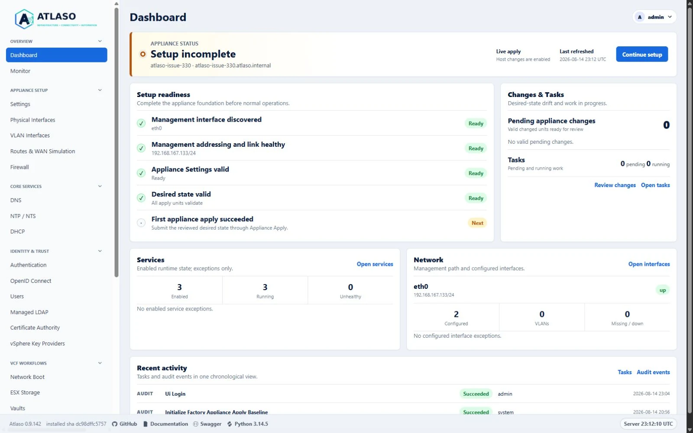
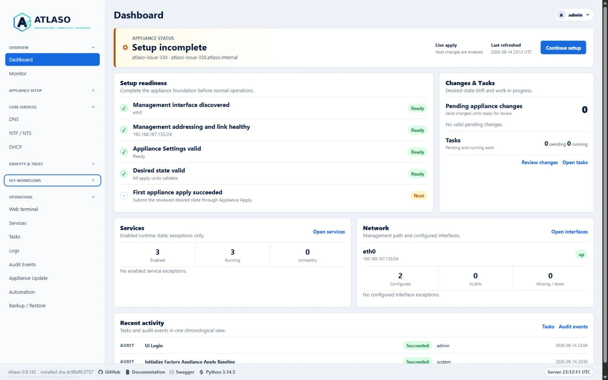
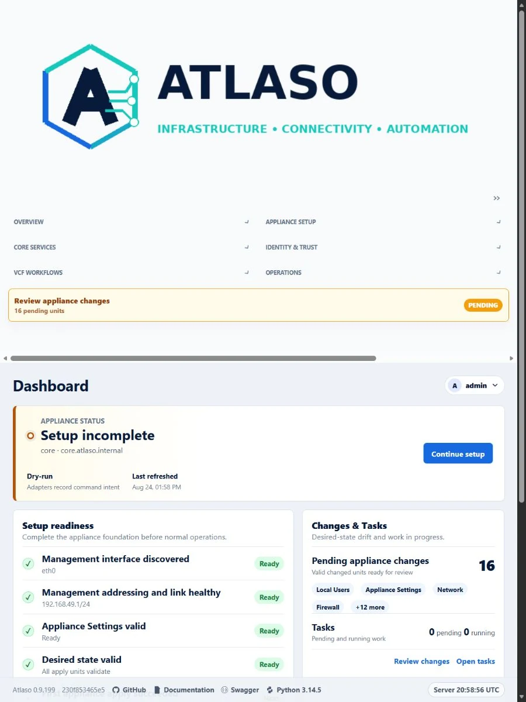

# Primary navigation

Authenticated management pages group permitted destinations into collapsible sidebar sections. This keeps the complete
route names and established sidebar width while letting you reduce vertical space.

<!-- BEGIN GENERATED INTERFACE OVERVIEW -->
## Interface overview

This verified appliance view provides visual orientation before you begin.

*Figure: Authenticated primary navigation with every authorized section expanded.*

<!-- END GENERATED INTERFACE OVERVIEW -->

## Expand or collapse a section

1. Select a section heading such as **Appliance Setup** or **Operations**.
2. Confirm that the chevron changes direction and only that section's links are hidden or revealed.
3. Use `Tab` to move through visible controls and links. Section buttons activate with `Enter` or `Space`.

The browser stores only expanded or collapsed choices under stable section keys. This local preference contains no
credentials or appliance configuration. If storage is unavailable, malformed, or from an unsupported schema, Atlaso
keeps every authorized section expanded and navigation remains usable.

## Current-page behavior

On every page load, Atlaso opens the section containing the current page even when that section was previously saved as
collapsed. The active link is revealed before normal keyboard focus begins. This temporary override does not replace
the saved choice, so the section can return to its preferred state when another section contains the current page.

First use starts every authorized section expanded. Selecting the current section heading can still collapse it for the
remainder of that page visit.

## Permissions and pending changes

Atlaso applies permission filtering before it renders navigation. A section with no permitted links is absent, including
its browser-state key. The server continues to enforce authorization for every destination.

The **Review appliance changes** card is not part of a collapsible section. It remains at the bottom of the sidebar and
stays visible whenever pending desired-state units exist.

**Network Objects** appears under **Appliance Setup** for identities with `read:firewall`. Editing continues to require
`write:firewall`, matching the access policy that applied when Source Groups were displayed on the Firewall page.

## Responsive layouts

At desktop widths, sections collapse vertically inside the fixed sidebar. At the tablet breakpoint, each entire section
occupies one cell of the two-column navigation layout, so a heading cannot separate from its links. Mobile layouts use
one section per row and preserve the same disclosure controls.

<!-- BEGIN GENERATED ADDITIONAL SCREENSHOTS -->
## Additional verified states

These captures show responsive layouts and useful operational states referenced by this page.

### Dashboard

*Figure: Authenticated primary navigation with independent sections partially collapsed.*

*Figure: Authenticated primary navigation with complete disclosure rows at the responsive viewport.*

<!-- END GENERATED ADDITIONAL SCREENSHOTS -->
