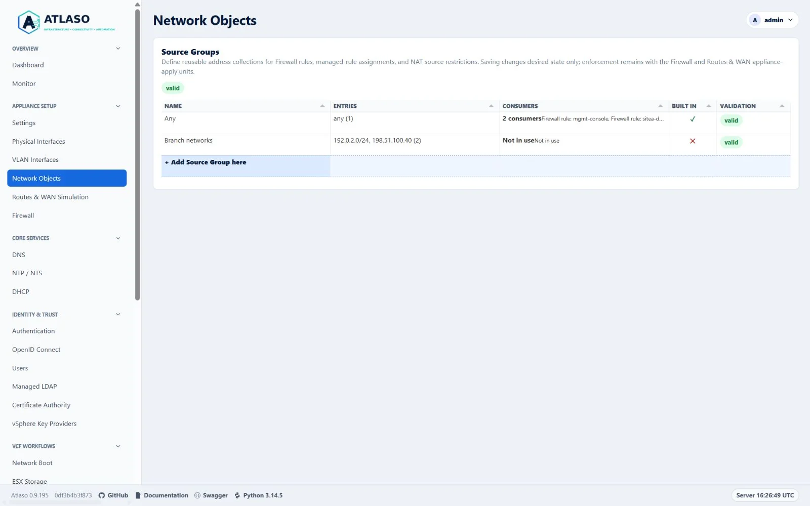
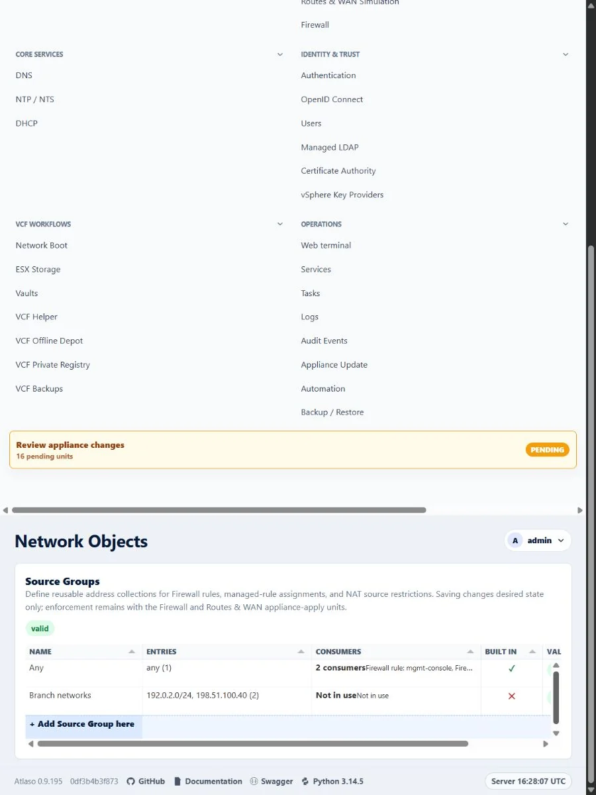

# Network Objects

Open **Network Objects** under **Appliance Setup** to manage reusable Source Groups. A Source Group can contain IPv4 or
IPv6 addresses, CIDRs, `any`, or stable references to other Source Groups. Firewall rules, managed-rule assignments,
and NAT rules consume the same objects.

<!-- BEGIN GENERATED INTERFACE OVERVIEW -->
## Interface overview

This verified appliance view provides visual orientation before you begin.

*Figure: Network Objects in the verified clean-appliance desktop state.*

<!-- END GENERATED INTERFACE OVERVIEW -->

## Add or edit a Source Group

1. Select **+ Add Source Group here**, double-click an existing row, or choose **Edit Source Group** from its row menu.
2. Enter a unique name and optional description.
3. Enter one address, CIDR, `any`, or `group:<stable-id>` reference per line.
4. Review the normalized entries, current consumers, and validation state before saving.
5. Return to the Firewall or NAT wizard when Network Objects was opened from **Manage source groups**.

The built-in **Any** row always remains visible and read-only. Saved identifiers remain stable when an object is
renamed, so nested references and rule assignments do not silently change meaning.

The return link preserves the current Firewall or NAT draft only in this browser tab. Atlaso reopens the originating
wizard with fresh server-rendered Source Group choices and restores focus. If an object selected in the draft was
removed, the wizard requires a current selection instead of silently widening the rule.

## Review and remove an object

The **Consumers** column summarizes current use. Choose **Review consumers** to inspect every nested Source Group,
operator Firewall rule, managed-rule assignment, and NAT rule that references the object.

Atlaso rejects removal with `409 Conflict` if any consumer appears during the final server-side check. This protects
against another session adding a reference after the page was loaded. Remove or reassign every consumer first, then use
the shared confirmation dialog to remove the unreferenced object. **Any** cannot be removed.

## Apply and archive behavior

Saving a Source Group changes desired state only. Firewall-rule and managed-assignment consumers remain enforced through
the **Firewall** Appliance Apply unit; NAT consumers remain enforced through **Routes & WAN Simulation**. Atlaso keeps
the established `firewall.managed_source_groups` settings-archive shape, object identifiers, nested references, and
assignments, so current archives round-trip without migration.

The canonical collection route is `/ui/management/network-objects/source-groups`. Safe legacy `GET` and `HEAD` requests
to `/ui/management/firewall/source-groups` redirect only after normal management-interface and session authorization.
Legacy `POST` requests invoke the same mutation handler and return `303 See Other`, preventing a browser from replaying
the mutation while following the canonical location.

<!-- BEGIN GENERATED ADDITIONAL SCREENSHOTS -->
## Additional verified states

These captures show responsive layouts and useful operational states referenced by this page.

### Network Objects

*Figure: Network Objects in the verified clean-appliance responsive state.*

<!-- END GENERATED ADDITIONAL SCREENSHOTS -->
