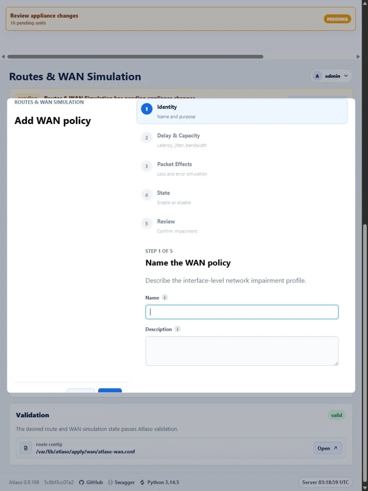
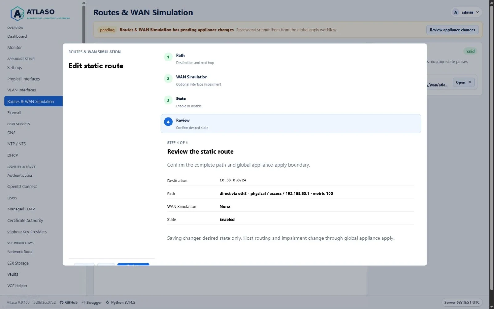

# Network configuration

Use **Physical Interfaces**, **VLAN Interfaces**, and **Routes and WAN** to build Atlaso network desired state while
preserving management access.

<!-- BEGIN GENERATED INTERFACE OVERVIEW -->
## Interface overview

This verified appliance view provides visual orientation before you begin.

*Figure: Physical Interfaces showing inherent management exposure and the standard Atlaso true glyph for access exposure.*

<!-- END GENERATED INTERFACE OVERVIEW -->

## Before you begin

Record the current management interface, address, gateway, and VM network attachment. Keep the
[local appliance console](appliance-console.md) available. A wrong interface, route, or VLAN can make the web UI
unreachable after apply.

## Configure the network

1. Inspect physical inventory and link state; do not treat an unused interface as failed.
2. Create VLAN interfaces only on the intended trunk parent and use the required VLAN identifier.
3. Define routes and WAN behavior with explicit interface and network boundaries.
4. Review validation and rendered network previews.
5. Submit the selected network units through [Appliance Apply](appliance-apply.md).

Edits from Physical Interfaces and `PATCH /api/v1/interfaces/physical/{name}` share the same transaction. When an
IPv4 or IPv6 CIDR changes, Atlaso derives the replacement addresses for selected DNS, NTP/NTS, CA, KMS, LDAP, VCF,
DHCP, and Network Boot/PXE bindings before committing. A reconciliation failure, including an existing DHCP range that
cannot fit after a prefix shrink, rolls back the interface and every dependent desired-state row together. Atlaso also
rejects address removal, trunk conversion, or administrative disablement while an enabled service, DHCP, or Network
Boot/PXE binding would lose its final eligible address. When other selected interfaces remain eligible, reconciliation
removes only the ineligible selection. Disable or move a final binding before retrying. Saving still does not change
Photon until global Appliance Apply is submitted.

The internal Certificate Authority does not require a public listener. If its last selected portal interface becomes
ineligible, reconciliation clears the CA portal interface/address and alias without disabling internal CA custody.
Valid operator-selected DHCP gateway, DNS, and NTP values remain unchanged unless they match a replaced interface
address or otherwise become stale.

### Choose where the management UI is available

A physical interface with the **management** role always exposes `/ui/management`; it has no separate management UI
switch. An addressed physical interface with the **access** role and **Access (untagged)** link type, or an enabled
access VLAN, can additionally enable **Management UI**. The interface remains an ordinary access network: it stays
eligible for public services and access service bindings, and it keeps access routing rather than gaining a
management-specific gateway or policy route.

Atlaso accepts that flag only when the access interface has a configured or observed usable non-link-local address.
An unaddressed or link-local-only interface cannot satisfy management lockout protection because no management HTTPS
listener can bind to it.

The default configuration remains `eth0` as the dedicated management interface with the switch disabled on all access
interfaces. To use one network for both planes, change `eth0` from management to access; Atlaso enables its management UI
switch as part of that conversion. You may then disable the unused second interface. Converting an access interface to
management clears its switch because management exposure is inherent in the role.

Atlaso permits at most one dedicated management-role physical interface. It also prevents desired state with no
effective management browser path: when no dedicated role exists, at least one active access interface or enabled
access VLAN must have **Management UI** enabled. Multiple flagged access interfaces are allowed. On a flagged access
address, `/` prefers the management sign-in, `/ui/management` requires normal authentication, and `/ui/public` remains
available for the same access network. The listener also preserves the complete authenticated management front door,
including stable API, API documentation, manifest, and service-worker routes required by the management UI and PWA.

Only a dedicated management role owns management DHCP, default gateways, DHCP resolver recovery, and isolated
management policy routing. If that role is absent, flagged access interfaces retain their normal access routes. The
appliance FQDN and managed HTTPS certificate cover every effective management UI address.

Management-to-lab and lab-to-management forwarding remain prohibited. Service listeners and firewall rules must bind to
the same intended interfaces.

## Configure routes and WAN behavior

**Static Routes** and **Routing Permissions** solve different jobs:

- A **Static Route** selects a path to an IPv4 or IPv6 destination through a non-management interface or VLAN. It owns
  the destination CIDR, optional gateway, output target, metric, enabled state, and optional interface-level WAN policy.
- A **Routing Permission** authorizes forwarded traffic from one non-management interface/VLAN network to another.
  Route-role networks generate these paths automatically. Access networks remain blocked until an explicit permission
  is enabled. Management is never an eligible source or destination.

Use the bottom add row in each tab to open the reviewed wizard. Double-click a saved row or use **Edit** in its row
menu to update it. Each wizard retains entered values while moving backward, validates before Review, and saves only
after the final add/update action. A saved row's **Enabled** value remains directly editable; this changes desired state
only.

The **NAT** wizard creates explicit IPv4 masquerade rules. Choose Any, an existing Firewall source group, or IPv4 source
CIDRs, then select an eligible IPv4-bearing access interface or enabled VLAN. Atlaso does not infer an outbound target
from an interface role and does not provide destination NAT, port forwarding, or IPv6 NAT in v1.

The **WAN Policies** wizard groups delay/capacity settings separately from packet loss and error effects. Assigning a
policy to a Static Route identifies its target interface or VLAN; WAN Simulation v1 impairs all traffic on that target,
not only traffic matching the route destination.

Saving any of these resources does not change Photon. Review the rendered configuration and submit the global
**Routes & WAN Simulation** unit through Appliance Apply when the complete desired state is ready.

### Add or edit a VLAN interface

The VLAN table is a read-only browse surface. Select **+ Add VLAN interface here** to create a row, or double-click an
existing row and use **Edit VLAN** from its context menu to revise it. The shared wizard reviews the complete VLAN
record in five steps:

1. Select an available trunk parent and VLAN ID; Atlaso derives the read-only `<parent>.<VLAN ID>` interface name.
2. Enter a valid IPv4 CIDR, IPv6 CIDR, or both, then confirm the MTU from `576` through `9000`. A new record starts with
   the selected parent MTU.
3. Select the VLAN role.
4. Confirm **Admin Up**. It is enabled by default for a new VLAN and preserves the saved value when editing.
5. Review the full desired-state change and save it.

The parent and VLAN ID must be unique. A VLAN whose previously saved parent is now missing may remain saved only while
disabled; select an available trunk before enabling it. Recoverable validation or server errors leave the wizard open
with its entered values. Saving refreshes validation and the configuration preview but does not change the host. Use
global **Appliance Apply** with the `network` unit when the reviewed desired state is ready for enforcement. Delete
remains a confirmed row-context action.

## Verify and roll back

Confirm the management URL, expected routes, and interface state after apply. If access is lost, use the local console
network recovery action to restore a known-good management configuration, then review desired state before retrying.

<!-- BEGIN GENERATED ADDITIONAL SCREENSHOTS -->
## Additional verified states

These captures show responsive layouts and useful operational states referenced by this page.

### Physical interfaces

*Figure: Physical Interfaces showing inherent management exposure and the standard Atlaso true glyph at the responsive viewport.*

### Routes Wan: Policies

*Figure: WAN policy wizard in the verified responsive viewport.*

### Routes Wan: Routes

*Figure: Static route wizard review with the complete path and appliance-apply boundary.*

### Routes and WAN simulation

*Figure: Routes and WAN Simulation in the verified clean-appliance desktop state.*

*Figure: Routes and WAN Simulation in the verified clean-appliance responsive state.*

### VLAN interfaces

*Figure: VLAN Interfaces shared Role step showing access management UI desired state in the verified appliance desktop state.*

*Figure: VLAN Interfaces in the verified clean-appliance responsive state.*

<!-- END GENERATED ADDITIONAL SCREENSHOTS -->
