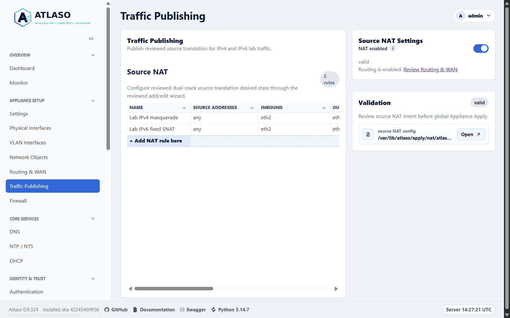
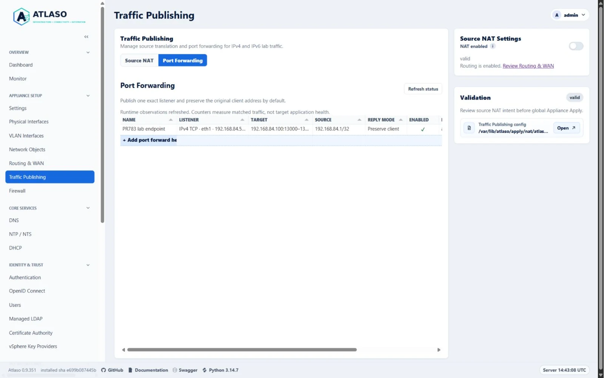
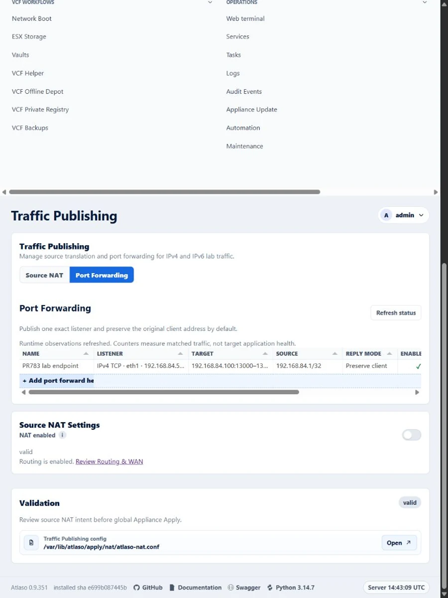
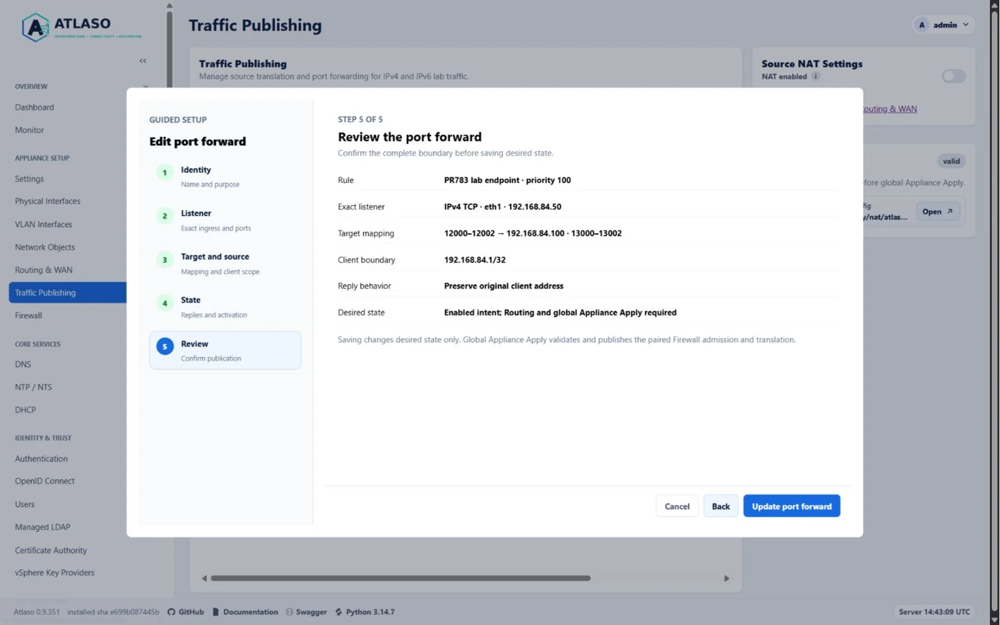
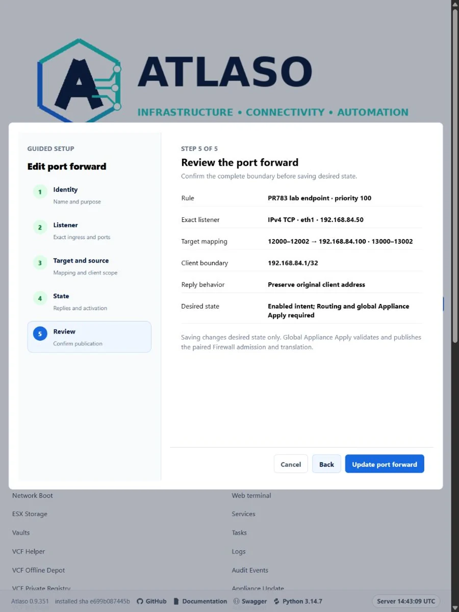
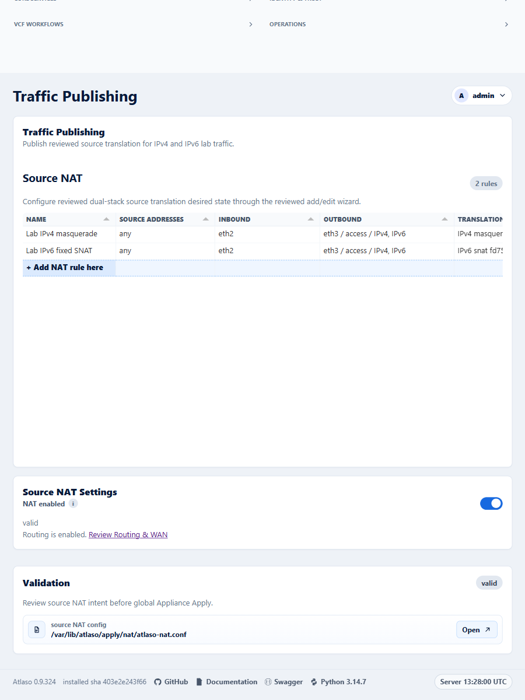
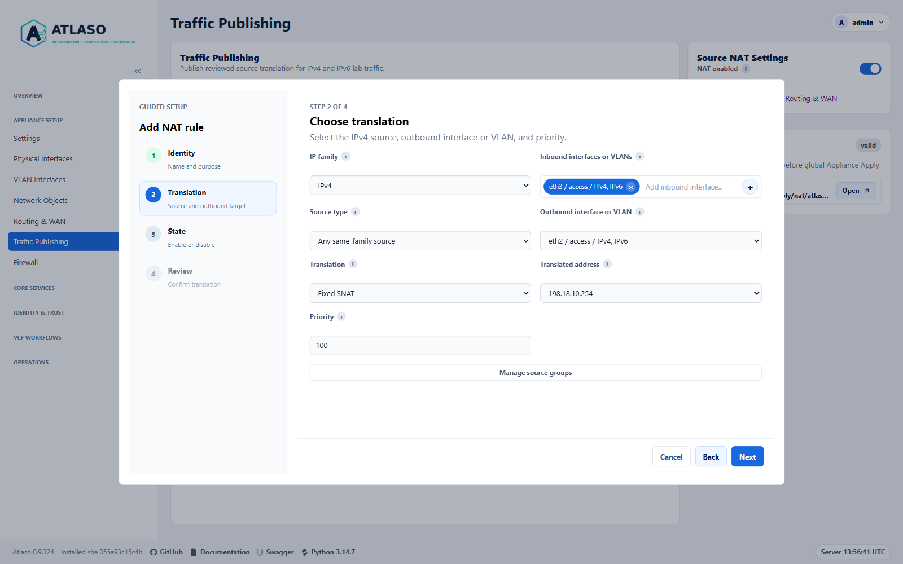
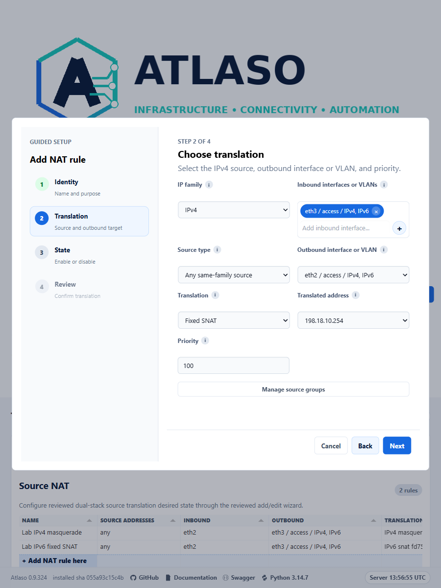
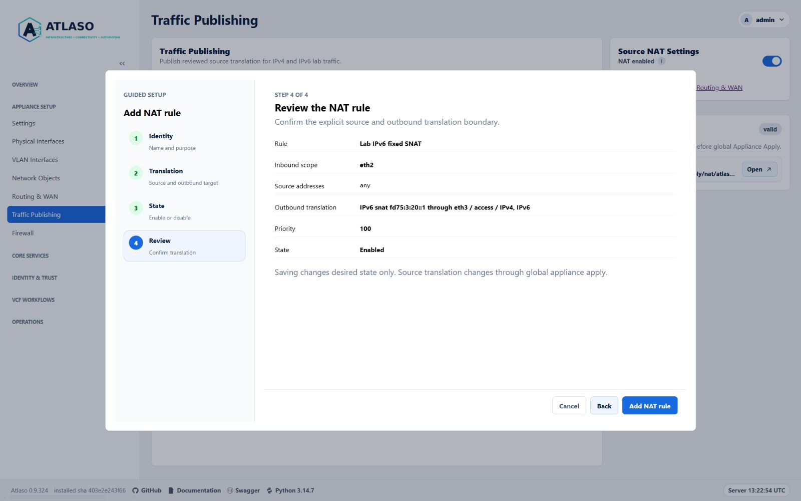
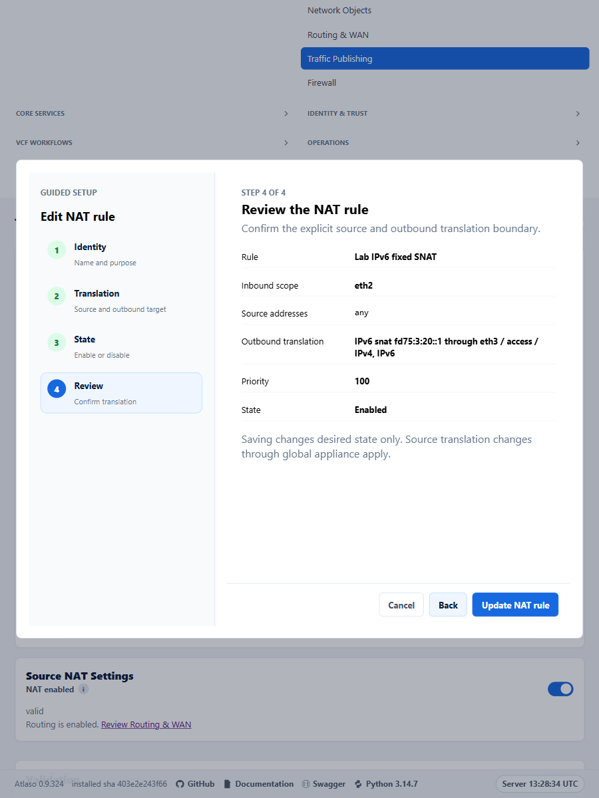

# Traffic Publishing

Use **Traffic Publishing** at `/ui/management/traffic-publishing` to configure source NAT and port forwarding.
**Routing & WAN**
at `/ui/management/routes-wan` owns static routes, routing permissions, forwarding, and WAN simulation. Traffic
Publishing requires Firewall read permission; changing its browser settings or rules requires Firewall write permission.

<!-- BEGIN GENERATED INTERFACE OVERVIEW -->
## Interface overview

This verified appliance view provides visual orientation before you begin.

*Figure: Traffic Publishing with reviewed IPv4 masquerade and the canonical NAT setting.*

<!-- END GENERATED INTERFACE OVERVIEW -->

## Configure source translation

1. Configure two distinct addressed lab targets in Physical Interfaces or VLAN Interfaces. Use enabled `access` or
   `route` targets. A VLAN also needs an available, enabled trunk parent. Dedicated management, unused, missing,
   disabled, and unaddressed targets are excluded. Access-management flags do not exclude an eligible access target.
2. The desktop grid fills the available viewport height and resizes with its panel. Narrow layouts use a compact height.
   Add a rule from the Source NAT grid's bottom row, or open an existing rule to edit it.
3. Select **IP family**: IPv4 or IPv6. Select every intended **Inbound interface or VLAN** and one distinct
   **Outbound interface or VLAN** with addresses in that family.
4. Select any same-family source, a shared Source Group, or explicit same-family source CIDRs. A Source Group must
   resolve entirely within the selected family. These selectors restrict addresses inside the selected ingress;
   they never grant access from another interface. **Manage source groups** opens Network Objects in a new tab.
   Return to the wizard to refresh the source-group choices while preserving the rule draft.
5. Select **Interface-address masquerade**, or **Fixed SNAT** and choose the exact same-family address assigned to the egress
   target. The address selector refreshes when the family or egress changes and does not accept arbitrary text.
   Fixed SNAT does not assign an address or create a pool. IPv6 translation is stateful NAT66.
   Saved rules retain unavailable translated addresses so you can reach State and disable them. An enabled final
   state requires available targets and an assigned address; changing family, egress, or mode clears the saved choice.
6. Review the family, ingress, source, egress, translation, priority, and enabled state, then save.
7. Enable **NAT enabled** and enable Routing in **Routing & WAN** when forwarding is intended. Both switches default
   off. Routing is the sole owner of IPv4 and IPv6 forwarding. NAT intent remains saved and visibly suspended while
   Routing is off; WAN simulation remains independent.
8. Review global Appliance Apply and submit **Traffic Publishing** (`nat`). Changed Network and Routing dependencies
   join the submission so the translation snapshot matches target and forwarding state. Management changes retain
   the protected management handoff. Firewall Apply also replays Traffic Publishing after replacing the
   firewall ruleset, even when NAT desired state is unchanged.

Saving only changes desired state. There is no rule-specific Apply action. Disabled features preserve their rows.
Every rendered rule includes explicit ingress selectors, so appliance-originated traffic cannot match it. This page
does not configure proxies, address pools, or NPTv6.

## Configure port forwarding

1. Select the **Port Forwarding** tab and add a rule. Enter its name, purpose, and priority.
2. Choose IPv4 or IPv6, one eligible addressed ingress interface or VLAN, and its exact listener address.
   Dedicated management interfaces are excluded. An access interface with the management UI flag remains eligible,
   but Atlaso service listener ports cannot be redirected.
3. Choose TCP or UDP and the external port range. Enter the same-family target address and an equally sized target
   port range. For example, `12000–12002` to `13000–13002` maps each port by its offset. The target must be another
   host and cannot be a dedicated management-network address. IPv6 forwarding uses stateful NAT66.
4. Choose Any, a shared Source Group, or explicit same-family CIDRs. The source restriction applies only inside the
   selected ingress boundary. Overlapping enabled listeners are rejected even when their source restrictions differ.
5. Keep **Preserve client source** unless the target's return path requires reply masquerade. With preservation,
   arrange the target's route back to the client through Atlaso. Masquerade replaces the original client source;
   selecting it requires an explicit acknowledgement before saving.
6. Review the complete mapping and enablement. New rules default disabled. Save desired state, then use global
   Appliance Apply. Routing must be enabled for activation; the Source NAT enable switch does not control port forwards.

Firewall shows generated admission attributed to the owning port forward. These rows are read-only; edit their source
boundary and listener in Traffic Publishing. Apply captures Firewall and NAT together, validates their complete program,
and publishes both atomically. It commits both application baselines before acknowledging the root-owned recovery
record. Management changes include this pair in the protected management handoff and its wider rollback.
Both ordinary Apply and management handoff preserve connections for unchanged mappings and retire only changed IDs.
Handoff failures before paired publication skip connection retirement; later rollback retires only candidate changes.
Inventory reconciliation follows a verified NIC rename, including child VLAN listeners. A missing NIC keeps its
inert identity and exact mapping, disables the forward, and requires operator review before reactivation.

Removing, disabling, or suspending a rule retires its counters and Atlaso-marked connections during Apply. Sessions
through that mapping must reconnect. Unchanged mappings retain their connections during unrelated Apply submissions;
edits retire only changed rule marks. This retirement never flushes unrelated connection tracking. Appliance
images and wheel deployments include `conntrack-tools`; its daemon is not required. An unavailable retirement tool
blocks publication rather than leaving stale translations active.

Refresh status after applying. A missing lab route or a failed target/next-hop neighbor produces a degraded warning
while keeping the safe mapping applied. Review Routing & WAN, the target address, power, and connectivity. A present
route or an unresolved neighbor does not prove application health: test from an allowed client and check the target
service. Status performs bounded read-only observations and does not probe target ports.

Archives preserve complete mappings and source references. An unavailable restored interface relationship remains
saved but disabled and marked for review. Factory reset removes desired mappings and retires their runtime state before
replacing interface configuration. A pending publication recovery must be reconciled before reset can continue.

## Verify and recover

At boot, the NAT replay service runs after Routing & WAN and before Atlaso startup. Atlaso's subsequent startup
reconciliation therefore verifies the saved NAT state without racing the replay service.

Inspect the global task result and `nft list table ip atlaso_nat` and `nft list table ip6 atlaso_nat` on the appliance.
Use traffic from a selected ingress to verify the translated source and return path. Also verify that another ingress,
the dedicated management interface, the wrong family, and appliance-local traffic do not match. Existing connection
tracking can retain an established flow's prior translation; use new connections when testing changed rules.

The NAT helper captures staged input once and uses that same snapshot for validation, rendering, and persistence.
It validates the captured configuration, verifies each physical MAC and live interface index, and verifies
that a fixed address is actually assigned to the live egress. It atomically replaces the two Atlaso-owned NAT tables
without replacing unrelated nftables tables. A durable recovery record restores the previous configuration, runtime
program, and service enablement if persistence or activation fails. Failed recovery remains actionable.

Successful Apply persists `/etc/atlaso/traffic-publishing/atlaso-nat.conf` and enables `atlaso-nat.service` only while
source NAT or port-forward intent is enabled. Disabling Source NAT does not disable port forwards. Factory reset clears
both kinds of translation. Boot and
control-plane startup rebuild selectors using current interface indexes. A replaced or missing NIC, or an unavailable
fixed address, quarantines translation and requires review. The saved desired rule is preserved. Do not hand-edit
`/etc/atlaso/nftables.d/atlaso-nat.nft`; the managed include path remains stable.

Management handoff rollback restores Firewall before replaying NAT, so a firewall ruleset replacement cannot erase
the restored source translations.

## Upgrade, archives, and API compatibility

### Port-forward API

The `/api/v1/traffic-publishing/port-forwards` collection owns destination-translation intent independently of the
legacy source NAT collection. List and read operations require `read:firewall`; create, replace, and delete require
`write:firewall`. WAN permission does not grant access to these operations.

| Operation | Meaning |
| --- | --- |
| `GET /api/v1/traffic-publishing/port-forwards` | List up to 256 saved rules, including disabled intent. |
| `POST /api/v1/traffic-publishing/port-forwards` | Validate and create a complete rule; return `201`. |
| `GET /api/v1/traffic-publishing/port-forwards/{id}` | Read one saved rule; return `404` when absent. |
| `PUT /api/v1/traffic-publishing/port-forwards/{id}` | Validate and atomically replace the complete saved rule. |
| `DELETE /api/v1/traffic-publishing/port-forwards/{id}` | Delete desired intent and return `204` without a body. |
| `GET /api/v1/traffic-publishing/port-forwards/status` | Compare current intent with bounded applied observations. |

A complete rule names one IP family, exact assigned ingress listener, TCP or UDP, ordered external and target port
ranges of equal length, and a same-family target address. Each external port maps to the target port at the same
offset. Source restrictions may use Any, a shared Source Group, or up to 128 same-family CIDRs. Source Groups containing
both families are rejected instead of silently filtering their members. Enabled rules cannot overlap on the same
family, listener, protocol, and external ports, even when their source restrictions differ. At most 65,535 external
ports may be mapped across enabled rules.

`reply_mode=preserve` keeps the original client address. Selecting `reply_mode=masquerade` requires
`acknowledge_source_loss=true` in the create or replacement request. The acknowledgement is request-only. New rules
default disabled. Validation failures use ProblemDetails and preserve the previous row and its audit history.
Complete replacements revalidate bindings, source restrictions, target safety, and listener collisions even when
disabled. Archive restoration and missing-NIC reconciliation may retain unavailable disabled relationships for review.
Saving never invokes host enforcement; global Appliance Apply owns translation changes.
Successful replacements, including enable/disable changes, refresh the API's `updated_at` timestamp.
Signed upgrades install missing `conntrack-tools` through the candidate service's pre-start hook, including upgrades
performed by older installed helpers. Existing installations are reused. Installation failure blocks candidate startup
and leaves the upgrade's normal rollback path responsible for recovery; restore Photon repository access before retrying.

Status distinguishes disabled, pending, suspended, applied, and degraded records. An edited target or source boundary
does not inherit the previous mapping's counters. Packet and byte counts are nullable: unavailable observations are
not reported as zero. Applied status requires the DNAT rule, both generated Firewall admission directions, and the
owned counter and both guard admission directions to remain present in one runtime snapshot. Missing members report
degraded even if counters survive.
The page summary includes enabled port forwards independently of source NAT and reports their validation errors.
These counters describe matched traffic, not proof that an application at the target is healthy.

### Source NAT compatibility

Existing IPv4 rules gain `ip_family=4`, `translation_mode=masquerade`, and an empty `translated_address`. Existing
explicit NAT enablement migrates to the single `traffic_publishing.nat_enabled` setting. When neither global switch
exists, enabled legacy NAT rules preserve inferred activation; explicit disable and factory reset still take
precedence. A rule without explicit ingress stays saved for review and cannot become active until its ingress is
selected. Archives preserve rules and missing identities backed by archived host inventory; restoring them does not
make those identities runtime-eligible. Factory reset disables NAT and clears its desired rules through the normal
reset and Apply lifecycle.

`GET` and `PUT /api/v1/traffic-publishing/settings` use `read:firewall` and `write:firewall`. The response exposes
`nat_enabled`, `routing_enabled`, `effective_nat_enabled`, and `suspended`; only `nat_enabled` is writable. These are
desired-state values, not a live-health assertion. Validation failures use ProblemDetails.

Existing `/api/v1/nat/rules` paths, operation IDs, and `read:wan` / `write:wan` authorization remain compatible. The
family, mode, and translated-address fields are additive. Older IPv4 request bodies retain their defaults. Rule PATCH
preserves omitted ingress, family, mode, and translated-address fields. `masquerade` remains a compatibility mirror.
`RoutesWanSettings.nat_enabled` is deprecated and projects the same canonical setting; legacy writes update that
setting in the same desired-state transaction. It does not create a second NAT owner.

Existing Routes/WAN NAT form submissions are internally handled and return a same-host `303` to Traffic Publishing;
mutations are never replayed through `307` or `308`. Use the canonical Traffic Publishing bookmark for the rule grid.

<!-- BEGIN GENERATED ADDITIONAL SCREENSHOTS -->
## Additional verified states

These captures show responsive layouts and useful operational states referenced by this page.

### Traffic Publishing

*Figure: Port Forwarding is independent of source NAT; counters do not prove target health.*

*Figure: Port Forwarding is independent of source NAT; counters do not prove target health.*

*Figure: Review the listener, port mapping, client boundary, and replies before saving desired state.*

*Figure: Review the listener, port mapping, client boundary, and replies before saving desired state.*

*Figure: Traffic Publishing with reviewed IPv4 masquerade and the canonical NAT setting.*

*Figure: Choose an assigned translated address and open source groups in a separate tab without leaving the wizard.*

*Figure: Choose an assigned translated address and open source groups in a separate tab without leaving the wizard.*

*Figure: Review an IPv6 fixed-SNAT rule before saving desired state.*

*Figure: Review an IPv6 fixed-SNAT rule before saving desired state.*

<!-- END GENERATED ADDITIONAL SCREENSHOTS -->
