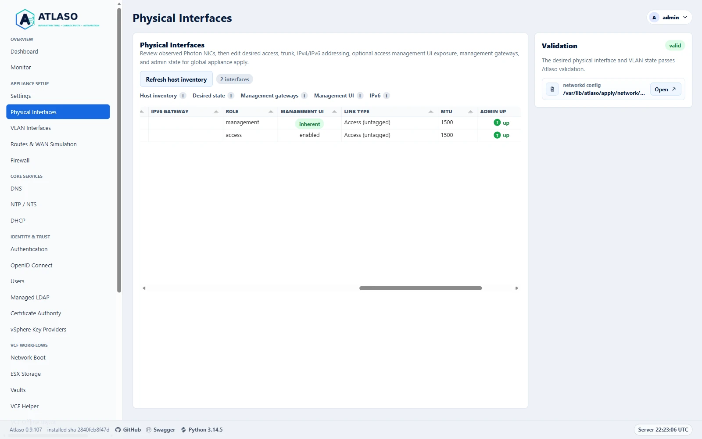
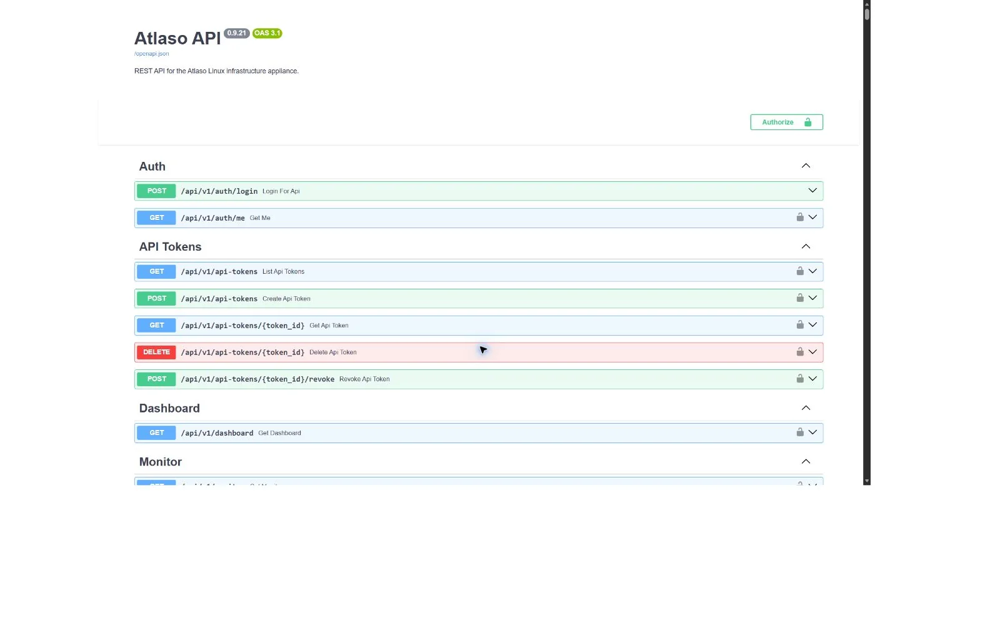
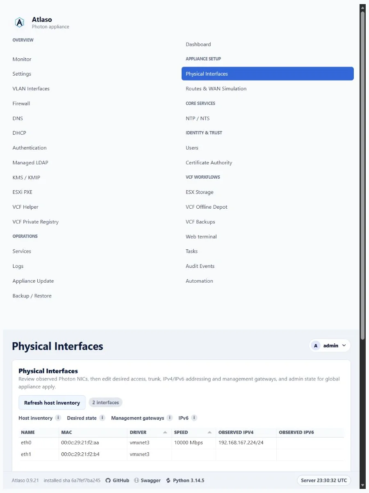
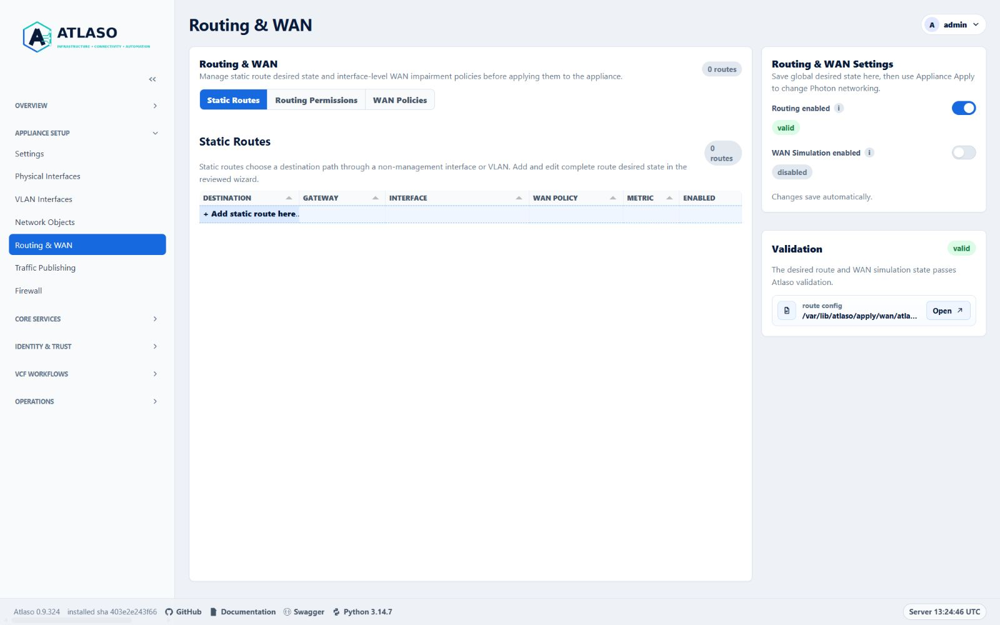
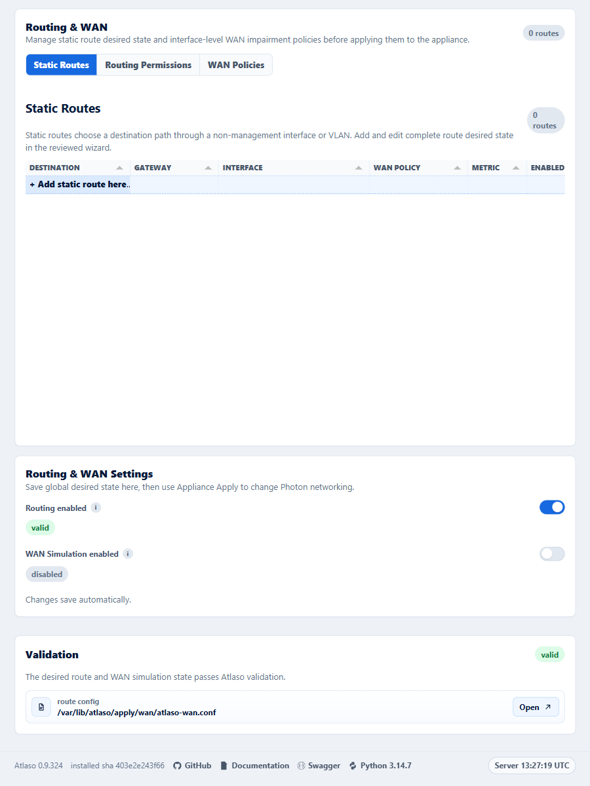
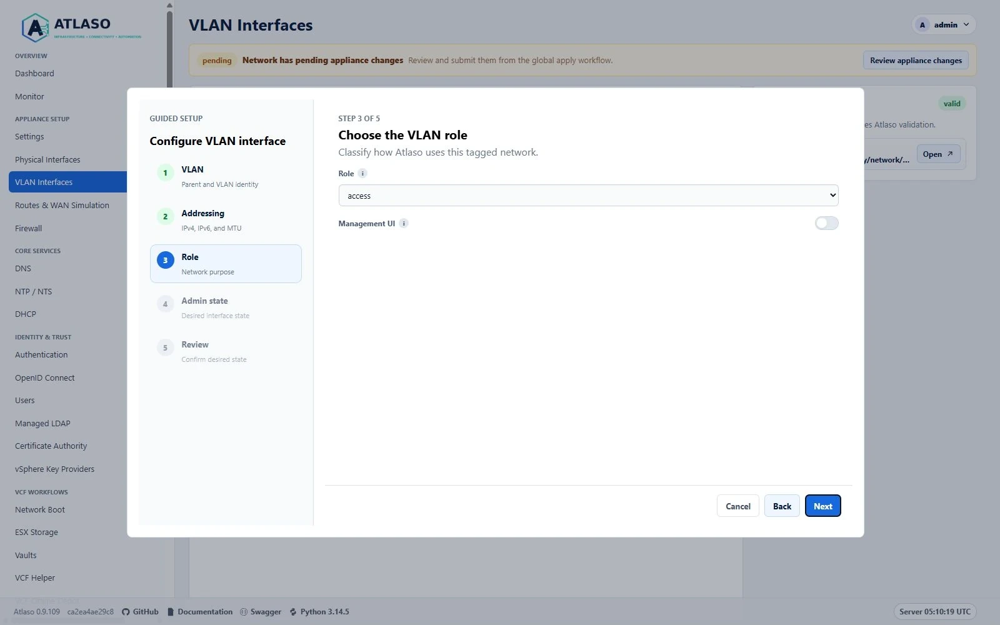
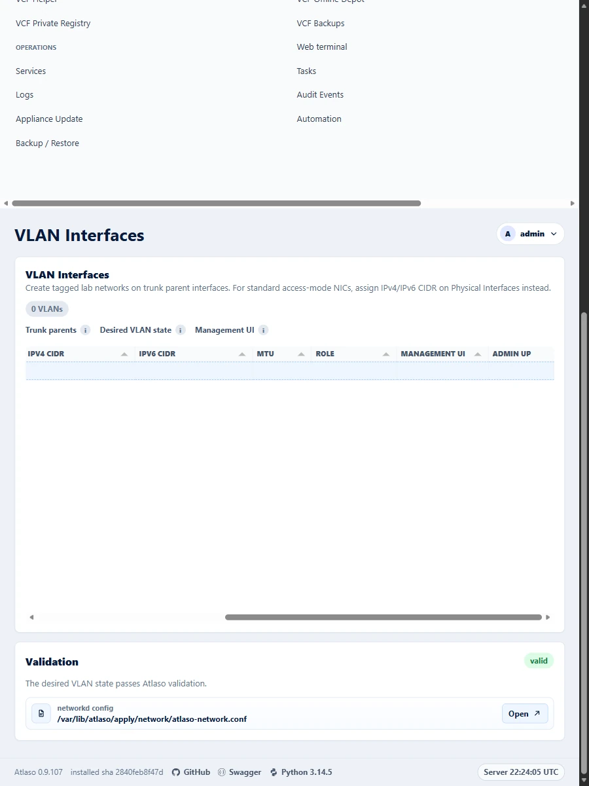

# Full technical reference


<!-- BEGIN GENERATED INTERFACE OVERVIEW -->
## Interface overview

This verified appliance view provides visual orientation before you begin.



*Figure: Physical Interfaces in the verified clean-appliance desktop state.*

<!-- END GENERATED INTERFACE OVERVIEW -->

**Everything your virtualization lab needs.**

Infrastructure • Storage • Identity • Networking • Lifecycle

Atlaso is a Linux-based, web-managed infrastructure appliance for homelabs, VMware Cloud Foundation labs, POCs, training
environments, isolated network labs, and WAN simulation testing. Atlaso supports POC, lab, and test environments by
simplifying deployment, maintenance, and validation.

Its product pillars are **Infrastructure • Connectivity • Automation**.

Fresh appliances use `core.atlaso.internal` as the management identity and `atlaso.internal` as the default managed DNS
zone. Service names include `ca.atlaso.internal`, `kms.atlaso.internal`, and `depot.atlaso.internal`. Future clustered
deployments are expected to use `core-01`, `core-02`, and `core-vip`; clustering is not implemented in 0.9.18.

Atlaso 0.9.18 is a clean break. Existing appliances from the retired product must be redeployed; Atlaso provides no
data, configuration, certificate, or update-channel migration.

## Community and licensing

Contributions follow the [contributing guide](https://github.com/mdaneri/Atlaso/blob/main/CONTRIBUTING.md),
[Code of Conduct](https://github.com/mdaneri/Atlaso/blob/main/CODE_OF_CONDUCT.md), and
[Security Policy](https://github.com/mdaneri/Atlaso/blob/main/SECURITY.md). Atlaso authored code is available under the
[MIT License](https://github.com/mdaneri/Atlaso/blob/main/LICENSE). Each released appliance includes an automatically
generated `/usr/share/doc/atlaso/THIRD_PARTY_NOTICES.md` inventory for every shipped Python package, Photon RPM, and
bundled component; the same release-specific notice file is published with the signed release assets. Third-party
software retains its own license terms, including the bundled iPXE bootloaders.

The MVP is a safe runnable scaffold. It provides the FastAPI control plane, appliance-style web UI, local
authentication, JWT bearer API tokens, audit logging, OpenAPI 3.1, dry-run system adapters, and Windows/Hyper-V script
scaffolding. It does not apply real host networking, firewall, service, SFTP, registry, repository, DNS, DHCP, CA, or
KMS changes by default.

## Photon OS Appliance Image

The first real OS appliance target is Photon OS 5.0 on Hyper-V. The image builder lives in
[`image/hyperv/`](https://github.com/mdaneri/Atlaso/tree/main/image/hyperv) and provisions:

- a Photon OS 5.0 Generation 2 Hyper-V VM with Secure Boot off;
- updated Photon packages from the configured Photon 5.0 repositories, with a second update pass after appliance
  packages are installed;
- the `atlaso` system user;
- `/opt/atlaso` for the installed application;
- `/etc/atlaso/atlaso.env` for appliance environment settings;
- `/etc/atlaso/build-info` for build/update provenance;
- masked `systemd-ssh-generator` so Photon does not attempt automatic SSH-over-AF_VSOCK sockets on Hyper-V while normal
  TCP SSH remains available;
- `/var/lib/atlaso` for durable state;
- `/var/log/atlaso` for local logs;
- fixed appliance mount points under `/mnt/atlaso-vcf-*`;
- operator-approved ESX Storage ext4 mounts under `/mnt/atlaso-esx-storage`, with Photon `nfs-utils` and `rpcbind`
  installed but disabled until global apply;
- `atlaso.service` running uvicorn from a Python virtual environment;
- nginx enabled as the default management front door, with deployed-VM first boot generating the integrated root CA and
  `appliance:https` certificate, redirecting HTTP/80 to CA-backed HTTPS/443, and proxying HTTPS/443 to uvicorn on
  `127.0.0.1:8000`;
- `atlaso-firewall.service` loading the appliance nftables firewall;
- an Atlaso recovery console on tty1 with authenticated configuration and power menus, `top`, and an
  authenticated/audited root Bash handoff, while tty2 and later terminals retain normal Photon login prompts; VMware
  first boot can also use its bounded non-secret network-review state before network and data-disk initialization; and
- `/opt/atlaso/bin/atlaso-helper` and a constrained sudoers template.

Finished Hyper-V appliance VMs and VMware OVF/OVA appliances also attach two durable expandable data disks: one for the
VCF Offline Depot at `/mnt/atlaso-vcf-offline-depot` and one for VCF Backups at `/mnt/atlaso-vcf-backups`. VMware images
precede those disks with file-backed Photon OS and Atlaso system-content VMDKs; the latter holds `/opt/atlaso` and the
appliance-wide PowerShell modules through required UUID-backed mounts. Keep depot and backup workloads off both payload
disks. On first boot, `atlaso-data-disks.service` labels blank attached data disks as `ATLASO_DEPOT`
and `ATLASO_BKUP`, formats them as ext4, persists them in `/etc/fstab`, and mounts them at those fixed paths before
`atlaso.service` starts.

Atlaso writes operational events to `/var/log/atlaso/atlaso.log`. Audit events, desired-state edits, and appliance apply
submissions are mirrored there with sensitive values redacted. The Settings page controls local file verbosity and can
also forward the same operational events to an external syslog receiver.

For logging and audit purposes, IP addresses, MAC addresses, hostnames, and account names are non-sensitive operational
identifiers when they appear by themselves. Passwords, tokens, authenticated URLs, session material, private keys,
password hashes, credential verifiers, and other secret-bearing data remain sensitive. Content-integrity hashes of
non-secret material and one-way change-detection hashes of encrypted-at-rest ciphertext do not. An identifier is
sensitive when embedded in or paired with authentication or cryptographic material. This classification does not relax
access controls or site handling policy.

The `Monitor` page is an operator-facing, read-only runtime view for appliance resource health. It charts thick
appliance totals alongside thin per-logical-CPU, per-interface RX/TX, and unique-device disk activity over the last one,
three, or six hours, plus memory pressure and compact per-interface and virtual-machine context. Disk Activity retains a
deduplicated per-device read/write table; all per-mount capacity presentation, including the top-level Disks metric,
Disk Usage chart, and capacity table, is intentionally omitted. Disk activity totals count each underlying device once
even when several mount rows share it. Each chart can be expanded into a near-full-screen view without changing its
active time range; only that expanded view exposes editable percentage zoom and drag-to-select time-window zoom.
Hovering near a sampled point or line segment emphasizes the associated series, legend entry, and exact sample; clicking
the chart or a legend item pins that series until it is cleared or another series is selected. The 1h, 3h, 6h, 12h, and
24h history selectors use the same sampled data. The sampler records one row about every 30 seconds and keeps the
24-hour window plus a small buffer. Collection uses Linux `/proc`, `/sys`, filesystem usage, DMI data,
`systemd-detect-virt`, and `vmtoolsd` when present; it does not call privileged helpers or mutate host services. Set
`ATLASO_MONITOR_ENABLED=false` to disable both the background sampler and request-time collection from
`/ui/management/monitor/data`
or `/api/v1/monitor`. When disabled, Atlaso may read existing monitor rows but it does not probe the host or create new
`monitor_samples` rows. See [Monitor hierarchy and interaction design QA](../project/monitor-apply-ux-design-qa.md) for
the current hierarchy, interaction behavior, responsive expectations, and the history of the removed Disk Usage panel.

The authenticated `/ui/management/dashboard` page is the compact operations command center. Its server-rendered
snapshot shows overall appliance state, setup readiness, actionable exceptions, valid pending changes, active tasks,
enabled service health, the management network path, and a six-entry task/audit activity feed. Invalid changed apply
units, recent failed tasks, unhealthy enabled services, and missing or unexpectedly down configured interfaces are
prioritized in that order.
Disabled optional services and unused interfaces remain quiet. The page refreshes from the session-authenticated
`/ui/management/dashboard/data` UI endpoint every 30 seconds while visible, retains the last successful snapshot on
failure, and marks retained data stale. This private UI endpoint does not replace or change the bearer-authenticated `/api/v1/dashboard`
contract. Dashboard actions are links into existing workflows; the page does not apply configuration, restart services,
or mutate the appliance.

Photon OS 5.0 GA shipped with Python 3.11, but the current Photon 5.0 updates stream has moved beyond that baseline. On
June 21, 2026, live repository metadata showed `python3` as `3.14.5-2.ph5`. Atlaso targets Python 3.14 only
(`requires-python >=3.14,<3.15`); verify the appliance stream with:

```bash
python3 scripts/check_photon_compatibility.py
```

Atlaso Windows automation supports only PowerShell 7.x (`pwsh`). Windows PowerShell 5.1 (`powershell.exe`) is not
supported. Run every documented Windows command from `pwsh`, including elevated Hyper-V operations.

The Windows Inventory Linux wrapper requires an already functional WSL 2 installation and uses the explicitly
provisioned `Atlaso-Build` distribution by default. It does not install WSL or silently create a missing
distribution. `-WslDistribution <name>` selects an existing compatible alternative. Photon image wrappers do not build
or embed Inventory Linux. Buildroot's Linux-only `PATH`, native-filesystem cache, repository-specific work tree, and
`flock` remain
in force for every distribution. A checkout-wide Windows mutex protects shared final output across distributions. See
[Windows image-build WSL environment](../contribute/windows-image-build-wsl.md) for the pinned setup, safety boundary,
storage, recovery, and removal procedures.

Build inputs are the current Photon OS 5.0 ISO URL and checksum. On Hyper-V, use the Windows wrapper so the Photon
kickstart is attached as a local single remastered ISO instead of depending on early installer networking:

```powershell
pwsh -ExecutionPolicy Bypass `
  -File scripts/windows/hyperv/build-photon-image.ps1 `
  -IsoUrl "https://packages.broadcom.com/photon/5.0/GA/iso/photon-5.0-dde71ec57.x86_64.iso" `
  -IsoChecksum "sha512:6a7a258399a258da742032987c043ab25503698d35edafaf1ae000f12127da1a161d8b84caa17fd8f23d129e81e1faa7ab087c20ab9229772a643f8f9475305f" `
  -SshPassword "<one-time-build-root-password>" `
  -BootstrapAdminPassword "<initial-atlaso-admin-password>"
```

Run Packer from an elevated PowerShell 7 session or as a user in the `Hyper-V Administrators` group. Prepare the Atlaso
Hyper-V management network before building:

```powershell
pwsh -ExecutionPolicy Bypass -File scripts/windows/hyperv/create-switches.ps1
```

The Packer build VM uses the `Atlaso-Mgmt` switch by default with temporary static address `192.168.49.30/24` and
gateway `192.168.49.254`. This avoids fragile `Default Switch` host-IP detection while still giving the builder NAT
internet access for `tdnf update`. Unless `-BuilderStaticDns` is supplied, the wrapper discovers the host's active IPv4
DNS servers and uses them for both the temporary Photon builder and the finished appliance management interface, with
public DNS only as a fallback. The wrapper writes `photon-ks.json`, embeds it into a remastered Photon ISO, replaces the
ISO's UEFI GRUB config with a Atlaso auto-install entry, and passes that single ISO to Packer. Photon then boots with
`ks=cdrom:/photon-ks.json` without Packer typing boot commands. Raw `packer build .` is intentionally blocked unless the
ISO is marked as wrapper-prepared; the wrapper is the tested Windows Server 2025 path. Build runs pass Packer's `-force`
flag by default so the fixed output directory can be rebuilt in one command. Use `-OutputDirectory <path>` to keep
multiple artifacts or `-KeepExistingOutput` when you want Packer to fail instead of replacing an existing output
directory. Use `-PackerOnError abort` to keep a failed builder VM for debugging, or `-PackerOnError ask` to choose the
failure action interactively. During provisioning, the shared Photon path reads `[project].version` from the staged
`pyproject.toml` with Python's TOML parser and validates the repository's strict `X.Y.Z` release format before creating
the bootstrap release directory. Missing, unreadable, malformed, or invalid version metadata fails the build with the
specific version-policy error instead of an ambiguous shell match failure. Both Photon Packer targets stage
`requirements-appliance.lock` with the application source so bootstrap dependency installation can retain
`--require-hashes`; a missing staged lock fails the image rather than falling back to unpinned dependencies. They also
stage the third-party notice generator, its vendored-component inventory, and the referenced Inventory Linux README so
the image can generate the required
Python, Photon RPM, and bundled-component notice at build time. Installed Python inventory reads only top-level
virtual-environment distributions; package-internal vendored metadata is not treated as a separately installed locked
dependency. Long TDNF operations capture their raw transaction output and emit one compact Packer status line every 30
seconds with elapsed time and cache size. Successful operations report their duration; failures preserve the TDNF exit
status and replay a normalized, bounded output tail. This avoids progress redraws appearing as hundreds of empty
Packer-prefixed lines without hiding actionable failures.

The image builder does not configure a custom pip package index by default. If your build network requires an internal
PyPI mirror, pass `-PipGlobalIndex` or `-PipGlobalIndexUrl` to set Photon site-level pip configuration before the Atlaso
virtual environment is created. The provisioner does not upgrade pip as a separate bootstrap step; it uses the
Photon-packaged pip to install Atlaso so a transient public PyPI pip release download cannot fail the image before the
application install starts. Leave both options empty to keep standard pip behavior:

```powershell
pwsh -ExecutionPolicy Bypass `
  -File scripts/windows/hyperv/build-photon-image.ps1 `
  -IsoUrl "<photon-5.0-iso-url>" `
  -IsoChecksum "<packer-checksum>" `
  -PipGlobalIndex "https://packages.vcfd.broadcom.net/artifactory/api/pypi/upstream-pypi-virtual/pypi" `
  -PipGlobalIndexUrl "https://packages.vcfd.broadcom.net/artifactory/api/pypi/upstream-pypi-virtual/simple"
```

The generated appliance intentionally keeps `ATLASO_DRY_RUN_SYSTEM_ADAPTERS=true`. Real host mutation is staged per
apply unit after the helper-backed command path is reviewed. Build disposable demo or lifecycle images with
`-EnableRealSystemAdapters` when the VM should actually mutate Photon services through the reviewed helper paths.
Firewall desired state is nftables-backed. The image installs nftables and boots with management access to SSH, HTTPS,
and the Atlaso web UI.

Appliance Update is a separate runtime-maintenance workflow from global `/appliance-apply`. Repository-style sources
cover Photon/tdnf, PowerShell Gallery or internal PowerShell repositories, and signed Atlaso release channels; the
retired Python Libraries and independent wheel streams are not available. Update work is queued to
`atlaso-worker.service`; the same worker runs Automation schedules, managed scripts, and VCF Offline Depot downloads.
Repository creation uses the shared guided workflow to capture identity, endpoint and trust policy, desired state, and
review before saving. Runtime package-client configuration still changes only through the explicit repository
synchronization task.

Successful `main` CI publishes immutable signed release bundles to GitHub Releases and advances the signed `development`
pointer on GitHub Pages. The Pages root provides a static release-repository landing page, while appliances use the
signed machine-readable documents under `/updates`. `preview` and `stable` promotions reuse an existing verified
release. GitHub Release descriptions preserve the exact signed source commit and append generated notes grouped from
merged pull-request labels, contributors, and comparison metadata. A protected manual publication dispatch can recover
an exact commit only when it already has a successful `main` push CI run. Publication refuses any existing tag or
release whose commit or asset bytes differ. The same dispatch safely retries channel advancement after a release has
already published because it verifies the existing asset bytes first. The guarded backfill command updates only
provenance-only legacy descriptions, preflights the complete selected range, and verifies that release identity and
assets remain unchanged after each body edit. See [Appliance Update](../operate/appliance-update.md) and
[Automation](../operate/automation.md).

The exported Hyper-V appliance resets to `192.168.49.1/24` on `Atlaso-Mgmt`; the Windows host side should be
`192.168.49.254/24`. `scripts/windows/hyperv/create-switches.ps1` configures that address and a NAT for the management
network so Photon package checks work when the host has internet access.

## Development

Primary workflow:

1. Develop inside WSL2 on Windows 11.
2. Run unit and API tests in WSL2.
3. Build the Photon OS Hyper-V appliance image with Packer.
4. Test the appliance in Hyper-V with PowerShell automation.

UI work must follow the mandatory [Atlaso UI Design Guide](../contribute/ui-design-guide.md). Classify each affected
interaction as direct-edit Tabulator, wizard-backed Tabulator, read-only Tabulator, non-grid settings, or approval-only
custom/other. Reuse the guide's named reference instead of creating a page-specific grid or interaction; custom/other
must cite maintainer approval and the closest related reference. Existing-surface remediation is tracked in
[GitHub issue #115](https://github.com/mdaneri/Atlaso/issues/115).

Install and run:

```bash
python3.14 -m venv .venv
source .venv/bin/activate
pip install -e ".[dev]"
uvicorn atlaso.app.main:app --reload --host 127.0.0.1 --port 8000
```

Run the repository syntax/content checks before committing broad UI, template, or documentation changes:

```bash
python scripts/check_repo.py
```

Install the local pre-commit hook to run the same checks automatically against changed Python, Jinja/HTML, Markdown,
CSS, JavaScript, JSON, TOML, YAML, PowerShell, and SVG files:

```bash
pre-commit install
pre-commit run --all-files
```

The checker is intentionally syntax-first: Python AST parsing, Jinja template parsing, `node --check` for JavaScript,
structural CSS balancing, JSON/TOML parsing, Markdown fence/local-link checks, SVG XML parsing, UTF-8 validation, and
unresolved merge-conflict marker detection. It skips vendored static assets, bundled third-party payloads, build output,
and test-result artifacts.

### Pull requests and versions

`main` is protected and accepts squash merges only after the version policy, repository checks, and complete pytest
suite pass. Each pull request carries one SemVer patch increment. The trusted `Version bump` workflow updates the Python
project version, Python runtime fallback, and PowerShell module version together on branches in this repository. Fork
pull requests must run the same command before they can pass the required version check:

```bash
python scripts/version.py bump --base-root /path/to/main-checkout
```

For a local version update, `python scripts/version.py bump` increments the current patch version by one. Pass the
current version for an idempotent no-op or the exact next patch when the intended version is already known. For example,
when the current version is `2.4.6`:

```bash
python scripts/version.py bump --version 2.4.7
```

On Windows, the PowerShell wrapper provides the same two operations:

```powershell
.\scripts\version.ps1
.\scripts\version.ps1 -Version 2.4.7
```

Do not edit only one version source. `python scripts/version.py check` verifies that all three sources agree; when
`--base-root` is supplied, it also requires the pull request to be exactly one patch above its base. `--version` and
`--base-root` are mutually exclusive, and an explicit target cannot skip a patch or change the major or minor version.
Updating an older pull request from `main` lets the workflow recalculate the next unused patch version.

Repository auto-merge remains an explicit maintainer choice per pull request. A `main` push runs
`update-auto-merge-prs.yml`, which uses GitHub's update-branch API only for open, same-repository, non-draft pull requests
that have auto-merge enabled and report `BEHIND`. Each request includes the observed head SHA, so a concurrent contributor
push causes GitHub to reject the stale update instead of merging over it. Forks, conflicted branches, and pull requests
without auto-merge are never updated by this workflow.

An internal branch update performed with `GITHUB_TOKEN` also creates a `pull_request` CI run that GitHub may hold for
approval. Those approval-gated jobs have diagnostic names and are not required contexts. Because a token-authenticated
update does not trigger `pull_request_target`, the updater waits for GitHub's new head SHA and sends a typed repository
dispatch. GitHub loads that handler from protected `main`; it re-fetches the PR and verifies that it remains open,
same-repository, based on `main`, and at the expected head before checking out or pushing. The privileged updater has no
manual-dispatch trigger.

Trusted CI is also dispatched from protected `main`, not from the candidate branch's workflow revision. It receives the
exact pull-request number, base SHA, and head SHA. Read-only jobs check out and validate that candidate. Before and after
those jobs, separate status-publisher jobs with no candidate checkout revalidate the PR identity and publish the
canonical `Version policy`, `Repository checks`, and `Python tests` commit statuses on its exact head. Each status names
the trusted run and links to it, so the checks are visible and attributable in the pull request. Only a bot-authenticated
dispatch can publish these statuses; manual dispatch remains diagnostic. Trusted dispatches and diagnostic
pull-request runs use separate concurrency groups, preventing a delayed diagnostic run from canceling the trusted
publisher. This bridge is required because GitHub does not associate an ordinary `workflow_dispatch` check suite with
the pull request even when it runs on the same commit.

The application update build continues to append `+g<commit>` metadata to wheel versions. A merged pull request does not
create a Git tag, GitHub release, or changelog entry; those remain deliberate release-management actions.

Run from PowerShell 7 using the WSL development virtualenv:

```powershell
wsl -e sh -lc "cd /mnt/c/Users/m_dan/Documents/Atlaso && /home/m_dan/.venvs/atlaso/bin/python -m uvicorn atlaso.app.main:app --host 127.0.0.1 --port 8000"
```

Run in the background from PowerShell 7:

```powershell
wsl -e sh -lc "cd /mnt/c/Users/m_dan/Documents/Atlaso && setsid -f /home/m_dan/.venvs/atlaso/bin/python -m uvicorn atlaso.app.main:app --host 127.0.0.1 --port 8000 >/tmp/atlaso-uvicorn.log 2>&1"
```

View the background server log:

```powershell
wsl -e sh -lc "tail -f /tmp/atlaso-uvicorn.log"
```

Stop the background server:

```powershell
wsl -e sh -lc "pkill -f 'uvicorn atlaso.app.main:app'"
```

Development URL:

```text
http://127.0.0.1:8000
```

Bootstrap local login:

```text
username: admin
password: atlaso-admin
```

For a real appliance image, pass `-var "bootstrap_admin_password=<initial-atlaso-admin-password>"` to Packer. This
credential is independent from the build-time `ssh_password`. On Photon appliances, the bootstrap admin also exists as a
password-backed sudo OS account for local recovery and debugging.

Default local VCF backup SFTP user:

```text
username: vcf-backup
status: disabled until VCF Backups is enabled and Local Users apply creates the Photon OS account
```

Set/reset this account from `Users`, then apply Local Users before exposing the SFTP endpoint beyond a development lab.

## Vaults

Vaults at `/vaults` store only VCF and ESX passwords. Entries contain a lowercase dotted key, description, optional
username, encrypted password, and up to nine credential-free HTTP, HTTPS, SSH, or SFTP URIs. Passwords remain masked in
the management UI until an administrator explicitly uses the audited, no-cache, 15-second reveal control.

Managed-script jobs persist both the selected vault ID and a non-reusable scope fingerprint. The worker verifies both
before decrypting, stages values as a transient systemd credential, and removes the staged file after execution.
`Get-AtlasoVault -Key <key>` is the PowerShell interface; `atlaso-vault get --key <key>` is the Bash/Python interface.
Both commands fail closed outside a scoped managed-script run.

ESXi Kickstarts derive vault scope exclusively from exact source markers. Dynamic responses support
`{{vault.<vaultname>.<key>.username}}`, `{{vault.<vaultname>.<key>.password}}`, and `uri1` through `uri9`; save,
validation, and request-time rendering fail closed for malformed, missing, renamed, inaccessible, or unsupported
references. Completion metadata contains names only, resolution is limited to exact referenced values, previews and
source downloads retain markers, and resolved responses disable caching. VCF Helper can import supported passwords
from VCF 9 SDDC Manager and VCF Installer after explicit TLS fingerprint confirmation. VCF Automation and vSphere
pre-authentication fingerprint probes require TLS 1.2 or newer while retaining fingerprint confirmation, rather than
ordinary CA verification, as the trust decision.

HTTP and HTTPS URI actions open a separate browser tab. SSH and SFTP actions use a short-lived one-use Web Terminal
launch, require explicit host-key fingerprint confirmation, recheck the host key, and authenticate server-side without
placing the password in browser state. Settings archives exclude vault entries; restore also clears the unused legacy
Kickstart-binding compatibility table. See [Vaults](../services/vaults.md) for operator procedures and recovery
guidance.

## VCF Helper

VCF Helper at `/vcf-helper` generates DNS desired state, deploys SDDC Manager OVAs found under
`/mnt/atlaso-vcf-offline-depot/PROD/COMP/SDDC_MANAGER_VCF`, imports the active Atlaso root CA into VCF 9 appliances, and
configures an existing VCF Installer or SDDC Manager to use the applied local VCF Offline Depot. OVA deployment and
remote depot configuration are monitored background jobs; target and depot credentials remain transient. DNS creation
remains desired-state only and is enforced through global `Appliance Apply`. See [VCF Helper](../services/vcf-helper.md)
and [VCF Certificate Trust](../services/vcf-trust.md).

Default local VCF Offline Depot HTTP user:

```text
username: vcf-depot
status: disabled until VCF Offline Depot is enabled, a Photon OS password is staged through Users, and Local Users apply creates the Photon OS account
```

Set/reset this account from `Users`, then apply Local Users. The first service setup requires the changed VCF Offline
Depot and Public Services units so both nginx front doors share the same authentication behavior, but later Local Users
password applies refresh the existing nginx credential automatically. The same applied Photon password works in the
`/PROD/login` browser form and with HTTPS Basic Auth from `curl` or `wget`. Leave `Unauthenticated access` off for
normal VCF clients; enable it only for an isolated open mirror.

VCF Offline Depot uses the proprietary VCF Download Tool to stage disconnected VCF 9 depot content. Uploading the VCF
Download Tool file (`vcf-download-tool-*.tar.gz`) only validates and stores desired state, clears stale generated
metadata, and records that a package is ready for apply; upload does not extract the archive, create runtime folders,
run the tool, or generate a software depot ID. Global appliance apply for `vcf_offline_depot` validates the rendered
nginx site, runs helper-owned `stage-tool`, extracts the uploaded archive under
`/opt/atlaso/vcf-download-tool/extracted`, exposes `/opt/atlaso/vcf-download-tool/vcf-download-tool` as the stable
wrapper, records the tool version from `vcf-download-tool --version`, and applies `application-prodv2.properties` to
both the helper extraction tree and `/var/lib/atlaso/vcfDownloadTool/active-tool/conf/`. Ordinary settings and profile
applies preserve the recorded software depot ID. When no ID exists, or the operator explicitly confirms its refresh,
Atlaso runs `vcf-download-tool configuration generate --software-depot-id`, reads the persisted identity back with
`vcf-download-tool configuration get --software-depot-id`, and records only one unambiguous canonical readback value;
a generation failure preserves the previous ID, while successful generation followed by failed or ambiguous readback
invalidates it because VCFDT may already have replaced its runtime identity. Apply then syncs intent and applies HTTPS.
Stage Broadcom credentials through the combined VCFDT configuration wizard as either a download token or activation
code, by file or pasted text; existing storage keys remain separate, and credential bodies are never returned in
responses, previews,
logs, or job output. Metadata and binaries profiles use the most recently staged runtime credential: the download-token
file used by `--depot-download-token-file` or the activation-code file used by
`--depot-download-activation-code-file`. Existing state with indistinguishable credential timestamps retains the
download-token fallback, while ESX profiles always use the activation-code file. Global appliance apply records show
only sanitized filenames, presence flags,
generated software depot ID metadata, generated tool version metadata, and generated command intent. The generated VCFDT
script uses `/var/lib/atlaso/vcfDownloadTool/active-tool` runtime credential paths, writes the telemetry flag, supports
install, upgrade, upgrade-only, patch-only, Day-N component, and ESX activation-code workflows, and writes ESX
disabled-platform selections to `conf/esxUserConfig.json`. Operators can manually start an individual download profile
from the Download Profiles grid; Start is disabled until that profile has a token or activation-code file, but missing
profile credentials do not block applying or disabling the depot service. Start creates a durable `vcf-depot-download`
task, prepares runtime credential files under the VCFDT working tree, and runs the selected VCFDT commands as the Atlaso
service user. Enabled profiles can also be scheduled under Operations → Automation. When enabled, the depot apply unit
stages nginx config under `/var/lib/atlaso/apply/vcf-offline-depot/`, serves the fixed depot store as an HTTPS static
document root, uses the CA-managed `vcf_offline_depot:https` certificate/key file paths, and protects `/PROD/` with HTTP
Basic Auth backed by the selected local `vcf-depot` user unless unauthenticated access is explicitly enabled.

The profile grid's **Schedule download** action opens the shared Automation wizard with the profile selected. Manual,
Run now, and due-schedule admission share an atomic single-active VCFDT job guard. Scheduled overlap is retained as a
skipped execution, while execution-time tool, enabled-profile, credential, desired-state, and command checks fail the
task before VCFDT mutation. Disabling or tool-resetting a profile disables its schedules; profile deletion requires all
attached schedules to be removed first. Schedule archives remain compatible because only the stable integer
`profile_id` is stored.

## Public Service Front Door

VMware CEIP consent is centralized under **Settings → VMware Product Preferences**. The single appliance-wide choice
defaults to disabled and is used by VCF Download Tool command previews and runtime preparation, VCF PowerCLI at vendor
`AllUsers` scope, and future Atlaso-managed VMware product integrations. Atlaso does not migrate or infer this value
from the retired VCF Download Tool-specific choice. Explicit PowerCLI `User` and `Session` overrides remain outside
Atlaso ownership.

Atlaso renders a generated `public_services` Nginx site for non-management service IPs. Requests to `/` dispatch by the
requested host/interface: management-role addresses redirect to `/ui/management`, while eligible non-management
addresses redirect to `/ui/public`. The public directory is scoped to the called host or IP. Requests entitled to
neither plane return not found. Nginx publishes `/ui/management` only on the management listener and `/ui/public` only
on applicable public listeners; the URL prefix is never the sole authorization boundary.

App-owned public pages remain scoped per IP: Certificate Authority `/ui/public/ca`, certificate requests
`/ui/public/ca/requests`, and Web Terminal `/ui/public/terminal`. Stable service paths remain outside `/ui`: CA downloads
under `/ca/downloads/` and `/certificate-authority/.../downloads/`; ESXi PXE `/pxe/esxi/`; VCF Offline Depot `/PROD/`;
and VCF Private Registry canonical URLs. OIDC `/identity/`, API/OpenAPI, and shared immutable assets likewise retain
their documented paths. The generated public-services HTTP site proxies only dynamic ESXi Kickstart requests and serves
PXE static content through a narrow Nginx alias on matching PXE service IPs.

Eligible legacy browser `GET`/`HEAD` requests receive temporary same-host redirects after destination listener checks.
Legacy mutations are rewritten internally to the canonical handler and never use replaying `307`/`308` redirects.
Same-plane return-target validation rejects external and cross-plane destinations. The checked-in route inventory makes
new human routes fail tests unless they belong to a declared UI plane or an explicitly reviewed protocol exemption.

The public portal uses the compact Atlaso shell across the directory, CA trust page, request portal, and depot browser.
Public user pages extend `public_portal_base.html`, the brand mark links back to `/ui/public`, the header action is contextual
`Login` or `Sign out`, and GitHub, Swagger, Python, and version metadata live in the shared bottom footnote. Public
service cards default to hostname URLs and include a Name/IP switch near the login action; the preference is stored in
the `atlaso_public_address_mode` cookie. Card links use each service's configured scheme and port, such as the ESXi PXE
HTTP port, the VCF Offline Depot HTTPS port, and registry canonical URL. Service-owned HTTPS `/PROD/` locations follow
the VCF Offline Depot unauthenticated-access setting; in the default authenticated mode, directory browsing redirects to
`/PROD/login`, while artifact downloads remain protected by the same `vcf-depot` htpasswd file after the depot unit is
applied.

## Operational Logs And Appliance Power

The authenticated Logs page is a read-only, redacted view of fixed appliance sources: VCFDT is retired from this page,
while Atlaso App, KMS, NTPsec, Nginx, DNS, DHCP, and TFTP remain available as tabs. DNS, DHCP, and TFTP are classified
views of the shared `dnsmasq.service` journal so operators can inspect each protocol without losing the common dnsmasq
runtime boundary. The page fetches the latest content every five seconds and lets the operator select a 100, 200, or 500
line tail. Log syntax highlighting distinguishes timestamps, severity levels, components, identifiers, addresses, and
redaction markers and is reapplied after each refresh. The log panel stays within the viewport; its header and source
tabs remain visible while the terminal output owns vertical scrolling. Long log lines wrap inside that terminal scroller
instead of widening the page or adding a horizontal scrollbar. File or systemd source details appear in each tab's hover
tooltip instead of consuming a separate panel header, and an unavailable source disables its tab. NTPsec, Nginx, and
dnsmasq output comes from their systemd journals through allowlisted helper actions; log rendering continues to redact
sensitive-looking lines before display.

Audit Events is a separate Operations page because it is structured history rather than stream output. Its read-only
Tabulator grid fills the available viewport and uses local pagination sized dynamically from the visible holder height
and compact row pitch, without a fixed row count or page-size selector. The page size is recalculated when the grid
resizes, preventing an internal scrollbar; long detail values use ellipsis with the full value available on hover. The
responsive grid minimum preserves a useful working area without scrolling the parent page.

The top-right account menu contains About, `Sign out (<username>)`, and admin-only Reboot and Shutdown actions. About
reports the installed Atlaso build and Python version. Reboot and Shutdown always use the shared confirmation modal,
create and commit an auditable task first, and then ask the constrained helper to schedule the host action after a
five-second delay. These runtime maintenance tasks are separate from global Appliance Apply. Shutdown powers off the
appliance, so hypervisor or physical access is required to start it again.

The Tasks grid uses backend-owned filtering and pagination. Status and state use fixed choices, while Task / Component
offers recorded task/component choices and accepts a custom fragment. Task detail modals render redacted result payloads
as wrapped, syntax-highlighted JSON audit previews. Console output omits helper execution-envelope JSON, shows process
stdout and stderr separately, and colors stderr red. The task-log dialog uses nearly the full available viewport for
operational output. Preview controls are overlaid without reserving blank text rows, and read-only output remains inside
the viewport rather than appearing as a form control.

## Appliance Apply Workflow

Atlaso treats service pages as desired-state editors. Routine setting and grid edits save into the control-plane
database, but they do not mutate host services on each field change.

Use `Appliance Apply` to review and submit appliance changes. The bottom-left pending card and page-level review actions
open a wide review modal. There is no separate appliance-apply page; a direct GET to
`/ui/management/appliance-apply` redirects to the
Dashboard and opens the same modal. The workflow:

- lists changed apply units such as Local Users, Appliance Settings, Network, Routes & WAN Simulation, DNS/DHCP, ESXi
  PXE, ESX Storage, Firewall, Certificate Authority, KMS, Managed LDAP, VCF Backups, VCF Offline Depot, VCF Private
  Registry, and Public Services;
- checks changed valid units by default;
- shows compact summaries with collapsed, on-demand rendered config previews or diffs;
- lets operators unselect changed units that should stay pending;
- atomically creates one `appliance-apply` master task plus an ordered child execution record for every selected
  component, then reuses the modal as a non-dismissible live task grid;
- keeps failed and cancelled results open for inspection, while successful master-task results close automatically after
  15 seconds;
- hides submitted units from the sidebar pending count immediately, while unselected units remain available for review;
- blocks other authenticated mutations with `423 Locked` while the master is active, while read-only inspection,
  authentication/session lifecycle actions, and safe parent cancellation remain available;
- executes component children sequentially, persists each successful component baseline immediately, fails fast on the
  first component failure, and marks remaining children skipped;
- retains the terminal result until an administrator closes it. The main Tasks grid exposes the same expandable
  master/child hierarchy and read-only redacted child evidence.

Within each selected component, helper commands run sequentially and stop on the first failure. A failed `validate`
command prevents the matching `apply` or follow-on reload/sync command from running. Parent cancellation completes the
currently running component, skips the remaining children, marks the master cancelled, and releases the global lock.
Restart recovery fails an interrupted running child and skips the remainder before failing the master.

Fresh Photon appliance startup records a factory desired-state baseline when no baseline, appliance-apply job, or
non-auth operator audit event exists. This only initializes comparison state and marks the provisioned bootstrap admin
OS account as synced; it does not run helper commands or mutate host services.

Local Users stages `/var/lib/atlaso/apply/local-users/atlaso-users.json` and synchronizes Atlaso local users to Photon
OS accounts. Users can hold multiple Atlaso roles, edited from the Users grid with a multi-select role editor;
permissions are the union of the selected roles while Photon OS sync still applies one local account and shell per user.
Each user has a desired default shell, defaulting to `/sbin/nologin`, and enabled users are created or updated with that
shell. New or reset passwords are held only in process memory until a successful real global apply sends them to
`chpasswd`; Atlaso does not store local user password hashes or encrypted pending OS passwords in the database, and
previews and job results show counts/status only. Disabled or removed managed users are removed from Photon OS with
`userdel -r`, unlock requests reset `passwd` and `faillock`, and the desired password policy is written to Photon
PAM/pwquality during Local Users apply.

Appliance Settings owns the appliance FQDN, OS hostname, resolver mode, resolver servers, management UI HTTPS
preference, passwordless web-terminal preference, and root SSH login preference. NTPsec owns appliance time service
desired state and NTP/NTS enforcement. The helper installs nginx Atlaso site config, writes a loopback-only
`atlaso.service` override, applies the Atlaso-owned root SSH and web-terminal CA sshd drop-ins and schedules a short
delayed restart so the apply job can finish recording before uvicorn moves behind nginx. Root SSH and the web terminal
are disabled by default. The web terminal requires management HTTPS, is always bound to the management interface when
enabled, and may be bound to additional addressed non-management interfaces selected by an administrator.
Extra-interface nginx listeners expose only login/logout, terminal, WebSocket, and static asset routes; they do not
expose the dashboard or API. Each local user has an explicit **Web SSH** permission, default off; access also requires
an enabled user, an interactive shell, and an applied Photon password. The bootstrap administrator starts with
permission enabled. The management listener uses the Operations/admin shell, while selected additional listeners render
the terminal inside the Public Services shell and authenticate eligible local users against Photon. The terminal
connects automatically and retains one bounded server-side shell per authorized user across page reloads and short
WebSocket interruptions. A different browser must confirm moving that same live shell; takeover preserves its working
directory and buffered terminal output while disconnecting the original browser. `Ctrl-D` and `exit` intentionally end
the shell, after which the transcript remains available for copy or download and the terminal offers an in-place
reconnect action. Each attachment uses a one-use browser ticket, while the shell itself uses an ephemeral Ed25519 key
and a 60-second OpenSSH user certificate restricted to loopback source with forwarding, agent, X11, and user RC
disabled. The certificate removes the SSH-password prompt, but `sudo` retains the Photon OS account password policy.
When management UI HTTPS is enabled, it uses the CA-managed `appliance:https` certificate, redirects public HTTP/80 to
HTTPS/443, and reverse-proxies HTTPS to uvicorn on `127.0.0.1:8000`. When management UI HTTPS is disabled, including
after factory reset plus apply, nginx serves public HTTP/80 as a plain reverse proxy to the same loopback upstream and
does not expose a management HTTPS listener. See [Web terminal](../operate/web-terminal.md) for the operator flow and
security boundaries.

Routes & WAN Simulation stages `/var/lib/atlaso/apply/wan/atlaso-wan.conf` and owns static lab route desired state,
routing permissions, IPv4 masquerade NAT rules, and interface/VLAN-level `tc/netem` WAN impairment. Atlaso has no `wan`
interface role: WAN Simulation is an explicit traffic-behavior workflow, not an interface classification, and NAT
eligibility is never inferred from role. Physical Interfaces owns optional static management IPv4 and IPv6 gateways and
installs each configured default in both the main table and policy-routing table `100`; IPv6 accepts an on-link or
link-local gateway. Routes & WAN owns non-management route gateways in table `200`, so management and lab traffic can
use different default gateways without forwarding through management. Routes can target non-management access physical
interfaces and enabled VLANs with IPv4, IPv6, or dual-stack CIDRs. Route-role networks forward to other route-role
networks by default; access networks require explicit routing rules. NAT v1 is explicit IPv4 outbound masquerade only;
there is no destination NAT or port forwarding, and the outbound interface must have an IPv4 CIDR. Route-specific WAN
impairment is roadmap work tracked in `docs/routing-wan-roadmap.md`; v1 exposes only interface/VLAN-level impairment.

DNS and DHCP share one `DNS/DHCP (dnsmasq)` apply unit because they render and reload the same dnsmasq config. The
Services page shows DNS and DHCP as separate desired-state rows, but their runtime status comes from the shared
`dnsmasq.service`. DNS listen addresses are derived from selected access physical or enabled VLAN interface CIDRs,
including both IPv4 and IPv6 when present. When Authoritative DNS is enabled, every managed forward domain emits
`auth-zone`, with shared interface-bound `auth-server`, `auth-soa`, and `auth-ttl` directives; Atlaso generates
read-only SOA/NS records and A/AAAA nameserver glue from the selected listen addresses and advances the SOA serial on
DNS mutations. dnsmasq treats those selected interfaces as authoritative-only, while non-authoritative listeners such as
loopback retain existing PTR and upstream-recursive behavior. Generated reverse zones retain their existing PTR
behavior. When the appliance resolver is still in DHCP mode and DNS upstream servers are blank, the DNS page and
rendered dnsmasq preview use the management interface's observed DHCP DNS servers as fallback forwarders; converting a
management DHCP lease to static copies those observed DNS servers into Appliance Settings external DNS and into DNS
service upstreams when either side was relying on DHCP. DNS can render DNSSEC validation with package-provided trust
anchors, rebind protection with explicit domain exemptions, temporary `log-queries=extra` troubleshooting, and
operator-managed A/AAAA/CNAME/TXT/SRV/MX/CAA/PTR records. See [`docs/dns.md`](../services/dns.md) for authoritative
behavior and verification. DHCP IP zones can be IPv4 or IPv6: IPv4 zones bind to interfaces with IPv4 CIDR, IPv6 zones
bind to interfaces with IPv6 CIDR and render dnsmasq DHCPv6/RA config. Each DHCP zone uses one comma-separated range
expression, such as `192.168.87.100-200, 192.168.87.222, 192.168.87.226-228` for a `/24` or `192.168.87.100-87.200` for
a `/16`; IPv6 ranges use full IPv6 addresses. Live lease readback uses the Atlaso-owned dnsmasq lease file under
`/var/lib/atlaso/dnsmasq/`. The **NTP / NTS** page owns NTPsec desired state, including its upstream grid, explicit
address binding, restrictive client access, `tos minsane`, source health through `ntpq`, and Firewall-owned UDP/123. The
helper requires Photon’s `ntpsec` package and NTPsec binary identity. Fresh desired state uses NTS-enabled
`time.cloudflare.com` and `nts.netnod.se`; NTS server mode uses CA-managed certificate material, persistent cookie keys,
and Firewall-owned TCP/4460 while ordinary NTP remains available. The one-time `ntp_nts_restoration_v1` reconciliation
re-enables only the canonical Cloudflare and Netnod defaults and leaves custom sources and server mode untouched.
Disabling server mode removes its `ntp:nts` record and applied certificate, key, and cookie material without disabling
NTS client sources. Appliance Settings and Web Terminal autosave do not own or mutate any of this NTP/NTS state.
Certificate Authority stores CA and leaf private keys
encrypted in the database with `ATLASO_SECRETS_KEY`, auto-ensures VCF/KMS/service certificates when enabled, and stages
`/var/lib/atlaso/apply/ca/atlaso-ca.json`; the helper writes public bundles and service certificate/key files under
`/etc/atlaso`. The public CA portal defaults to `ca.atlaso.internal`: `/ui/public/ca` shows public trust material and
`/ui/public/ca/requests` is the authenticated certificate request/revocation workflow. The management console keeps CA
configuration under `/ui/management/certificate-authority`, with its request list under
`/ui/management/ca/requests`. Root-level browser paths remain temporary compatibility entries.

ESXi PXE stores Kickstart source files in the Atlaso database. The database is the source of truth; generated files
under `/var/lib/atlaso/pxe/http/esxi/ks/<id>.cfg` are runtime copies for drift/apply bookkeeping, while boot-time
Kickstart responses are rendered dynamically by Atlaso from `/pxe/esxi/ks/<file>.cfg?mac=<normalized-mac>`. Kickstart
templates may use restricted `{{variable}}` markers such as `{{host.hostname}}`, `{{host.ip_address}}`,
`{{dhcp.gateway}}`, `{{dhcp.netmask}}`, `{{dhcp.dns_servers}}`, `{{dhcp.ntp_servers}}`, `{{dhcp.domain}}`,
`{{pxe.http_base_url}}`, and per-host custom values under `{{custom.<name>}}`. Missing, invalid, disabled, or unknown
MAC selectors return an error; Atlaso does not infer MAC addresses from source IP or leases. Kickstarts are managed in
a wizard-backed Tabulator collection with direct Enabled editing and a four-step Monaco Editor wizard. Completion
suggests built-in variables, custom definitions from the direct-edit **Custom Variables** collection, the editable
`{{custom.<variable>}}` template, and authorized exact vault markers after `{{` without loading vault values. Custom
definitions carry a description and optional non-secret default; per-host Host References JSON values take precedence
over that default.
Saving updates desired state and marks the `esxi_pxe` apply unit changed. ESXi PXE boot settings select one or more IPv4
DHCP IP zones instead of a freeform interface/IP pair; Atlaso derives the PXE interfaces, TFTP server addresses, DNS
records, firewall bind targets, and dnsmasq scope tags from those zones. Native UEFI HTTP URLs are generated per
selected IPv4 zone and always load `snponly.efi`; every iPXE second request loads `/pxe/boot.ipxe` so exact host
assignment and one-time Inventory Linux overrides are resolved in one place. Installer ISO choices are discovered from
`/mnt/atlaso-vcf-offline-depot/PROD/COMP/ESX_HOST`, the VCFDT ESX host component folder; Atlaso creates that folder when
needed, marks VCFDT-discovered images separately from user-uploaded images with dates, and lets operators upload or
delete `.iso` files from the Installer ISOs tab. Deleting an ISO clears host/default PXE references to that image;
generated runtime files are reconciled on the next global apply. Host PXE definitions are edited in the Host References
grid, can reference both a database Kickstart and a selected installer ISO path, may include an optional IP address that
creates an ESXi-managed DHCP reservation plus DNS A/AAAA record, and list every Custom Variables definition in the
Host Reference wizard. The grid shows each read-only default beside its editable host override, uses the default when
no override is assigned, and stores only explicit overrides as JSON. The
default/undefined-MAC profile can boot installer media but cannot use a Kickstart because dynamic Kickstart rendering
requires a defined host MAC. Global appliance apply stages schema-v2
`/var/lib/atlaso/apply/esxi-pxe/atlaso-esxi-pxe.json`, validates selected ISO paths stay under the ESX_HOST folder,
extracts selected installers to `/var/lib/atlaso/pxe/http/esxi/images/<image-key>/`, generates default and host-specific
`boot.cfg` plus PXELINUX configs, writes an HTTP `boot.ipxe` entrypoint even when there are no host profiles, stages
`undionly.kpxe`, `snponly.efi`, `pxelinux.0`, `mboot.efi`, and `mboot.c32`, installs a dedicated ESXi PXE HTTP listener
on the configured HTTP port that redirects `/pxe/esxi` to `/pxe/esxi/`, serves a small `/pxe/esxi/` status response,
proxies dynamic `/pxe/esxi/ks/` and `boot.ipxe` requests to Atlaso, serves boot/image artifacts statically, records
render/apply timestamps, and redacts sensitive Kickstart values from previews, diffs, jobs, logs, and audit events. The
helper searches Photon package paths plus `/var/lib/atlaso/pxe/bootloaders` for the iPXE/SYSLINUX first-stage files;
Photon image provisioning stages Atlaso's bundled iPXE `undionly.kpxe` and `snponly.efi` artifacts there because the
appliance package stream may not ship those filenames. When ESXi PXE boot settings change, review and apply the changed
DNS/DHCP, ESXi PXE, and Firewall units together so dnsmasq, generated boot artifacts, and UDP/69 plus the configured PXE
HTTP port allow rules stay aligned.

VCF Offline Depot stages nginx HTTPS static-site config under `/var/lib/atlaso/apply/vcf-offline-depot/`, validates the
CA-managed `vcf_offline_depot:https` certificate/key paths, and installs
`/etc/atlaso/nginx/sites.d/vcf-offline-depot.conf` through `atlaso-helper`. The default local HTTP user is `vcf-depot`;
apply Local Users after setting or changing its password, then apply VCF Offline Depot so the helper can derive the
nginx htpasswd entry from the applied Photon password hash. VCF Backups stages an OpenSSH `Match User` drop-in under
`/var/lib/atlaso/apply/vcf-backups/`; when the service desired state is off, the default `vcf-backup` user is disabled
so the next Local Users apply removes that OS account. Real VCF Backup apply validates the selected OS backup user,
installs `/etc/ssh/sshd_config.d/atlaso-vcf-backups.conf`, prepares the fixed chroot volume and `/backups` upload
directory, and restarts `sshd` through `atlaso-helper`. Apply Local Users before VCF Backups when the selected SFTP user
is new, disabled/enabled, removed, has a pending password, changes shell, or has an unlock request.

Public Services stages `/var/lib/atlaso/apply/public-services/atlaso-public-services.conf` and installs
`/etc/atlaso/nginx/sites.d/public-services.conf` through `atlaso-helper`. The renderer creates HTTP server blocks only
for non-management IPs where ESXi PXE is enabled, proxies dynamic PXE requests to the app, serves PXE static artifacts
through a narrow alias, and leaves CA, certificate requests, depot, registry, and management routes on their
HTTPS/app-owned front doors. When web terminal access is selected for a non-management interface, that interface's
Public Services directory includes a `Web Terminal` tile linked to its HTTPS `/ui/public/terminal` route.
Management-role IPs stay on the management front door.

The firewall preview derives Atlaso-managed service allow rules from service desired state, including management, DNS,
DHCP, NTPsec, KMS, VCF Backup, VCF Offline Depot, and VCF Private Registry listeners. It also derives managed routing
rules: route-role network pairs are allowed, explicit access routing rules are allowed, and management-to-lab or
lab-to-management forwarding is always dropped. Managed listener rules default to the built-in `Any` group; operators
can create, rename, remove, and assign firewall groups containing `any`, CIDRs, addresses, or other groups when rule
sources or destinations need narrower access. DHCP bootstrap remains interface-bound because clients may not have an
address yet: IPv4 zones open UDP/67 and IPv6 zones open UDP/547. NTPsec opens UDP/123 on selected service bind targets
and adds TCP/4460 when NTS server mode is enabled. Moving a DHCP scope, service listener, or routing permission to a
VLAN such as `eth2.50` also changes the Firewall apply unit. In development, system adapters remain dry-run by default
and record command intent instead of mutating host services directly.

vSphere Key Providers use Atlaso's appliance-native daemon and remain experimental until the VCF 9.1 acceptance and
recovery gate in issue #172 passes. `/ui/management/vsphere-key-providers` manages
multiple immutable UUID namespaces, provider-scoped trusted vCenters, canonical public X.509 certificates, and one
appliance-wide listener/server identity. The same fingerprint cannot map to multiple providers, and Atlaso exposes no
client-private-key or management key workflow.

Real internal `kms` apply stages `/var/lib/atlaso/apply/kms/server.json` and the public-only
`/var/lib/atlaso/apply/kms/client-trust.pem`, installs fixed runtime paths, and manages the hardened, unprivileged
`atlaso-kmip.service`. The daemon exposes only the checked-in KMIP 1.4 AES-256 symmetric-key contract, maps each exact
peer fingerprint to one provider UUID, and stores only AES-GCM-wrapped operational keys under `/var/lib/atlaso/kmip`.
`systemd-creds` protects the runtime store credential. TLS requires 1.2 or newer and permits partial-chain verification
for imported public leaves, and the daemon binds every derived selected listener address. Authenticated status returns
only service/store health and nullable per-provider lifecycle counts; unavailable evidence is never represented as zero.
Disabling the service preserves the operational store. Provider deletion also requires the disabled and detached state
to complete global Appliance Apply before authenticated zero-key evidence can authorize removal.

Managed LDAP provides an OpenLDAP 2.6 service for VCF Automation 9.1 while Atlaso operator sign-in remains local. Each
VCF organization receives an isolated suffix and LMDB database, organization-local users and nested groups, and a
read-only bind identity whose secret is encrypted with `ATLASO_SECRETS_KEY`. Organizations use DNS-style tabs, users and
groups use editable Tabulator grids with add rows and context menus, and operators can generate counted synthetic
users/groups with complete profiles, memberships, and one-time passwords for lab testing. The `/ldap` page owns service
settings and directory data; the Managed LDAP tile in `/vcf-helper` owns manual bundles and guided VCF configuration;
Backup / Restore owns the separate passphrase-encrypted LDAP recovery workflow. CA-managed LDAPS is enabled by default
with a configurable port; optional plaintext LDAP has its own configurable port and is disabled by default. External
listeners are limited to addressed non-management access or route interfaces and enabled VLANs, while privileged
reconciliation uses local `ldapi:///` with SASL EXTERNAL. VCF configuration includes the mandatory `serviceAccount` to
`employeeType` mapping. The VCF Automation fingerprint probe requires TLS 1.2 or newer and keeps explicit fingerprint
confirmation as its trust decision, but Atlaso does not import groups or assign VCF roles. See
[Managed LDAP for VCF Automation 9.1](../services/managed-ldap.md).

The dedicated `/openid-connect` page contains Atlaso's constrained OIDC provider in Provider, Clients, Signing Keys,
Group Mappings, and Stable Subjects tabs in the main column while its editable settings remain in the standard
right-hand service column. Provider readiness appears inline rather than in a separate validation frame. The
service-owned hostname defaults to
`oidc.atlaso.internal`; listeners are selectable addressed access or routed interfaces and enabled VLANs, with a
configurable HTTPS port. Atlaso derives listener addresses and app-owned DNS records from those selections. The
provider implements Authorization Code with
confidential `client_secret_basic`, mandatory PKCE S256, exact redirects, required state and nonce, signed secure
browser sessions, five-minute RS256 ID/access JWTs, UserInfo revalidation, and RP-initiated logout. Provider enablement
requires the canonical issuer, an applied `oidc:https` certificate covering the issuer and listener addresses, an active
signing key, and protocol readiness. The restricted non-management nginx front door exposes only `/identity/`; DNS,
certificate, listener, and firewall state is installed through global Appliance Apply. Shared grid/wizard administration
supports client editing, exact redirect
lifecycle, one-time secret rotation, retired-key overlap and cleanup, and a public-metadata-only integration export.
Client policy edits invalidate pending authorization transactions before they can issue a code under stale redirects
or scopes.
Unbound clients authenticate Local identities; organization-bound clients authenticate only their fixed managed LDAP
organization, and managed LDAP OIDC sessions never grant operator UI access. See
[Constrained OpenID Connect provider](../services/oidc-provider.md).

Complex resource collections use the shared wizard-backed Tabulator pattern. Their identity steps use the shared
two-column field grid and place supported descriptions on a separate full-width multiline row. Authentication API
tokens use a role-constrained scope checklist instead of free-form permission text. Authentication API tokens and OIDC
clients, CA profiles and certificate requests, operator firewall rules, vSphere Key Providers and trusted vCenters,
DHCP IP zones, VCF
Offline Depot download profiles, and VCF Private Registry bundles remain visible as browsable grids. The pinned bottom
row launches add; row double-click and the context menu launch edit where permissions allow. Guided steps validate
before advancing, retain recoverable server errors in the open dialog, and finish with a desired-state and safety-boundary
review. Deletion continues through the shared confirmation flow. These editors save application desired state only;
host enforcement remains owned by global Appliance Apply, while explicit depot download actions remain separate task
operations. Their dialogs reuse the standard wide wizard shell: a fixed step rail, a scrollable content region, and a
separate footer action row that remains readable without narrowing the form. Server-rendered tables remain available as
truthful read-only fallbacks when JavaScript is unavailable.

Local Users uses the same wizard-backed collection pattern for account identity, Atlaso roles, Photon shell, and Web SSH
desired state; password staging, unlock, disable, and removal remain explicit row actions. Managed LDAP organization
creation also opens the shared wizard from the Organizations heading, while existing organization tabs continue to
switch directory context without a full page reload.

On the Photon appliance, real mutating helper actions re-enter through a transient `systemd-run` service when
`ATLASO_HELPER_USE_SYSTEMD_RUN=1` is set. This keeps the web control plane inside its restricted `atlaso.service`
sandbox while allowing the reviewed root helper to write approved `/etc` configuration files from outside the service's
read-only mount namespace.

More detail lives in [Appliance Apply](../operate/appliance-apply.md).

## Backup, Restore, And Factory Reset

`Backup / Restore` exports Atlaso desired-state settings as a JSON archive. The archive includes appliance, network,
DNS/DHCP, `ntp_settings`, ESXi PXE Kickstarts and host references, firewall, CA, KMS, VCF service, safe generic
desired-state settings, and encrypted CA private-key material. The retired `chrony_settings` table is neither exported
nor restored. The archive does not include audit events, jobs, API tokens, password hashes, uploaded secret bodies,
generated PXE runtime files, or other runtime history. Restoring usable CA private material requires the same
`ATLASO_SECRETS_KEY`.

Restoring a settings archive replaces desired-state configuration in the control-plane database only. Factory reset
removes current desired-state configuration and reseeds only core Atlaso defaults. It does not recreate demo VLANs,
routes, NAT rules, WAN policies, trunk-only parent NIC posture, DHCP scopes or reservations, firewall rules, CA
requests, vSphere Key Provider records, depot download profiles, or service listener bindings, including after a
service restart. The core reset keeps only the appliance DNS zone derived from the appliance FQDN and an app-owned
appliance A/AAAA record pointing at the management IP. The core reset leaves only `eth0` desired up for management;
other physical NICs are desired admin down until an operator enables them. Disabled service settings reset with blank
listen interfaces and addresses so `Appliance Apply` can submit a clean disabled baseline. Both restore and factory
reset force service status rows to stopped, disabled, and `unconfigured`; host services are not mutated until the
operator reviews and submits selected units through the global `Appliance Apply` workflow.

## Brand Assets

Reusable SVG assets live in `atlaso/app/static/brand/` and are documented in `docs/branding.md`.

## Safety Boundary

Python is the control plane and desired-state owner. Atlaso does not reimplement routing, firewalling, DNS, DHCP, SFTP,
or HTTPS serving in Python; CA v1 is the exception for local trust custody, where Python generates and encrypts
CA/certificate material while host file writes still go through `atlaso-helper`.

The MVP follows these boundaries:

- App package: `atlaso`
- Service user: `atlaso`
- Default database: `data/atlaso.db`
- VCF Offline Depot store and HTTPS document root: `/mnt/atlaso-vcf-offline-depot`
- VCF private registry volume mount: `/mnt/atlaso-vcf-registry`
- VCF backup volume mount: `/mnt/atlaso-vcf-backups`
- VCF backup SFTP remote directory: `/backups`
- System adapters default to dry-run mode.
- On appliance startup, Physical Interfaces automatically refresh read-only Linux NIC inventory from Photon/Hyper-V and
  persist the observed host facts. Operators can also refresh inventory manually; observed host facts are separate from
  desired interface state and do not create an appliance apply job. Host NIC reconciliation matches by MAC address
  before Linux interface name so removing a NIC and rebooting cannot move desired state to a different adapter; removed
  host NICs are made inert, dependent VLANs are disabled, service listener interfaces and listener addresses are pruned
  or disabled when no listener remains, and the cleanup is written to the app log and audit events.
- Real network apply is Photon `systemd-networkd` backed: it stages Atlaso's desired network state, installs
  Atlaso-owned `.network`/`.netdev` files under `/etc/systemd/network/`, reloads networkd, reconfigures non-management
  links, and reconciles VLAN links. The appliance image's default `00-atlaso-mgmt.network` matches only `eth0`, Atlaso
  retires Photon catchall network defaults, and apply keeps management explicit while avoiding blind management-link
  reconfiguration. Management source networks use the management route table; access and route networks use the lab
  route table.
- Photon image provisioning installs Photon's `powershell` package, system-wide `VCF.PowerCLI` `9.1.0.25380678`, and
  Python `vcf-sdk` `9.1.0.0`. It keeps the system module tree root-owned and read-only to non-root users, verifies
  `Connect-VIServer` from the bootstrap administrator's unprivileged PowerShell session, records tool versions in
  `/etc/atlaso/build-info`, and creates that OS account under `/var/lib/atlaso/users` with `/usr/bin/pwsh`. Appliance
  Update preserves the same permissions after managed PowerShell module installs. Before a PSGallery install, shared
  provisioning expands the build-time `/tmp` tmpfs to 4 GiB so dependency extraction does not exhaust Photon's default
  capacity; the deployed appliance returns to normal `/tmp` sizing after reboot. PowerCLI is for interactive
  administration and reviewed future workflows; the web service does not expose arbitrary PowerShell execution.
- Local Users apply stages `/var/lib/atlaso/apply/local-users/atlaso-users.json`, creates or updates enabled local users
  under `/var/lib/atlaso/users` with their desired shell, removes disabled or removed managed users with `userdel -r`,
  handles staged unlock requests with `passwd -u` and `faillock --reset`, writes the desired PAM/pwquality password
  policy, and clears in-memory pending OS passwords only after a successful real apply.
- Appliance Settings apply stages `/var/lib/atlaso/apply/appliance-settings/atlaso-settings.json`, sets the OS hostname
  to the appliance FQDN, configures the management resolver for local or external DNS mode, manages root SSH login
  through `/etc/ssh/sshd_config.d/atlaso-root-login.conf`, manages passwordless browser SSH trust through
  `/etc/ssh/sshd_config.d/atlaso-web-terminal.conf`, and can switch the management UI to CA-backed HTTPS through nginx
  plus a loopback-only `atlaso.service` override. NTPsec owns appliance time service desired state and NTP enforcement.
- Certificate Authority apply stages `/var/lib/atlaso/apply/ca/atlaso-ca.json`, validates CA/certificate material,
  writes public CA bundles and service certificates under `/etc/atlaso`, and keeps private keys out of previews, logs,
  and job results.
- VCF Backups apply stages `/var/lib/atlaso/apply/vcf-backups/atlaso-vcf-backups-sshd.conf`, validates the
  Atlaso-rendered OpenSSH drop-in and selected OS backup user, installs
  `/etc/ssh/sshd_config.d/atlaso-vcf-backups.conf`, prepares `/mnt/atlaso-vcf-backups/backups`, and restarts `sshd`.
  Firewall apply owns the listener allow rule for the selected interface and port.
- Public Services apply stages `/var/lib/atlaso/apply/public-services/atlaso-public-services.conf`, installs
  `/etc/atlaso/nginx/sites.d/public-services.conf`, renders one server per non-management service IP, and exposes only
  the narrow terminal route set when an extra interface is selected. It must not expose management-only dashboard/API
  routes or `/registry` proxying.
- Privileged changes must use reviewed `atlaso-helper` commands and sudo allowlists. On the Photon appliance, real
  mutating helper actions run through `systemd-run` from inside the helper so they are not trapped in the web service's
  read-only `/etc` mount namespace.
- Subprocess calls must use argument arrays, not arbitrary shell strings.
- The global `/appliance-apply` workflow is the only appliance enforcement path.

## ESX Storage

Photon image provisioning disables and verifies VCF PowerCLI CEIP participation at `AllUsers` scope. Appliance Settings
apply enforces the central VMware CEIP choice for installed VCF PowerCLI and VCF Download Tool runtimes; missing
optional products are skipped. Appliance Update reapplies the central choice after managed `VCF.PowerCLI` installs or
updates.

ESX Storage lives at `/esx-storage` under VCF Workflows and publishes ESX 9.x datastores over NFS 3 or NFS 4.1. IPv4 and
IPv6 are equal v1 connection families: each share selects one addressed interface/VLAN and enables IPv4, IPv6, or both
with matching VMkernel client allowlists. Atlaso generates explicit family-specific A/AAAA target names, copyable ESXCLI
and PowerCLI connection commands, the canonical `nfs.<domain>` alias, PTR-capable app-owned host records, and equivalent
family-specific nftables rules. Datastore state is editable through the standard grid icon or the add/edit wizard, while
a dedicated Connection Instructions tab keeps mount guidance separate from desired-state editing.

Blank whole disks require stable `/dev/disk/by-id` identity, complete job-scoped `FORMAT <volume-name>` authorization,
immediate safety revalidation, whole-device ext4 formatting, and UUID mounts under `/mnt/atlaso-esx-storage`; existing
mounted ext4 volumes are also supported. Global apply stages
`/var/lib/atlaso/apply/esx-storage/atlaso-esx-storage.json`, manages bind exports under `/srv/atlaso/esx-storage`, and
enables `rpcbind`/`nfs-server` only while valid shares are active. Removing desired state never deletes stored data.
Settings backup/restore includes the service, volume identities, and shares but never format authorization. See
[ESX Storage over NFS](../services/esx-storage.md) for network, DNS, mount, safety, lifecycle, and iSCSI-boundary
details.

## REST API

API prefix:

```text
/api/v1
```

OpenAPI and docs:

```text
http://127.0.0.1:8000/openapi.json
http://127.0.0.1:8000/api/docs
```

The OpenAPI document uses OpenAPI 3.1 and includes a JWT bearer security scheme. Physical-interface responses and PATCH
updates expose optional `ipv6_gateway` alongside `ipv6_enabled` and `ipv6_cidr`. Existing clients may omit it. A value
is accepted only for static management IPv6 and must be on-link or link-local; setting IPv6 to Disabled or Automatic
clears the stored static gateway.

Initial resource areas:

- Auth
- API Tokens
- Dashboard
- Monitor
- Interfaces
- VLANs
- Routes
- NAT
- WAN
- VCF Offline Depot
- ESX Storage status, disk inventory, volumes, and NFS shares
- Services
- Logs
- Audit
- Jobs
- Settings

Several future appliance resources are intentionally scaffolded as dry-run or status-only surfaces until their native
Linux adapters are implemented.

## API token use

Create least-privilege bearer tokens from **Authentication > API Tokens** and copy each one-time secret only into its
intended secret store. The [API operator guide](../operate/api.md) documents Swagger authorization, safe curl and
PowerShell examples, revocation, scopes, errors, request IDs, and apply boundaries. Credential-bearing query-string
examples are intentionally excluded from the technical reference.

Call the dashboard API:

```bash
curl -s \
  -H "Authorization: Bearer <token>" \
  http://127.0.0.1:8000/api/v1/dashboard
```

Create a WAN policy:

```bash
curl -s \
  -X POST \
  -H "Authorization: Bearer <token>" \
  -H "Content-Type: application/json" \
  http://127.0.0.1:8000/api/v1/wan/policies \
  -d '{
    "name": "Slow WAN",
    "latency_ms": 100,
    "jitter_ms": 10,
    "packet_loss_percent": 0.5,
    "bandwidth_mbit": 100
  }'
```

Create an outbound NAT rule:

```bash
curl -s \
  -X POST \
  -H "Authorization: Bearer <token>" \
  -H "Content-Type: application/json" \
  http://127.0.0.1:8000/api/v1/nat/rules \
  -d '{
    "name": "SiteA outbound WAN",
    "source": "192.168.50.0/24",
    "outbound_interface": "eth1.20",
    "masquerade": true,
    "priority": 100
  }'
```

Problem-details errors use this shape:

```json
{
  "type": "https://atlaso.internal/errors/validation-error",
  "title": "Validation error",
  "status": 422,
  "detail": "Invalid request payload",
  "instance": "/api/v1/wan/policies",
  "error_code": "VALIDATION_ERROR",
  "request_id": "req_123"
}
```

## API Scopes

Supported initial scopes:

```text
read:dashboard
read:monitoring
read:interfaces
write:interfaces
read:vlans
write:vlans
read:routes
write:routes
read:wan
write:wan
read:firewall
write:firewall
read:dns
write:dns
read:dhcp
write:dhcp
read:ca
write:ca
read:kms
write:kms
read:repository
write:repository
read:vcf-registry
write:vcf-registry
read:vcf-backups
write:vcf-backups
read:services
write:services
read:logs
read:audit
write:backup
admin:all
```

Role checks and scope checks are both enforced. A viewer cannot mint admin scopes, and a network-admin cannot mint CA or
repository administration scopes.

## Hyper-V Workflow

Windows-side automation lives in `scripts/windows/`, with shared helpers under `scripts/windows/common/` and
provider-specific entry points under `scripts/windows/hyperv/` and `scripts/windows/vmware/`.

From WSL2:

```bash
pwsh -ExecutionPolicy Bypass -File scripts/windows/hyperv/create-switches.ps1
```

The scaffold uses these switch names:

- `Atlaso-Mgmt`
- `Atlaso-Services`
- `Atlaso-SiteA`
- `Atlaso-SiteB`
- `Atlaso-Trunk`

The primary appliance image target remains Hyper-V VHDX. VMware Workstation VMX/VMDK is also available for local desktop
parity work; ESXi/vSphere OVA and KVM/Proxmox QCOW2 are future packaging targets.

The Photon image build scaffold lives in:

```text
image/hyperv/
```

Use the existing scripts to create switches, create a VM from the Packer VHDX, start the VM, attach test NICs, and run
smoke checks. The first appliance smoke pass should verify SSH, `systemctl status atlaso`, web UI login,
`/openapi.json`, `/api/v1/dashboard`, reboot persistence, and dry-run `/appliance-apply` job output.

For a normal Hyper-V test appliance, use the explicit Hyper-V wrapper:

```powershell
pwsh -ExecutionPolicy Bypass `
  -File scripts/windows/hyperv/create-atlaso-test-vm.ps1 `
  -WaitForIp
```

Lifecycle interop testing uses a separate Hyper-V VM set and must not reuse or destroy the normal `Atlaso` test VM. The
simple entry point is:

```powershell
pwsh -ExecutionPolicy Bypass `
  -File scripts/windows/hyperv/invoke-lifecycle-test.ps1
```

The wrapper prepares the tiny Alpine client VHDX, selects the newest appliance VHDX under `image/hyperv/output`, creates
a unique `AtlasoLifecycle-*` lab, validates DNS, DHCP, firewall, routing, NAT, WAN netem simulation, CA apply with
deterministic packet-loss/recovery proof, CA apply with a ClientA CSR request and issued-certificate verification, VCF
Backup SFTP with the `vcf-backup` OS user, client-side connectivity, and by default a backup/restore redeploy pass that
confirms the restored ClientA certificate has the same serial number and SHA-256 fingerprint as the pre-restore
certificate and that the restored CA archive fingerprints match the original settings backup. It prints a human-readable
console summary, writes `result.json`, then removes the VMs it created. It defaults to the local Hyper-V lab password
for admin and appliance/client SSH access; appliance host-state probes log in as `admin` because root SSH is disabled by
default, then run checks through sudo. It uses a separate policy-compliant default for VCF Backup SFTP test access; pass
`-AdminPassword`, `-SshPassword`, and `-VcfBackupPassword` to override those defaults. Pass `-SkipBackupRestoreTest`
only when you need the older single-pass run, and pass `-KeepVms` only when preserving a failed lab for inspection. Use
`-PrepareNetworksOnly` to set up the Hyper-V switches/NAT, `-CleanupVmsOnly` to remove only lifecycle VMs, and
`-CleanupNetworksOnly` to remove Atlaso switches/NAT after all attached VMs are gone. Details live in
[Hyper-V Lifecycle Testing](hyperv-lifecycle-testing.md).

When troubleshooting a Hyper-V builder VM, use `scripts/windows/hyperv/get-atlaso-vm-ip.ps1` from an elevated PowerShell
session to read the current IPv4 address reported by Hyper-V.

## VMware Workstation Workflow

The Workstation image target lives in:

```text
image/vmware-workstation/
```

It shares Photon ISO remastering, kickstart generation, checksum validation, Packer var-file generation, and appliance
provisioning with the Hyper-V image path. The original Photon source ISO cache is shared under `image/common/source`;
the Workstation image installs `open-vm-tools` instead of Hyper-V guest integration packages.

Build the image with:

```powershell
pwsh -ExecutionPolicy Bypass `
  -File scripts/windows/vmware/build-photon-image.ps1 `
  -IsoUrl "<photon-iso-url-or-path>" `
  -IsoChecksum "<packer-checksum>"
```

Before a forced Workstation rebuild deletes the output directory, the wrapper finds any existing output VMX and
unregisters it with `vmrun -T ws unregister` through the same VMware Workstation discovery path used by the rest of the
VMware scripts. The cleanup is scoped to the configured image output directory so stale template registrations do not
survive a rebuild. The remastered kickstart disables Photon's socket-activated SSH unit and enables the normal
`sshd.service`, ensuring Packer receives a deterministic SSH daemon after the first installed-system boot. The temporary
Photon root/build password remains separate from the Atlaso web bootstrap administrator password.

The Workstation Packer template creates a 40 GiB OS disk and a sparse 20 GiB `ATLASO_SYSTEM` disk. Final provisioning
removes the build-only `python3-devel` package, clears package/download caches and staged sources, trims the filesystems,
and leaves Packer compaction enabled. OVF export preserves both payload VMDKs and adds empty 500 GiB depot and backup
definitions at SCSI units 2 and 3. `export-ovf.ps1 -Release` derives the exact tag and destination repository from the
clean tagged checkout, then preflights and uploads the OVF assets with GitHub CLI. It uploads the combined OVA only when
that archive independently remains below the configured asset limit. On deployed-VM first boot, OVF IPv4, IPv6,
gateway, and DNS relationships validate before mutation. Invalid management values hold networkd and data-disk startup
while the network-independent Atlaso tty1 console accepts a non-secret correction; the applied marker is written only
after the corrected customization succeeds. A baked root-owned initialization lock keeps privileged tty1 actions
unavailable until deployment credentials apply, and marker-first startup recovery removes stale review state after an
interruption.

Lifecycle testing uses VMX/VMDK artifacts and `vmrun.exe`:

```powershell
pwsh -ExecutionPolicy Bypass `
  -File scripts/windows/vmware/invoke-lifecycle-test.ps1
```

Results are written under `test-results/vmware-workstation-lifecycle/<timestamp>`. Workstation vmnets provide isolated
layer-2 segments, but they do not model Hyper-V access/trunk VLAN port controls exactly; keep Hyper-V lifecycle evidence
authoritative for that VLAN-specific behavior. Details live in
[VMware Workstation Lifecycle Testing](vmware-workstation-lifecycle-testing.md).

For a normal Workstation test appliance on the management vmnet:

```powershell
pwsh -ExecutionPolicy Bypass `
  -File scripts/windows/vmware/create-atlaso-test-vm.ps1 `
  -Redeploy `
  -ResetDataDisks `
  -WaitForIp
```

To deploy the current repo to an existing VMware test appliance without rebuilding the image, use the wheel deploy
helper. If you already know the appliance IP, this is the most direct path:

```powershell
.\scripts\windows\vmware\deploy-wheel.ps1 `
  -IpAddress 192.168.167.10 `
  -SshPassword '<admin-password>'
```

If you want the helper to resolve the guest IP from VMware Tools, pass the VMX path as the `-VmxPath` argument:

```powershell
.\scripts\windows\vmware\deploy-wheel.ps1 `
  -VmxPath "image\vmware-workstation\test-vms\Atlaso-VMware\Atlaso-VMware.vmx" `
  -SshPassword '<admin-password>'
```

Do not pipe the VMX path or put it on a separate line by itself; PowerShell will try to execute the `.vmx` file. The
helper builds `python -m pip wheel . -w dist`, uploads the latest `atlaso-*.whl` plus the pinned `Authlib`, `joserfc`,
and `pycdlib` runtime wheels, installs them into `/opt/atlaso/.venv`, syncs `scripts/appliance/atlaso-helper` to
`/opt/atlaso/bin/atlaso-helper`,
builds and installs the independently versioned Inventory Linux package from `image/inventory-linux/output`, restores
virtualenv permissions, restarts `atlaso.service`, and verifies both guest loopback and host-facing
`/openapi.json`. With `-SshPassword`, the helper uses the local Python runtime and Paramiko so SSH and sudo do not
prompt interactively. If the selected Python cannot already import Paramiko, the helper installs it and its dependencies
into the temporary deployment directory from the wheels downloaded under `dist`; it does not modify the global Python
environment. When using `-SkipBuild`, keep those dependency wheels in `dist` or install the Atlaso Python dependencies
first. You can also set `ATLASO_DEPLOY_SSH_PASSWORD` instead of passing the password on the command line. Without a
password, it preserves the original `scp`/`ssh` key or agent workflow. Helper sync matters because the privileged helper
is installed outside the Python virtualenv and is not replaced by `pip install`. If the app takes longer to import after
reinstalling the wheel, increase the readiness wait with `-ReadinessTimeoutSeconds 120`. Use
`-SkipInventoryLinuxSync` only when deliberately leaving the appliance's existing Inventory Linux package unchanged.

Pass `-IncludeLabNetworkAdapters` only after `VMnet2`, `VMnet3`, and `VMnet4` exist for the SiteA, WAN/SiteB, and
trunk-like validation networks.

Discover the running Workstation appliance address with:

```powershell
pwsh -ExecutionPolicy Bypass `
  -File scripts/windows/vmware/get-atlaso-vm-ip.ps1
```

## PowerShell Roadmap

The future PowerShell module scaffold lives in:

```text
clients/powershell/Atlaso/
```

The first generated or hand-wrapped cmdlets should map cleanly to the OpenAPI operation IDs. Token authentication should
be preferred for automation. `-SkipCertificateCheck` may be added for lab testing only and must not be the default.

## Tests

Run:

```bash
pytest
python -m compileall atlaso
python scripts/check_photon_compatibility.py
```

The MVP test suite covers auth, token revocation, scope enforcement, audit records, UI smoke rendering, and OpenAPI
contract checks.

<!-- BEGIN GENERATED ADDITIONAL SCREENSHOTS -->
## Additional verified states

These captures show responsive layouts and useful operational states referenced by this page.

### API reference



*Figure: Swagger API reference in the verified clean-appliance desktop state.*


*Figure: Swagger API reference in the verified clean-appliance responsive state.*

### Physical interfaces



*Figure: Physical Interfaces in the verified clean-appliance responsive state.*

### Routes and WAN simulation



*Figure: Routes and WAN Simulation in the verified clean-appliance desktop state.*



*Figure: Routes and WAN Simulation in the verified clean-appliance responsive state.*

### VLAN interfaces



*Figure: VLAN Interfaces in the verified clean-appliance desktop state.*



*Figure: VLAN Interfaces in the verified clean-appliance responsive state.*

<!-- END GENERATED ADDITIONAL SCREENSHOTS -->
