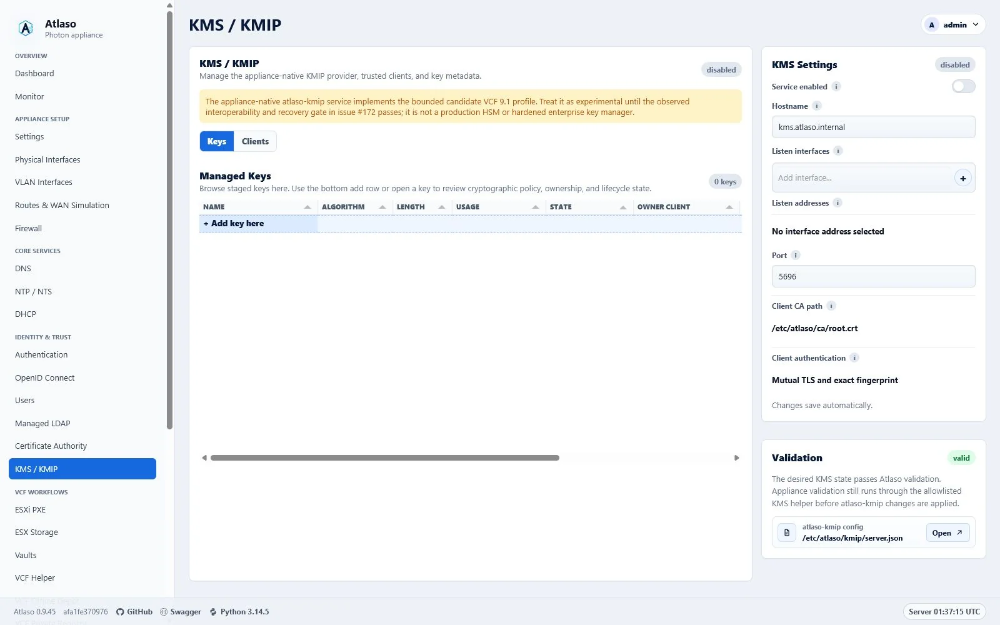
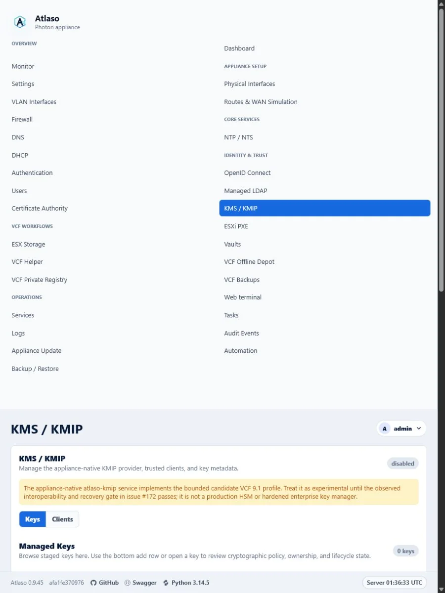

# Verified interface gallery

These images were captured from the dedicated `Atlaso-Docs` VMware Workstation VM. The frozen baseline
runs Atlaso 0.9.21; individually recaptured images record their exact later version and source revision in
the screenshot manifest alongside viewport, capture method, brand variant, and sensitive-data review status.

The clean, configured, pending, failed, and applied labels describe observed appliance states. A
successful state is shown only where the corresponding task completed successfully.

## Api / Docs

Route: `/api/docs`

Figure: Swagger API reference in the verified clean-appliance desktop state.

Figure: Swagger API reference in the verified clean-appliance responsive state.

## Appliance Update

Route: `/appliance-update`

Figure: Appliance Update in the verified clean-appliance desktop state.

Figure: Appliance Update in the verified clean-appliance responsive state.

## Audit Log

Route: `/audit-log`

Figure: Audit Events in the verified clean-appliance desktop state.

Figure: Audit Events in the verified clean-appliance responsive state.

## Authentication

Route: `/authentication`

Figure: Authentication in the verified clean-appliance desktop state.

Figure: Authentication in the verified clean-appliance responsive state.

## Automation

Route: `/automation`

Figure: Automation in the verified clean-appliance desktop state.

Figure: Automation in the verified clean-appliance responsive state.

## Backup Restore

Route: `/backup-restore`

Figure: Backup and Restore in the verified clean-appliance desktop state.

Figure: Backup and Restore in the verified clean-appliance responsive state.

## Ca

Route: `/ca`

Figure: Public certificate portal in the verified clean-appliance desktop state.

Figure: Public certificate portal in the verified clean-appliance responsive state.

## Certificate Authority

Route: `/certificate-authority`

Figure: Certificate Authority in the verified clean-appliance desktop state.

Figure: Certificate Authority in the verified clean-appliance responsive state.

## Dashboard

Route: `/dashboard`

Figure: Atlaso About dialog with the deployed version and build identity.

Figure: Dashboard after a successful DNS appliance apply.

Figure: Dashboard reporting a failed appliance apply task.

Figure: Dashboard in the verified clean-appliance desktop state.

Figure: Dashboard in the verified clean-appliance responsive state.

Figure: Dashboard with valid pending changes and a unit needing attention.

## Dashboard: Appliance Apply Review

Route: `/dashboard#appliance-apply-review`

Figure: Appliance change review with valid and invalid desired-state units.

## Dhcp

Route: `/dhcp`

Figure: DHCP in the verified clean-appliance desktop state.

Figure: DHCP in the verified clean-appliance responsive state.

## Dns

Route: `/dns`

Figure: DNS desired state after a successful dnsmasq apply.

Figure: DNS in the verified clean-appliance desktop state.

Figure: DNS in the verified clean-appliance responsive state.

## Esx Storage

Route: `/esx-storage`

Figure: ESX Storage in the verified clean-appliance desktop state.

Figure: ESX Storage in the verified clean-appliance responsive state.

## Esxi Pxe

Route: `/esxi-pxe`

Figure: ESXi PXE in the verified clean-appliance desktop state.

Figure: ESXi PXE in the verified clean-appliance responsive state.

## Firewall

Route: `/firewall`

Figure: Firewall in the verified clean-appliance desktop state.

Figure: Firewall in the verified clean-appliance responsive state.

## Kms

Route: `/kms`

Figure: KMS and KMIP in the verified clean-appliance desktop state.

Figure: KMS and KMIP in the verified clean-appliance responsive state.

## Ldap

Route: `/ldap`

Figure: Managed LDAP in the verified clean-appliance desktop state.

Figure: Managed LDAP in the verified clean-appliance responsive state.

## Login

Route: `/login`

Figure: Appliance sign-in in the verified desktop viewport.

Figure: Appliance sign-in in the verified responsive viewport.

## Logs

Route: `/logs`

Figure: Logs in the verified clean-appliance desktop state.

Figure: Logs in the verified clean-appliance responsive state.

## Monitor

Route: `/monitor`

Figure: Runtime monitoring after a successful appliance apply.

Figure: Monitor in the verified clean-appliance desktop state.

Figure: Monitor in the verified clean-appliance responsive state.

## Ntp

Route: `/ntp`

Figure: NTP and NTS in the verified clean-appliance desktop state.

Figure: NTP and NTS in the verified clean-appliance responsive state.

## Physical Interfaces

Route: `/physical-interfaces`

Figure: Physical Interfaces in the verified clean-appliance desktop state.

Figure: Physical Interfaces in the verified clean-appliance responsive state.

## Requests

Route: `/requests`

Figure: Certificate requests in the verified clean-appliance desktop state.

Figure: Certificate requests in the verified clean-appliance responsive state.

## Routes Wan

Route: `/routes-wan`

Figure: Routes and WAN Simulation in the verified clean-appliance desktop state.

Figure: Routes and WAN Simulation in the verified clean-appliance responsive state.

## Services

Route: `/services`

Figure: Services in the verified clean-appliance desktop state.

Figure: Services in the verified clean-appliance responsive state.

## Settings

Route: `/settings`

Figure: Settings in the verified clean-appliance desktop state.

Figure: Settings in the verified clean-appliance responsive state.

Figure: Valid Appliance Settings waiting for global appliance apply.

Figure: Rendered Appliance Settings configuration preview.

Figure: Appliance Settings validation error for an invalid FQDN.

## Tasks

Route: `/tasks`

Figure: Failed appliance apply task with redacted operator detail.

Figure: Successful appliance apply task with verified dnsmasq output.

Figure: Successful appliance apply log with captured commands and audit events.

Figure: Tasks in the verified clean-appliance desktop state.

Figure: Tasks in the verified clean-appliance responsive state.

## Terminal

Route: `/terminal`

Figure: Web terminal in the verified clean-appliance desktop state.

Figure: Web terminal in the verified clean-appliance responsive state.

## Users

Route: `/users`

Figure: Users in the verified clean-appliance desktop state.

Figure: Users in the verified clean-appliance responsive state.

## VMware console

Route: `vmware-console`

Figure: VMware console after a successful appliance apply.

## Vcf Backups

Route: `/vcf-backups`

Figure: VCF Backups in the verified clean-appliance desktop state.

Figure: VCF Backups in the verified clean-appliance responsive state.

## Vcf Helper

Route: `/vcf-helper`

Figure: VCF Helper in the verified clean-appliance desktop state.

Figure: VCF Helper in the verified clean-appliance responsive state.

## Vcf Offline Depot

Route: `/vcf-offline-depot`

Figure: VCF Offline Depot in the verified clean-appliance desktop state.

Figure: VCF Offline Depot in the verified clean-appliance responsive state.

## Vcf Private Registry

Route: `/vcf-private-registry`

Figure: VCF Private Registry in the verified clean-appliance desktop state.

Figure: VCF Private Registry in the verified clean-appliance responsive state.

## Vlan Interfaces

Route: `/vlan-interfaces`

Figure: VLAN Interfaces in the verified clean-appliance desktop state.

Figure: VLAN Interfaces in the verified clean-appliance responsive state.
