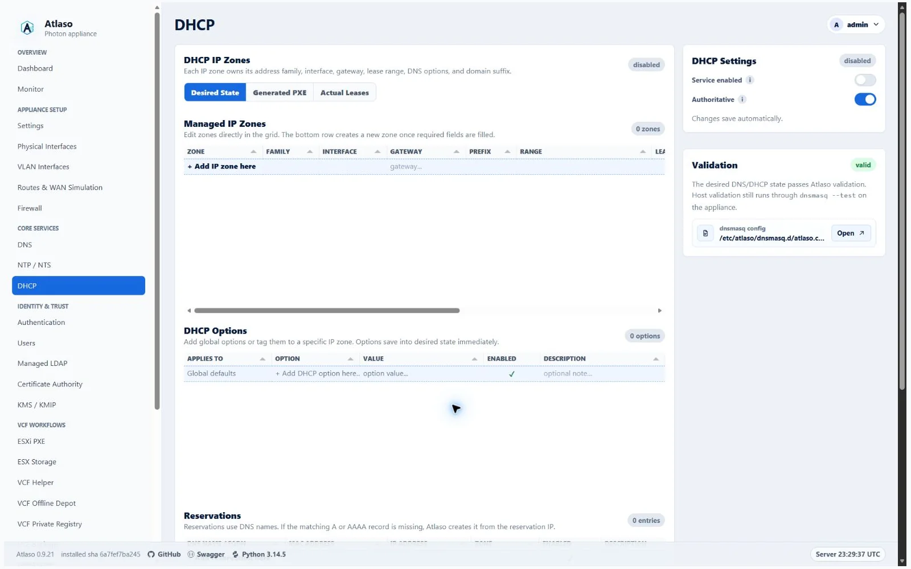
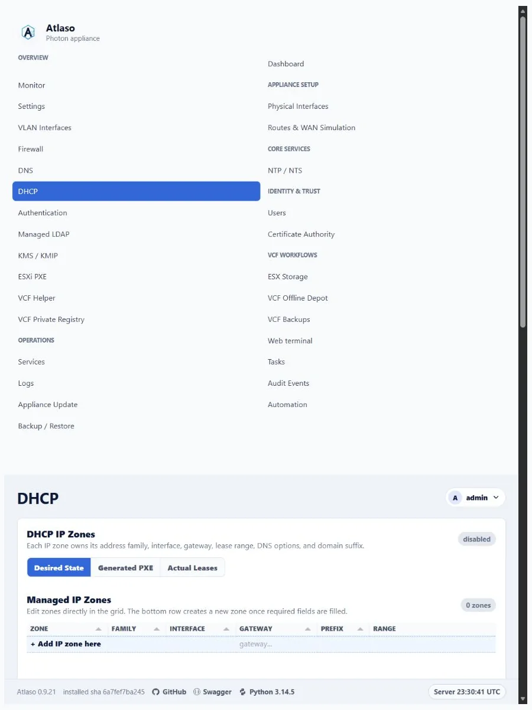

# DHCP

Open **DHCP** to manage scope and reservation desired state rendered into the shared dnsmasq apply unit.

<!-- BEGIN GENERATED INTERFACE OVERVIEW -->
## Interface overview

This verified appliance view provides visual orientation before you begin.

*Figure: DHCP in the verified clean-appliance desktop state.*

<!-- END GENERATED INTERFACE OVERVIEW -->

## Configure a scope

1. Select **Add IP zone here** and use the five-step guided workflow.
2. Select the interface that owns the client network and record the multiline zone description on its own identity row.
3. Confirm the lease range Atlaso derives from the gateway and prefix, or replace it with another valid,
   non-overlapping range.
4. Configure the lease as a positive whole-number duration with an explicit **Minutes**, **Hours**, or **Days** unit,
   then set DNS, NTP, and domain options and choose the zone's desired enablement in its dedicated step.
5. Add reservations with unique client identity and address values.
6. Resolve Validation-card errors and inspect the rendered dnsmasq preview.
7. Submit `DNS/DHCP (dnsmasq)` through [Appliance Apply](../operate/appliance-apply.md).

Changing a scope does not serve leases until the global apply task succeeds. Interface changes also affect generated
firewall bootstrap rules, so confirm the intended bind target in the review. Existing zones can be enabled or disabled
directly from the grid without reopening the wizard.

Select **Add DHCP option here** to choose Global defaults or a specific IP zone, enter the option code and value, set
enablement, and review the desired state. Existing option enablement remains directly editable in the grid.

## Verify

Confirm the task succeeded, `dnsmasq` is healthy, and a test client on the selected network receives the expected lease
and options. Roll back by restoring the previous desired state and submitting a new global apply.

<!-- BEGIN GENERATED ADDITIONAL SCREENSHOTS -->
## Additional verified states

These captures show responsive layouts and useful operational states referenced by this page.

### DHCP

*Figure: DHCP in the verified clean-appliance responsive state.*

<!-- END GENERATED ADDITIONAL SCREENSHOTS -->
