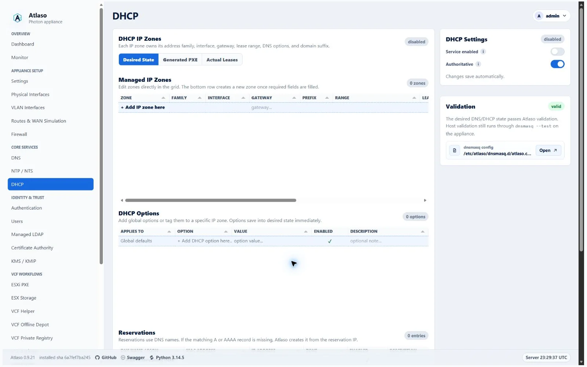
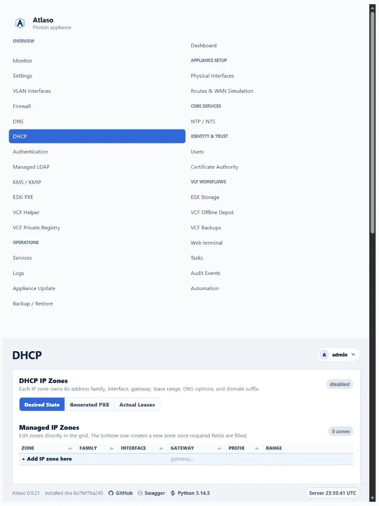
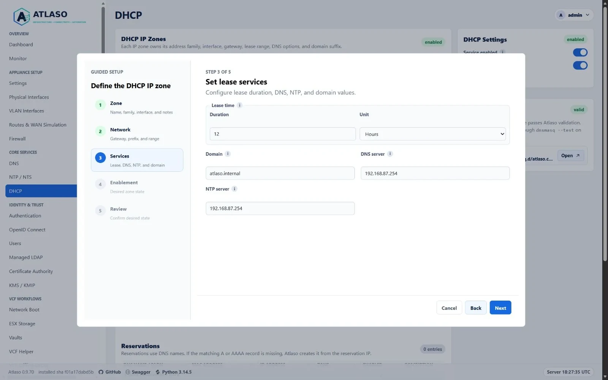
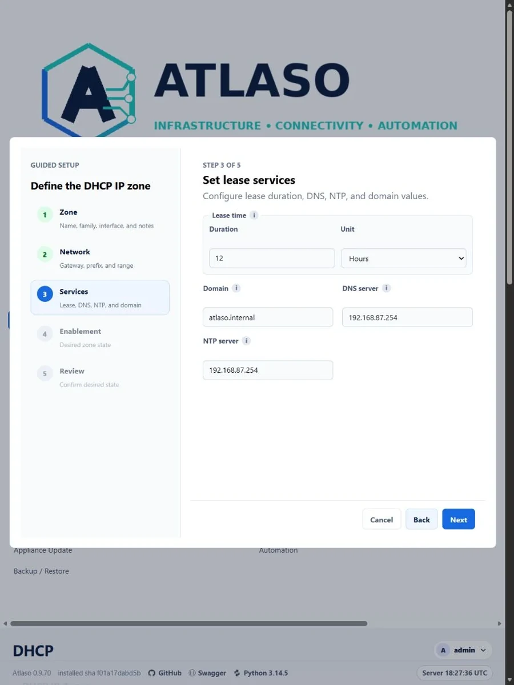

# DHCP

Open **DHCP** to manage scope and reservation desired state rendered into the shared dnsmasq apply unit.

<!-- BEGIN GENERATED INTERFACE OVERVIEW -->
## Interface overview

This verified appliance view provides visual orientation before you begin.

*Figure: DHCP in the verified clean-appliance desktop state.*

<!-- END GENERATED INTERFACE OVERVIEW -->

## Configure a scope

1. Select **Add IP zone here** and use the five-step guided workflow.
2. Select the interface that owns the client network and record the multiline zone description on its own identity row.
3. Confirm the lease range Atlaso derives from the gateway and prefix, or replace it with another valid,
   non-overlapping range.
4. Configure the visually framed **Lease time** group as a positive whole-number duration with an explicit **Minutes**,
   **Hours**, or **Days** unit, then set the aligned DNS, NTP, and domain options and choose the zone's desired
   enablement in its dedicated step.
   Existing lease strings outside those supported units remain unchanged until the operator supplies a supported
   duration and unit.
5. Add reservations with unique client identity and address values.
6. Resolve Validation-card errors and inspect the rendered dnsmasq preview.
7. Submit `DNS/DHCP (dnsmasq)` through [Appliance Apply](../operate/appliance-apply.md).

DNS and NTP options may name reachable service endpoints outside the served subnet, including addresses Atlaso does
not own. For example, a `192.168.4.0/24` scope can advertise `192.168.1.250` for both services. Configure routing and
firewall access separately. Each scope field accepts one usable unicast address of the scope's family, including routed
NAT64 endpoints. Loopback, unspecified, multicast, link-local, IPv4 this-network and limited-broadcast addresses, and
IPv4-mapped IPv6 addresses, the IPv6 discard-only prefix, plus the scope's network or IPv4 broadcast address are
rejected. Gateway and lease-range subnet rules remain unchanged. Global and per-zone option rows retain their existing
option-list syntax.

Changing a scope does not serve leases until the global apply task succeeds. Interface changes also affect generated
firewall bootstrap rules, so confirm the intended bind target in the review. Existing zones can be enabled or disabled
directly from the grid without reopening the wizard.

Select **Add DHCP option here** to choose Global defaults or a specific IP zone, enter the option code and value, set
enablement, and review the desired state. Existing option enablement remains directly editable in the grid.

## Verify

Confirm the task succeeded, `dnsmasq` is healthy, and a test client on the selected network receives the expected lease
and options. Roll back by restoring the previous desired state and submitting a new global apply.

## Check IPv4 allocation candidates

**Check IP availability before assignment** is enabled by default in DHCP Settings. It preserves dnsmasq's native,
daemon-wide IPv4 candidate ICMP checks. Disable it only when you accept that ordinary automatically selected candidates
will not be pinged: Atlaso stages `no-ping`. Saving changes desired state; submit **DNS/DHCP (dnsmasq)** through
Appliance Apply to activate it. Saving does not restart DHCP. New settings and legacy backups without this field
default to enabled; explicit opt-out persists across saves, restart and settings-archive restore.

Native checking is limited. Requested addresses, remembered leases, reservations and renewal paths may bypass the
candidate probe; dnsmasq can also reuse recent probe evidence or limit probes under load. ICMP-blocking devices and
devices appearing after an offer are not comprehensively detected. A nonresponse is not proof of availability. Keep
unmanaged static devices outside dynamic pools, or declare intended reservations. Ordinary lease and reservation
uniqueness checks remain active when candidate checking is disabled. DHCPv6 behavior is unchanged. See the
[dnsmasq manual](https://dnsmasq.org/docs/dnsmasq-man.html) and the
[upstream requested-address explanation](https://lists.thekelleys.org.uk/pipermail/dnsmasq-discuss/2017q2/011437.html).

## Verify an applied pool

1. Apply the enabled IPv4 pool, its reservations and required interface/VLAN configuration. Edited desired state cannot
   be verified until its new configuration is applied.
2. Open **Pool Health**, select the pool and choose **Verify pool** from its row menu. Read-only users can inspect
   results; launching requires DHCP write permission and browser CSRF authorization.
3. Follow the linked task in **Tasks** for progress and authorized cancellation. Cancellation stops at the next bounded
   observation checkpoint and retains the partial report without stopping DHCP.
4. Inspect the live pool summary and address grid. The visible page updates without a reload. Results are bound to
   applied configuration, exact pool and interface/VLAN; editing or deleting that identity invalidates older results.

Verification uses fresh interface-scoped ARP replies on directly connected IPv4 networks. It probes only applied
dynamic ranges and declared reservations in that pool's subnet. Gaps between ranges are excluded; gateway, local,
network and broadcast addresses are not probed. Arbitrary networks, relayed networks and IPv6 are not swept.
Unsupported links, unavailable lease evidence and incomplete observations remain **unknown**. ICMP-blocking devices
can still respond to ARP, but ARP does not authenticate devices. Proxy ARP can represent a remote endpoint instead of
its hardware identity. Stale neighbor entries are not accepted as fresh probe evidence.

Reports distinguish **legitimate use**, **unexpected occupancy**, **occupant/lease mismatch**, **confirmed conflict**
(multiple fresh responder MACs), **no response** and **unknown**. Unexpected occupancy can be legitimate static use;
it does not label a device malicious or unauthorized. Expired leases are ignored. Changed lease/client identities
during probing and unscoped leases for overlapping applied pools on different links remain unknown,
even when another pool has pending edits, disablement or deletion. A prior finding stays
unresolved after silence or incomplete work and resolves only after positive matching lease/reservation evidence.
Its original MAC/lease/client identity snapshot remains visible in the reason as retained evidence, with the original
verification time; current observations remain distinct. The API exposes that snapshot as `retained_finding`; an unchecked
address has a null current `verified_at` rather than claiming a fresh observation.
Details include observed/expected MACs, available client identifiers, reason, first/last seen and verification time.

Only one verifier is admitted globally. A run is limited to 1,024 addresses, chunks of at most 16, at most eight ARP
requests per second, bounded helper calls and ten minutes overall. The same pool cannot queue more than once in 15
minutes; skipped schedule runs do not extend this cooldown. Large or unsupported pools remain unknown; partial work never
implies exhaustive discovery. Verification
never evicts clients, deletes leases, changes reservations, blocks MACs, flushes neighbors or feeds results into
allocator exclusions. Remediation requires explicit desired configuration and Apply. DHCP's existing Logs view remains
the native allocation/exhaustion diagnostic surface; a scan does not prove every offer was protected.

Pool Health lists enabled IPv4 pools; disabled and IPv6 scopes remain in the ordinary scope overview.

Scheduled verification is optional and is not enabled by the default allocation-check switch. Choose **Schedule
verification** from the pool menu or create a **dhcp pool verify** task in **Automation Schedules**, select the IPv4
pool, then explicitly choose its state and an hourly or slower recurrence. Missed/overlapping runs are skipped;
edited, deleted or unapplied dependencies are revalidated at queueing and execution. Disable or delete the schedule to
stop future runs. Task history keeps bounded per-run identifiers and evidence; Pool Health retains the latest report.
Archive restore rebinds disabled verification schedules by unique pool name. Legacy archives without that binding,
or a missing or ambiguous name, leave the schedule detached and require explicit pool selection.
Deleting a pool disables and detaches its verification schedules; select an enabled IPv4 pool explicitly before
using them again. The State toggle refuses detached, missing, disabled or IPv6 pool bindings.
Settings restore retires pre-restore report and cooldown bindings while preserving verification job history.
Disabled detached schedules remain portable in settings archives. Service Admins can verify and cancel from Tasks;
creating verification schedules remains an administrator action.
Deletion removes its verification report. A recreated pool starts without the deleted pool's observations,
even when its database ID and configuration are reused. Historical jobs remain available; their retired scope
bindings do not impose a cooldown on a recreated pool. An old in-flight task cannot publish into the recreated pool.
No packet payload captures,
credentials or external uploads are included.

The full VMware lifecycle includes `dhcp-pool-verification-check`: it measures the installed dnsmasq version and check
mode, verifies that saving opt-out leaves runtime unchanged until Apply, restores checking, and requires fresh
legitimate-use evidence from its SiteA DHCP client. This is narrower than comprehensive packet/allocation acceptance;
requested-address, reservation, renewal and DHCPDECLINE behavior retain the documented native limits.

API clients use `GET /api/v1/dhcp/scopes/{scope_id}/verification` with `read:dhcp` and
`POST /api/v1/dhcp/scopes/{scope_id}/verification` with `write:dhcp`. POST returns `202` and a task ID; it accepts
only a managed pool ID and returns `409` for unavailable identity or admission. These calls neither apply configuration
nor restart services. The additive `check_ip_availability` settings field saves desired state; omission preserves an
existing explicit opt-out.

## Transport ownership

The management DHCP transports and their API v1 counterparts are owned by the dedicated `dns_dhcp` domain
routers. The stable UI and API facade modules continue to aggregate and export those handlers. This internal ownership
split does not change any path, method, permission, response, desired-state behavior, dnsmasq rendering, or the global
Appliance Apply boundary described above.

<!-- BEGIN GENERATED ADDITIONAL SCREENSHOTS -->
## Additional verified states

These captures show responsive layouts and useful operational states referenced by this page.

### DHCP

*Figure: DHCP in the verified clean-appliance responsive state.*

### Dhcp: Ip Zone Services

*Figure: DHCP IP zone Services step with aligned service fields and a framed Lease time group.*

*Figure: DHCP IP zone Services step in the verified narrow viewport.*

<!-- END GENERATED ADDITIONAL SCREENSHOTS -->
