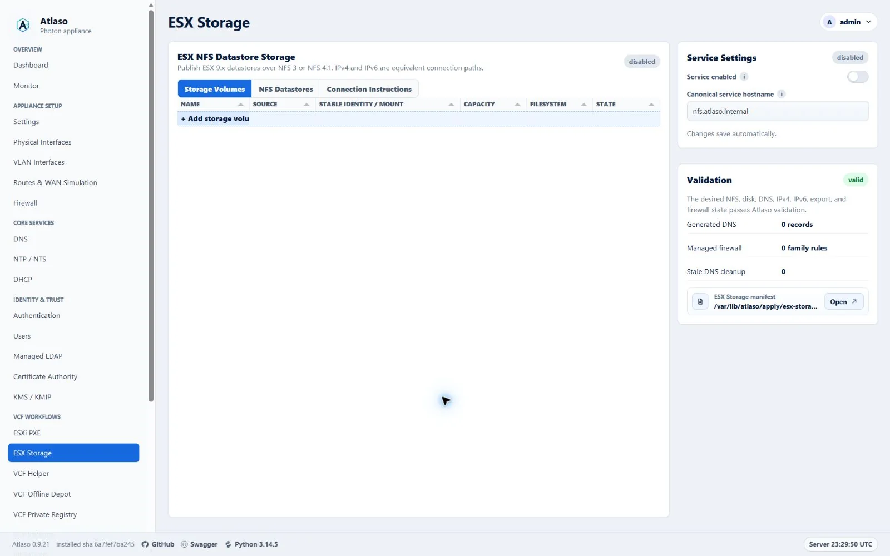
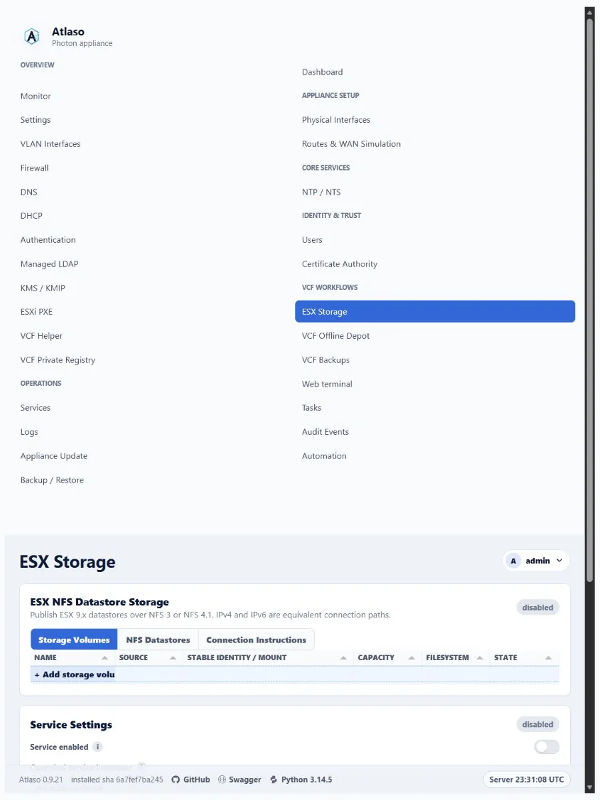

# ESX Storage over NFS

Atlaso ESX Storage publishes ESX 9.x datastores over kernel NFS 3 and NFS 4.1. IPv4 and IPv6 have equal status: a share
may enable IPv4, IPv6, or both, and Atlaso never treats either family as preferred, secondary, fallback, or future work.

<!-- BEGIN GENERATED INTERFACE OVERVIEW -->
## Interface overview

This verified appliance view provides visual orientation before you begin.



*Figure: ESX Storage in the verified clean-appliance desktop state.*

<!-- END GENERATED INTERFACE OVERVIEW -->

The Storage Volumes and NFS Datastores grids each end with an add row. Selecting it opens a guided modal that validates
the current step before advancing and summarizes the desired state before creation. Storage selectors show discovered
eligible devices directly and select the first available device; when inventory has no eligible choice, they show a
disabled unavailable state. Double-click a datastore row or choose **Edit datastore** from its row menu to reopen that
datastore in the wizard. Its Enabled column uses the standard state icon and is directly editable; the wizard exposes
the same switch in a dedicated State step after Clients and repeats the choice in Review. Disabling a datastore changes
desired state only, takes effect through global appliance apply, and never deletes backing data. Server validation
failures remain in the open wizard; successful creation closes the wizard and reloads the selected tab. Atlaso remembers
the active Storage Volumes, NFS Datastores, or Connection Instructions tab across refreshes, and a successful global
appliance apply refreshes this page so formatted UUID, mount, and applied state are current. Volume initialization
remains only a desired-state operation in this wizard; blank-disk formatting still requires explicit authorization in
the global appliance review.

## Architecture

One `EsxNfsShare` is one datastore name, one backing directory, one selected storage interface or VLAN, and one
preferred NFS version. A dual-stack share remains one database object and one data directory. Atlaso derives two
equivalent connection paths when both families are enabled:

- an IPv4 listener, A target record, IPv4 VMkernel allowlist, nftables `ip saddr` rule, and IPv4 ESX command;
- an IPv6 listener, AAAA target record, IPv6 VMkernel allowlist, nftables `ip6 saddr` rule, and IPv6 ESX command.

Every enabled family must have an address on the selected interface/VLAN. A non-empty VMkernel client list restricts
that family to the specified IP addresses or CIDRs. An empty IPv4 list explicitly renders `0.0.0.0/0`, and an empty IPv6
list renders `::/0`, allowing any client of that family. There is no automatic family preference or failover. Every ESX
host mounting the same datastore must use the same NFS version and the same generated hostname for the selected family,
consistent with
[Broadcom datastore identity guidance](https://knowledge.broadcom.com/external/article/422999/mounting-the-same-nfs-volume-in-differen.html).

## Storage VMkernel networks

Configure IPv4, IPv6, or both on the ESX VMkernel adapter that reaches the selected Atlaso storage interface/VLAN. Put
the exact VMkernel addresses or the smallest appropriate CIDRs into the matching share allowlists. Leave a family empty
only when every client on that reachable network should be allowed. Do not place an IPv6 client in the IPv4 list or an
IPv4 client in the IPv6 list.

Before mounting, verify the selected path from every ESX host:

```text
vmkping -I vmk2 nfs-192-168-87-254.atlaso.internal
vmkping -6 -I vmk2 nfs-2001-db8-87-0-0-0-0-fe.atlaso.internal
```

Also query Atlaso DNS directly and confirm the IPv4 target returns A and the IPv6 target returns AAAA. App-owned A/AAAA
records use the existing dnsmasq `host-record` renderer and therefore receive normal generated PTR answers.

## DNS names

The normal canonical alias is `nfs.<domain>`. Atlaso follows Appliance Settings’ global target-naming mode:

- IP mode generates names such as `nfs-192-168-87-254.<domain>` and `nfs-2001-db8-87-0-0-0-0-fe.<domain>`;
- interface mode generates an interface-derived target name with A and/or AAAA records.

The canonical alias publishes the same listener set as A and AAAA records for ordinary discovery. Dual-stack mount
instructions deliberately do not use the canonical alias: the IPv4 command uses the generated A target and the IPv6
command uses the generated AAAA target. Resolver preference therefore cannot choose a family implicitly.

Atlaso never replaces an operator-owned A or AAAA record. A collision blocks ESX Storage apply. Changing the interface,
addresses, enabled families, service hostname, or enabled state removes stale app-owned records and marks `esx_storage`,
`dnsmasq`, and `firewall` pending together. DNS desired state must be enabled and valid before ESX Storage can be
applied.

## Volumes and disk initialization

Storage Volumes supports two sources:

1. An approved blank whole disk. Inventory accepts only a disk with a stable `/dev/disk/by-id` identity and no
   filesystem, partition, mount, swap use, LVM or RAID membership, holders, existing ESX Storage claim, read-only state,
   or relationship to the operating-system disk.
2. An eligible mounted ext4 whole disk. It must have a stable `/dev/disk/by-id` identity, UUID-backed `/etc/fstab`
   persistence, no partitions or holders, and an active UUID-matching mount. Apply revalidates the complete contract and
   writes its exact UUID, stable identity, and mount to root-owned `/etc/atlaso/esx-storage-disks.conf`. Filesystems
   reserved for VCF Backups or VCF Offline Depot / VCFDT are never eligible, including paths below those mount roots.

A newly initialized disk becomes a whole-device ext4 filesystem mounted by filesystem UUID at
`/mnt/atlaso-esx-storage/<volume-slug>`. `/dev/sdX` names are never persisted. The global review displays the complete
model, serial, WWN, size, and stable identity and requires the exact text `FORMAT <volume-name>`. The resulting
authorization belongs only to that appliance-apply job and the exact manifest hash/device identity; it is not desired
state and is not placed in baselines or settings backups.

When a virtual SCSI controller does not expose a serial or WWN, the appliance udev policy creates a stable
topology-derived `atlaso-path-*` link under `/dev/disk/by-id`. The complete topology identity and fingerprint are still
reviewed and revalidated; `/dev/sdX` is never accepted.

The helper inventories the disk again immediately before `mkfs.ext4`. If any safety property changed, apply stops before
formatting. Formatting is deliberately not rolled back. If a later mount, export, service, DNS, or firewall step fails,
the successfully created ext4 filesystem and its UUID-based managed fstab entry remain intact, so boot verification and
an idempotent retry continue from it. Each formatted disk is persisted before apply advances to another failure-prone
volume. A retained filesystem keeps ownership of its managed mount path: a later blank volume cannot reuse that path
with a different UUID, even when it uses the same volume name. Resolve or detach the retained disk before assigning
that name to another filesystem. V1 has no wipe, reformat, or delete-data action.

## Share paths and exports

Share paths are relative to a selected volume. Atlaso rejects an empty/root path, `..` traversal, symlink escape,
duplicate datastore names, overlapping exports, and root-plus-child exports. Multiple sibling directories on one volume
are supported. Runtime bind mounts live under `/srv/atlaso/esx-storage/<share-slug>`.

NFS 3 and NFS 4.1 are enabled globally over TCP; NFS 2, NFS 4.0, and UDP transport are disabled. `rpcbind.service` and
`nfs-server.service` remain disabled until at least one valid share is active. Mountd uses fixed TCP port 20048. Exports
use `rw,sync,no_subtree_check,no_root_squash` with AUTH_SYS and are restricted to the IPv4 and IPv6 VMkernel allowlists.
Empty allowlists deliberately become the family-wide networks `0.0.0.0/0` and `::/0`. `no_root_squash` follows
[Broadcom’s ESX NFS access guidance](https://knowledge.broadcom.com/external/article/433826/esxi-host-fails-to-mount-nfs-datastore-w.html),
so narrow client allowlists and the dedicated storage network are strongly recommended whenever unrestricted access is
unnecessary.

Live service health requires `nfs-server.service` for every enabled share. When any enabled share prefers NFS 3, it also
requires `rpcbind.service`; a stopped, failed, or unreadable rpcbind state reports ESX Storage as degraded in Services,
the REST service status, and the appliance console. NFS 4.1-only desired state does not depend on rpcbind health.

The preferred version controls the generated command and remote path:

- NFS 3: `/srv/atlaso/esx-storage/<share-slug>` and TCP 111, 20048, and 2049;
- NFS 4.1: `/<share-slug>` and TCP 2049.

The dedicated **Connection Instructions** tab shows separate IPv4 and IPv6 commands for every enabled datastore. It
provides both ESXCLI and VMware PowerCLI `New-Datastore` forms, with a copy-to-clipboard action beside every exact
command. Set the PowerCLI `$vmHost` variable to the target ESX host before running the displayed command. The generated
PowerCLI command maps NFS 3 to `-FileSystemVersion NFS` and NFS 4.1 to `-FileSystemVersion NFS41`; its path and
family-specific hostname match the datastore desired state. See the
[Broadcom PowerCLI `New-Datastore` reference](https://developer.broadcom.com/powercli/latest/vmware.vimautomation.core/commands/new-datastore).
Use the command for the family configured on that ESX VMkernel path. After mounting, perform create/read/delete probes
on every protocol/family combination in the acceptance topology.

## Apply, persistence, backup, and reset

ESX Storage stages `/var/lib/atlaso/apply/esx-storage/atlaso-esx-storage.json`. The constrained helper supports:

```text
atlaso-helper esx-storage inventory
atlaso-helper esx-storage validate <manifest>
atlaso-helper esx-storage apply <manifest>
atlaso-helper esx-storage status
atlaso-helper esx-storage logs
```

Global appliance apply is the only mutation path. Dry-run records intended validation, format, UUID mount, bind mount,
export, DNS, firewall, and service commands without changing the host. Real apply writes a managed `/etc/fstab` block,
root-owned stable-identity claims for both formatted and existing disks in `/etc/atlaso/esx-storage-disks.conf`,
`/etc/exports.d/atlaso-esx-storage.exports`, and `/etc/nfs.conf.d/atlaso-esx-storage.conf`, then refreshes exports and
services. Reapply recognizes an existing bind target by its mountpoint and filesystem object identity, so a healthy
share is not mounted again; an unexpected mount at a managed target fails closed instead of being replaced. At boot,
nginx, the HTTPS bootstrap, Atlaso control plane, and worker require successful fixed/managed data-disk verification.
The preflight mounts each positively claimed primary ESX Storage path from its UUID-backed fstab entry when it is not
already active, then verifies the mounted UUID and block-device source before accepting the extra whole disk. Boot
safety therefore does not depend on `nofail` mount-unit timing. Atlaso escapes generated fstab fields and decodes
standard fstab path escapes before comparing mounted and persisted paths, so a claimed path containing whitespace keeps
the same identity during apply, release migration, and reboot validation.

An existing ext4 source must be read-write at its selected mount and cannot have another non-Atlaso mount. Apply rejects
state that the boot verifier would later reject, preventing a successful configuration change from making the next boot
fail closed. The root-owned disk claim records whether Atlaso formatted the disk or accepted an existing filesystem;
boot checks use that source type rather than treating a label pattern as ownership, while formatted-disk claims still
require their Atlaso `lf-<12 hex>` filesystem label.

For a blank fixed disk, the boot helper revalidates the topology link, resolved device, controller, capacity, contents,
read-only state, holders, raw-device users, and mounts immediately before formatting. The format command uses that
validated resolved device rather than dereferencing the topology link again.

Settings backups include the service, volume fingerprints/UUIDs/mounts, and shares but never a format authorization.
Restore marks volumes for runtime verification before reapply. Factory reset removes Atlaso desired state, exports, and
service enablement in its dedicated transaction; it does not erase, reformat, unmount, detach, or delete files on
storage disks. UUID disk mounts and exact boot claims remain while preserved disks are attached so they cannot block the
next boot; stale share bind mounts are removed. Reattach preserved ext4 data as an existing mounted volume.

## Troubleshooting

Check both address families independently:

```text
dig @<atlaso-dns-ip> nfs-192-168-87-254.<domain> A
dig @<atlaso-dns-ip> nfs-2001-db8-87-0-0-0-0-fe.<domain> AAAA
exportfs -v
ss -lntp | grep -E ':(111|2049|20048)\b'
nft list ruleset
systemctl status rpcbind.service nfs-server.service --no-pager
journalctl -u rpcbind.service -u nfs-server.service -n 200 --no-pager
```

If one family fails, verify its VMkernel address, route/VLAN, generated DNS record, allowlist family, and
family-specific nftables source expression. Do not work around a family mismatch by switching to the canonical alias.

## iSCSI boundary

iSCSI is not part of this feature. The current Photon appliance kernel does not provide the maintained target
modules/management stack required for a supportable implementation. iSCSI requires a separate feasibility issue and
architecture review covering the target kernel, target management implementation, authentication, LUN lifecycle,
persistence, firewalling, upgrade compatibility, and lifecycle acceptance. ESX Storage does not emulate iSCSI with an
unsupported userspace target.

<!-- BEGIN GENERATED ADDITIONAL SCREENSHOTS -->
## Additional verified states

These captures show responsive layouts and useful operational states referenced by this page.

### ESX Storage



*Figure: ESX Storage in the verified clean-appliance responsive state.*

<!-- END GENERATED ADDITIONAL SCREENSHOTS -->
