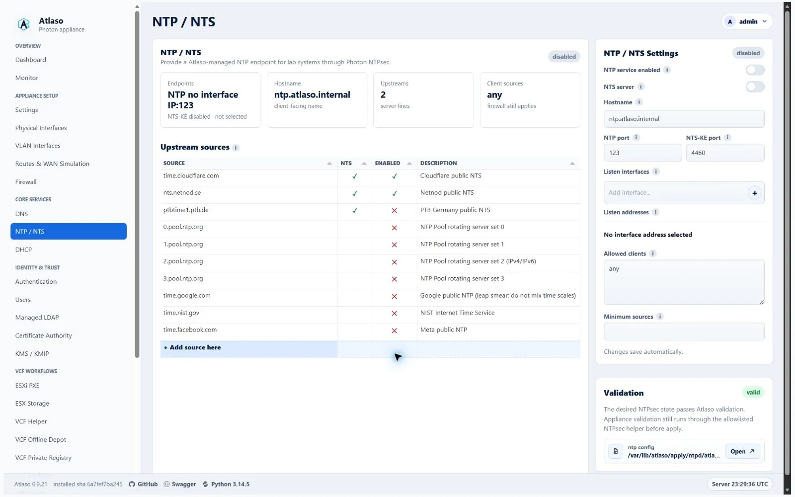
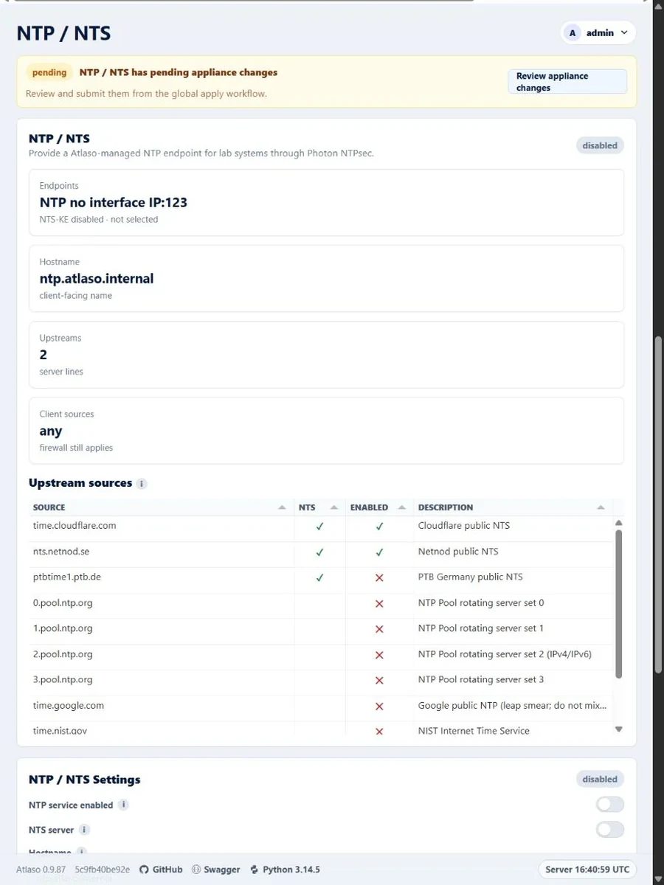

# NTP and NTS

Open **NTP and NTS** to configure appliance time sources, service behavior, and network time security settings owned by
NTPsec.

<!-- BEGIN GENERATED INTERFACE OVERVIEW -->
## Interface overview

This verified appliance view provides visual orientation before you begin.

*Figure: NTP and NTS in the verified clean-appliance desktop state.*

<!-- END GENERATED INTERFACE OVERVIEW -->

## Configure time service

1. Select **Add source here** and use the reviewed source wizard to enter the endpoint and a full-width multiline
   description.
2. Configure NTS and desired enablement in the wizard only when the source and certificate trust are available.
   Existing source enablement remains directly editable in the grid.
   Editing a source updates that row; source names are unique after hostname, address, and optional-port normalization.
   Rename or remove an existing row before reusing its source name.
3. Review warnings about source reachability or incomplete security settings.
4. Inspect the rendered NTPsec preview.
5. Submit the NTPsec unit through [Appliance Apply](../operate/appliance-apply.md). In NTS server mode, Atlaso always
   includes Certificate Authority first so missing or stale runtime certificate files are repaired; the CA does not
   need a public portal interface for this internal certificate deployment. If managed LDAP is active, Atlaso also
   includes any changed CA, DNS/DHCP, Firewall, and Managed LDAP dependency units in the same task.

Appliance Settings does not own time enforcement. DNS/DHCP also does not apply NTP configuration.
Web Terminal enablement and interface autosave are isolated to Appliance Settings and never change NTP/NTS sources,
server mode, certificate ownership, rendered configuration, or NTP apply selection.

Atlaso disables NTS controls when the installed NTPsec binary explicitly reports that NTS is unsupported. If the
capability check itself is temporarily unavailable, Atlaso preserves existing NTS desired-state flags and keeps the
controls disabled until detection succeeds. Validation blocks appliance apply while an enabled source or server mode
still requests NTS and capability remains unknown.

After upgrading from the release that removed NTS, Atlaso runs `ntp_nts_restoration_v1` once. It re-enables and
normalizes only the canonical Cloudflare and Netnod default rows and records a value-free system audit. Custom sources
remain unchanged, and NTS server mode stays off until an administrator enables it. Turning server mode off removes the
managed `ntp:nts` certificate record; the next NTP apply removes deployed server certificate, key, and cookie material
while leaving authenticated upstream client sources enabled.

## Verify

After the task succeeds, confirm the service is active and the appliance has selected a valid peer. Allow normal
settling time before treating an initial unsynchronized state as failure. Restore the previous sources and reapply if
the selected configuration cannot synchronize.

<!-- BEGIN GENERATED ADDITIONAL SCREENSHOTS -->
## Additional verified states

These captures show responsive layouts and useful operational states referenced by this page.

### NTP and NTS

*Figure: NTP and NTS in the verified clean-appliance responsive state.*

<!-- END GENERATED ADDITIONAL SCREENSHOTS -->
