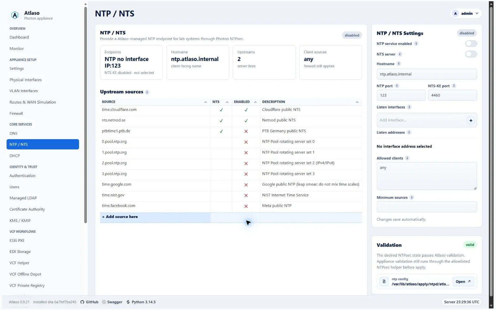
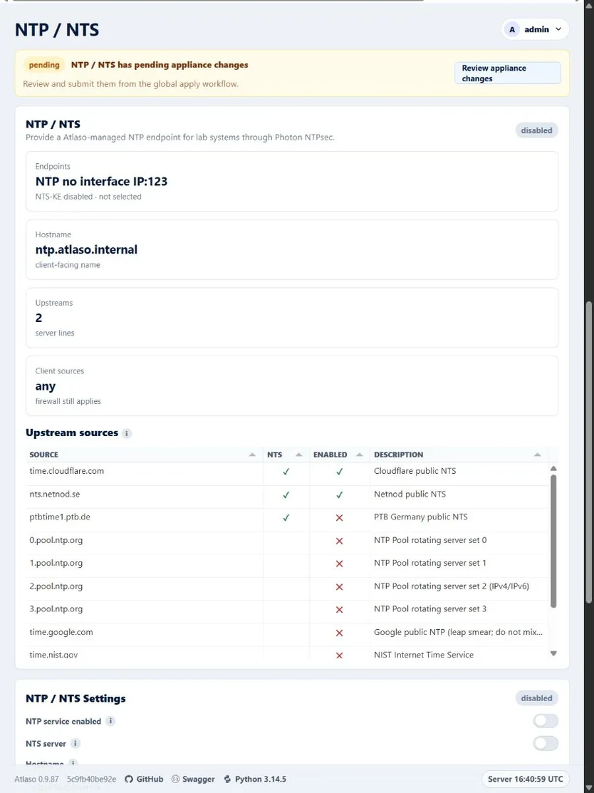

# NTP and NTS

Open **NTP and NTS** to configure appliance time sources, service behavior, and network time security settings owned by
NTPsec.

<!-- BEGIN GENERATED INTERFACE OVERVIEW -->
## Interface overview

This verified appliance view provides visual orientation before you begin.



*Figure: NTP and NTS in the verified clean-appliance desktop state.*

<!-- END GENERATED INTERFACE OVERVIEW -->

## Configure time service

1. Select **Add source here** and use the reviewed source wizard to enter the endpoint and a full-width multiline
   description.
2. Configure NTS and desired enablement in the wizard only when the source and certificate trust are available.
   Existing source enablement remains directly editable in the grid.
   Editing a source updates that row; source names are unique after hostname, address, and optional-port normalization.
   Rename or remove an existing row before reusing its source name.
3. Review warnings about source reachability or incomplete security settings.
4. Inspect the rendered NTPsec preview.
5. Submit the NTPsec unit through [Appliance Apply](../operate/appliance-apply.md). In NTS server mode, Atlaso always
   includes Certificate Authority first so missing or stale runtime certificate files are repaired; the CA does not
   need a public portal interface for this internal certificate deployment. Atlaso also publishes the shared NTP/NTS
   hostname through the DNS/DHCP unit after NTP succeeds when its managed record changed. If managed LDAP is active,
   Atlaso also includes any changed CA, DNS/DHCP, Firewall, and Managed LDAP dependency units in the same task.

## Appliance clock source

When the NTP service is disabled, **Appliance time source** selects one clock authority:

- **NTP client** is the default. Atlaso uses its configured upstream NTP/NTS sources to discipline the appliance
  clock and disables VMware Tools periodic guest time synchronization.
- **VMware Tools** uses the hypervisor's guest time synchronization and disables Atlaso's NTP client service.
  This choice is available only when the appliance confirms VMware Tools support. Appliances without VMware Tools
  use NTP client; a restored VMware Tools choice is normalized before Apply.

These sources are mutually exclusive because both can adjust the same system clock. Enabling the NTP service makes the
managed **NTP/NTS server** the effective clock mode; NTPsec uses the configured upstream sources and Atlaso disables
VMware Tools time synchronization. The remembered client choice is retained while server mode is on and becomes
effective again when the NTP service is disabled. The NTS server switch controls NTS Key Establishment for clients;
it does not select the appliance clock mode by itself.

Server mode keeps NTP transport available on routed interfaces so upstream replies can discipline the appliance clock.
A subsystem-owned packet guard permits upstream replies and local diagnostics, but accepts time-service requests only
at the selected listener addresses. Firewall replacement and reboot preserve this guard; missing or changed isolation
makes server health unavailable or unhealthy.

The selection autosaves as desired state. Global Appliance Apply performs the host transition and verifies its result;
the page reports the effective mode, NTP synchronization health, and detected local daemon states separately from the
saved choice. Before changing applied configuration, Atlaso durably records the prior configuration. If Apply is
interrupted before controller verification, startup and service guards restore it; a verified checkpoint retains the
new controller after a power loss. While a transaction remains prepared, status marks the mode as unverified and
withholds synchronization health even if the candidate clock has synchronized. An invalid checkpoint or a verified
checkpoint that differs from the current configuration also leaves status unverified until recovery.
NTS private material stays in its managed location until verification.
Before an NTS transition, Atlaso records the prior configuration and stops NTPsec before capturing its final key
material, so cookie rotation cannot leave an incomplete rollback snapshot. Boot and Tools hooks remain deferred
through candidate verification; NTPsec startup requires Apply authorization of the exact installed candidate after
its configuration, listener guard and key permissions are ready. A capture failure restores the prior
controller without changing that material. If an NTS transition fails, rollback stops the candidate controller and
restores the prior material exactly, including removing files created only by the candidate. Incomplete restoration
prevents the prior controller from
restarting and leaves recovery pending.
Missing, replaced, and legacy configurations require Apply before startup can establish their clock authority;
startup and service guards stop uncertain controllers until then without adopting vendor configuration.
If old NTS material cleanup fails after controller verification, Atlaso retains the
verified new mode and leaves Apply pending for a cleanup retry. NTP synchronization verification allows up to 60 seconds,
including recovery after a clock step when switching from VMware Tools.
Apply also allows a full synchronization wait during rollback. Recovery evidence remains available for a later retry
if neither restoring the prior controller nor safely stopping the unverified candidate can be verified.
VMware Tools Apply enables and starts the Tools service so the selected controller survives reboot. It also waits up
to 60 seconds for two advancing host-time observations that agree with the guest
clock within two seconds. This tolerance accounts for the host-time command's whole-second precision. An enabled
periodic-sync setting alone cannot complete Apply. Status reports clock disagreement as unhealthy and an unavailable
host-time comparison as unknown.
VMware Tools restart and failed-start hooks restore the selected NTP controller after temporarily stopping it.
Startup, restore, appliance updates, and reboot preserve the same mutual-exclusion rule. Settings archive
and restore include the selected source. Factory reset returns the source to the documented **NTP client** default.

For read-only diagnosis on the appliance, inspect the Atlaso status and VMware Tools time-sync interfaces:

```sh
atlaso-helper ntpd status
vmware-toolbox-cmd timesync status
```

An unsynchronized NTP client or server may indicate an unreachable upstream, NTS key-establishment failure, missing
NTP replies, `leap_alarm` or no system peer, or another active local clock daemon. VMware Tools being active while
NTP client or server mode is effective is a clock-source conflict. A listening UDP 123 or TCP 4460 socket alone does
not mean the appliance clock is synchronized. Use the status details, correct upstream reachability or the conflicting
service through the supported appliance workflow, and apply again. If helper status is unavailable, Atlaso reports the
effective state as unknown instead of claiming the clock is healthy.

NTP health uses the current synchronization state. NTPsec's last event can still show
`no_sys_peer` after synchronization recovers; that historical event does not override
current `leap_none` and `sync_ntp` state. If every actual upstream peer has zero reach, health reports missing replies
even while those synchronization flags remain set. Firewall Apply and service activation replay
the client-only ingress guard in the same nftables transaction as the firewall rules.

Appliance Settings does not own time enforcement. DNS/DHCP also does not apply NTP configuration.
The configured NTP hostname serves both NTP and NTS; Atlaso creates one managed CNAME with A and AAAA targets for
the selected listener addresses. Disable NTP to remove those owned records while preserving operator DNS rows.
Web Terminal enablement and interface autosave are isolated to Appliance Settings and never change NTP/NTS sources,
server mode, certificate ownership, rendered configuration, or NTP apply selection.

Atlaso disables NTS controls when the installed NTPsec binary explicitly reports that NTS is unsupported. If the
capability check itself is temporarily unavailable, Atlaso preserves existing NTS desired-state flags and keeps the
controls disabled until detection succeeds. Validation blocks appliance apply while an enabled source or server mode
still requests NTS and capability remains unknown.

After upgrading from the release that removed NTS, Atlaso runs `ntp_nts_restoration_v1` once. It re-enables and
normalizes only the canonical Cloudflare and Netnod default rows and records a value-free system audit. Custom sources
remain unchanged, and NTS server mode stays off until an administrator enables it. Turning server mode off removes the
managed `ntp:nts` certificate record; the next NTP apply removes deployed server certificate, key, and cookie material
while leaving authenticated upstream client sources enabled.

## Verify

After the task succeeds, confirm the service is active and the appliance has selected a valid peer. Allow normal
settling time before treating an initial unsynchronized state as failure. Restore the previous sources and reapply if
the selected configuration cannot synchronize.

<!-- BEGIN GENERATED ADDITIONAL SCREENSHOTS -->
## Additional verified states

These captures show responsive layouts and useful operational states referenced by this page.

### NTP and NTS



*Figure: NTP and NTS in the verified clean-appliance responsive state.*

<!-- END GENERATED ADDITIONAL SCREENSHOTS -->
