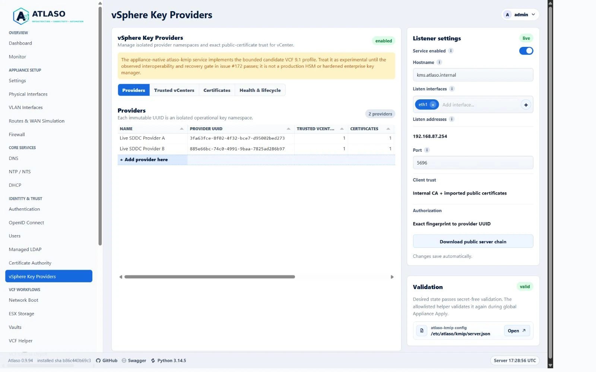
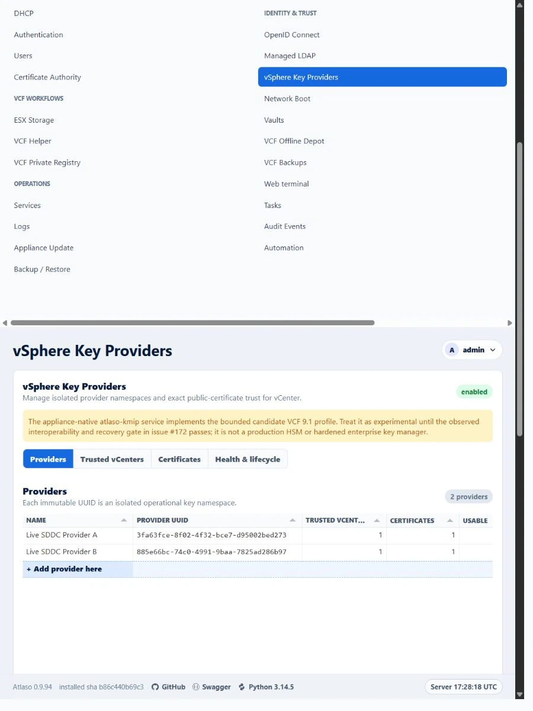

# vSphere Key Providers

Open **vSphere Key Providers** at `/ui/management/vsphere-key-providers` to manage Atlaso's appliance-native KMIP
endpoint. The
listener and server identity are shared appliance-wide, while every provider UUID is an isolated operational key
namespace.

<!-- BEGIN GENERATED INTERFACE OVERVIEW -->
## Interface overview

This verified appliance view provides visual orientation before you begin.

*Figure: vSphere Key Providers in the verified clean-appliance desktop state.*

<!-- END GENERATED INTERFACE OVERVIEW -->

Atlaso implements a bounded candidate profile for VCF 9.1. Keep it experimental until the observed interoperability
and recovery work in issue #172 is complete. Do not describe the current candidate as observed or supported VCF 9.1
behavior.

*Figure: the provider, trusted-vCenter, certificate, and lifecycle tools with listener settings in the right rail.*

## Enroll from vCenter

1. Enable Atlaso's Certificate Authority, configure the KMS hostname and listener, and add an enabled provider namespace.
   Atlaso issues and manages the shared KMIP server certificate from its CA when KMS is enabled. Run global
   **Appliance Apply** to deploy the server certificate and listener. Keep the provider's immutable UUID for the
   later approval step.
2. In the VCF 9.1 vSphere Client, add Atlaso's hostname and port as a standard KMS/key provider. Use vCenter's
   **Establish Trust** controls to trust Atlaso's server identity. The Atlaso listener rail exposes its public server
   chain. A root-CA trust choice is preferable where vCenter supports it, because vCenter versions that pin only the
   leaf need trust re-establishment after server-certificate renewal. Confirm the server identity independently.
3. In vCenter, create or select the KMS cluster's client certificate with **Make KMS trust vCenter**. The private key
   stays in vCenter. Give an Atlaso Vault entry a vCenter account with `Cryptographer.ManageKeyServers` permission;
   Atlaso uses it only for authenticated, read-only certificate discovery.
4. In Atlaso **Trusted vCenters**, choose **Enroll from vCenter**. Select the provider, enter the vCenter host and its
   exact KMS cluster ID, and choose the Vault credential. Inspect vCenter HTTPS, confirm its SHA-256 fingerprint through
   an independent trusted source, then inspect the public KMIP client certificate. Review its exact fingerprint and
   provider assignment before approval. Atlaso re-reads the certificate on approval and rejects a changed identity.
5. Review **Pending Appliance Changes** and run global **Appliance Apply** for `kms`. Until that apply completes,
   vCenter's client certificate is not usable for KMIP key operations. Recheck the connection in vCenter.

This path starts in vCenter and does not require a pre-created trusted-vCenter row or manual public-certificate paste
in Atlaso. The Vault credential is referenced by its stable vault and entry IDs; its password is not copied into
provider state. Discovery requires the selected vCenter cluster to point only to the configured Atlaso hostname and
port. Client authorization remains an exact fingerprint-to-provider-UUID mapping.

Certificate fingerprints are normalized SHA-256 values and are unique appliance-wide. The same fingerprint cannot be
assigned to another trusted vCenter or provider. Atlaso stores canonical public PEM and parsed public metadata only; it
does not generate, accept, export, or reveal a vCenter client private key.

Listener settings accept only currently available addressed access or VLAN interfaces. Atlaso derives the saved IPv4
and IPv6 listener addresses from those selected interfaces; API callers cannot bind the service to an unrelated address
by supplying a different `listen_addresses` value.

## Rotate or retire public trust

Use **Refresh from vCenter** on the trusted-vCenter row after preparing a replacement client certificate in vCenter.
Inspect and approve its new public fingerprint, then apply the overlapping trust bundle globally before switching
vCenter to the replacement. Retire the old certificate only after reconnect and key retrieval succeed. If discovery
is unavailable during recovery, **Add public certificate manually** remains an explicit fallback. Atlaso rejects
private-key blocks, malformed or expired certificates, CA certificates, and certificates that cannot perform client
authentication. An enabled trusted vCenter cannot lose its last usable fingerprint.

Settings backups preserve public certificate history, including certificates that expire after they were accepted.
Restore revalidates each PEM body and exact fingerprint while retaining its expired status; an expired record never
becomes usable trust merely because it was restored.

Atlaso CA issues the KMS server certificate automatically. On renewal, CA Apply deploys the new certificate and
private key under paths containing that certificate's SHA-256 fingerprint. Appliance Apply then switches the KMIP
service to those paths. The helper checks that the restarted service is active and restores the previous config,
client trust bundle, runtime credential, and service unit if cutover fails. The previous server certificate files
remain available for that rollback. The helper retains the snapshot through six consecutive active-state checks
spaced one second apart; a startup failure during that window triggers rollback. This bounded stability check does
not establish live vCenter interoperability. During upgrade, the helper stops the legacy `atlaso-kms.service` before starting
its replacement and restores the legacy listener's prior active and enabled state if cutover fails. After a
successful server certificate rotation, refresh the KMS server trust in vCenter as required by its selected KMS trust mode.
If automatic recovery cannot restart the prior service, the helper preserves a root-only snapshot at
`/etc/atlaso/kmip/.cutover-rollback` and blocks another apply. On the appliance console, inspect
`journalctl -u atlaso-kmip.service` and the snapshot's `state.json`. Restore `server.json` and `client-trust.pem` to
their matching files in `/etc/atlaso/kmip/` with owner `root:atlaso-kmip` and mode `0640`; restore `credential` to
`/etc/atlaso/kmip/atlaso-secrets-key.cred` with owner `root:root` and mode `0600`; restore `service-unit` to
`/etc/systemd/system/atlaso-kmip.service` with owner `root:root` and mode `0644`. Only files present in the snapshot
existed before cutover. Run `systemctl daemon-reload`; restart `atlaso-kmip.service` and check `systemctl is-active`
if `state.json` says it was active, otherwise stop and disable it. Restore `atlaso-kms.service` enablement from
`legacy_was_enabled`, and restart it only when `legacy_was_active` is true; stop the replacement first to release the
shared port. Verify the restored service before removing the
snapshot directory and retrying Appliance Apply. The prior fingerprint-specific server certificate and key remain
at their original paths.

## Health and lifecycle counts

**Health & lifecycle** reports saved provider state, apply readiness, shared-daemon state, and authenticated redacted
counts for **Pre-Active**, **Active**, and total operational keys. Counts come from the protected wrapped-key store
through the fixed `atlaso-helper kms status` operation. If authentication, integrity verification, or store access is
unavailable, Atlaso reports **Not reported** and null counts; it never substitutes zero.

Providers without a usable approved client certificate show **Enrollment required** and are omitted from the runtime
namespace until trust is approved. The certificate-only bootstrap listener remains valid.

Operational keys are daemon-owned. No browser or REST operation creates, edits, exports, deletes, or lists operational
key identifiers, and KMIP Destroy remains outside the bounded protocol contract.

## Removal safeguards

A provider can be deleted only when all of these conditions hold:

- it is disabled;
- every trusted vCenter has been detached;
- the disabled and detached desired state has completed global Appliance Apply; and
- authenticated runtime evidence reports exactly zero operational keys for its UUID.

Atlaso fails closed when empty-store evidence is unavailable. A trusted vCenter can be deleted only after it is disabled
and every certificate record is retired.

## Apply and trust-bundle boundary

Saving page or API changes updates database desired state only. Global Appliance Apply renders the enabled providers
with exact enabled fingerprints, configures the daemon on every derived selected listener address, stages
`/var/lib/atlaso/apply/kms/server.json` and
`/var/lib/atlaso/apply/kms/client-trust.pem`, and invokes the constrained helper. The helper accepts only those fixed
paths, rejects symbolic links and private-key material, and installs the bundle as
`/etc/atlaso/kmip/client-trust.pem` with root and `atlaso-kmip` ownership.

The TLS trust bundle contains the internal CA public root plus imported public leaf certificates. The daemon requires
TLS 1.2 or newer, permits X.509 partial-chain verification for explicitly imported leaf trust, and still authorizes the
connection only when the peer's exact fingerprint maps to one provider UUID.

## API access

Reads require `read:kms`; mutations require `write:kms`. The versioned resources are rooted at
`/api/v1/vsphere-key-providers` and include listener settings, providers, trusted vCenters, certificates, readiness,
health, lifecycle counts, and the public server chain. See the generated OpenAPI document at `/openapi.json` for request,
response, authorization, validation, and compatibility details.

*Figure: the wide service frame and DNS-style settings rail in the verified narrow layout.*

<!-- BEGIN GENERATED ADDITIONAL SCREENSHOTS -->
## Additional verified states

These captures show responsive layouts and useful operational states referenced by this page.

### vSphere Key Providers

*Figure: vSphere Key Providers in the verified clean-appliance responsive state.*

<!-- END GENERATED ADDITIONAL SCREENSHOTS -->
